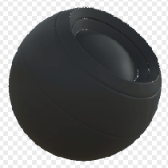

# 邊緣斑點

<table>
<tr style="border: 0;">
<td width="33.33%" style="border: 0;" valign="top">

{width="128px"}

<b>收錄於：</b> 基於網格的生成器>遮罩生成器

</td>
<td width="100.00%" style="border: 0;" valign="top">

## 說明

根據烘焙的地圖和使用者設定產生黑白遮罩。 類似 [Painter](https://support.allegorithmic.com/documentation/display/SPDOC/Substance+Painter) 裡[的智慧口罩](https://support.allegorithmic.com/documentation/display/SPDOC/Smart+Materials+and+Masks)。

此遮罩表示邊緣，並加以輕微斑點將其分割。 另見 [Edge Dirt](../../../../../../compositing-graphs/nodes-reference-for-com/node-library/mesh-based-generators/mask-generators/edge-dirt/edge-dirt.md)。

</td>
</tr>
</table>

## 輸入

|  |  |
|:---|:---|
| <b>曲率</b> <i>灰階輸入</i> | 烘焙地圖用於邊緣高亮。 必備！ |
| <b>變異遮罩</b> <i>灰階輸入</i> | 可選的遮罩槽用於遮蔽節點的效果。 啟用「覆蓋變異遮罩」。 |
| <b>面具（選用）</b> <i>灰階輸入</i> | 遮罩槽用於遮蔽節點的效果。 |

## 參數

|  |  |
|:---|:---|
| <b>關卡</b> <i>0.0 - 1.0</i> | 設定邊緣高亮的總量。 |
| <b>對比</b> <i>0.0 - 1.0</i> | 調整結果的對比度。 |
| <b>邊選</b> <i>0.0 - 1.0</i> | 設定凸邊的影響。 |
| <b>變體</b> <i>0.0 - 1.0</i> | 設定變化遮罩破壞效果的程度。 |
| <b>覆寫變異遮罩</b> <i>錯誤/真實</i> | 用自訂輸入槽覆蓋內建遮罩。 |

## 範例

<table style="margin-top: 32px; margin-bottom: 32px">
    <tr style="border: 0">
        <td style="border: 0; background: transparent">
            
        </td>
    </tr>
</table>
