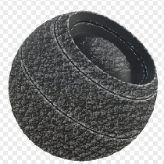

# 皮革服飾

<table>
<tr style="border: 0;">
<td style="border: 0;" valign="top">

{width="128px"}

## 皮革服飾

**收錄於：***基於網格的生成器**/遮罩生成器*

**中級**

</td>
<td style="border: 0;" valign="top">

## 說明

根據烘焙的地圖和使用者設定產生黑白遮罩。 類似 [Painter](https://support.allegorithmic.com/documentation/display/SPDOC/Substance+Painter) 裡[的智慧口罩](https://support.allegorithmic.com/documentation/display/SPDOC/Smart+Materials+and+Masks)。

此面具以皮革圖案代表磨損，邊緣磨損更多，基於曲線。 其功能類似 [玻璃纖維邊緣磨損](../../../../../../compositing-graphs/nodes-reference-for-com/node-library/mesh-based-generators/mask-generators/fiber-glass-edge-wear/fiber-glass-edge-wear.md) ，且參數大致相同。

## 參數

### 輸入

* **曲率**： *灰階輸入*\
  用於邊緣放置的烘焙地圖。 必備！
* **環境遮蔽**： *灰階輸入*\
  烘焙地圖會遮蔽某些區域。 建議，但不是必須的。
* **垃圾搖滾輸入**： *灰階輸入*\
  可選的 Grunge 地圖輸入槽，可透過「使用自訂 Grunge」參數切換。
* **遮罩（可選）：***灰階輸入*\
  遮罩槽用於遮蔽節點的效果。

### 參數

* **穿著等級**： *0.0 - 1.0*&#x200B;設定全球磨損等級，逐步展現。
* **磨損對比**&#x200B;度： *0.0 - 1.0*&#x200B;設定效果對比度。
* **垃圾搖滾量**： *0.0 - 1.0*&#x200B;設定垃圾搖滾（預設皮革圖案）的比例，讓它們在邊緣間融合。
* **環境遮蔽遮罩**： *0.0 - 1.0*&#x200B;設定 AO 遮蔽磨損效果的程度。
* **曲率權重**： *0.0 - 1.0*&#x200B;設定曲率邊緣對最終結果的影響程度。 即使設定為 0，你仍然需要曲率貼圖。
* **使用 Custom Grunge**： *False/True*&#x200B;啟用內建預設皮革圖案的覆蓋。 改用自訂輸入槽吧。

## 範例圖片

</td>
</tr>
</table>
