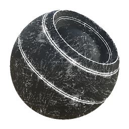

# 金屬邊緣磨損

<table>
<tr style="border: 0;">
<td width="33.33%" style="border: 0;" valign="top">

{width="128px"}

<b>收錄於：</b> 基於網格的生成器>遮罩生成器

</td>
<td width="100.00%" style="border: 0;" valign="top">

## 說明

根據烘焙的地圖和使用者設定產生黑白遮罩。 類似 [Painter](https://support.allegorithmic.com/documentation/display/SPDOC/Substance+Painter) 裡[的智慧口罩](https://support.allegorithmic.com/documentation/display/SPDOC/Smart+Materials+and+Masks)。

這個遮罩代表金屬物件的邊緣磨損，凸起邊緣會出現刮痕和缺口，可能被烘焙的 AO 暗區遮蓋。

</td>
</tr>
</table>

## 輸入

|  |  |
|:---|:---|
| <b>曲率</b> <i>灰階輸入</i> | 烘焙貼圖用於內部效果和遮罩。 |
| <b>環境遮蔽</b> <i>灰階輸入</i> | 烘焙貼圖用於內部效果和遮罩。 |
| <b>垃圾搖滾輸入</b> <i>灰階輸入</i> |  |
| <b>面具（選用）</b> <i>灰階輸入</i> | 遮罩槽用於遮蔽節點的效果。 |
| <b>世界太空常態</b> <i>色彩輸入</i> |  |
| <b>職位</b> <i>色彩輸入</i> |  |

## 參數

|  |  |
|:---|:---|
| <b>磨損程度</b> <i>0.0 - 1.0</i> | 設定總磨損程度，逐漸揭露。 |
| <b>戴對比</b> <i>0.0 - 1.0</i> | 設定了最終結果的對比。 |
| <b>邊緣平滑度</b> <i>0.0 - 16.0</i> | 設定曲率從邊緣衰減的平滑度。 |
| <b>垃圾搖滾量</b> <i>0.0 - 1.0</i> | 設定多少的髒污點，讓邊緣之間融合。 |
| <b>垃圾搖滾等級</b> <i>1 - 16</i> | 設定了垃圾搖滾的規模。 |
| <b>環境遮蔽</b> <i>0.0 - 1.0</i> | 設定 AO 對最終效果的影響，暗區會被遮蔽。 |
| <b>曲率權重</b> <i>0.0 - 1.0</i> | 設定曲率中凸邊對最終效果的影響。 |
| <b>使用自訂垃圾搖滾</b> <i>錯誤/真實</i> | 啟用自訂的 Grunge 地圖輸入槽。 |
| <b>使用三平面</b> <i>錯誤/真實</i> | 啟用 [三平面](../../../../../../compositing-graphs/nodes-reference-for-com/node-library/mesh-based-generators/utilities-mesh-based-gen/tri-planar/tri-planar.md) 投影來隱藏接縫。 |
| <b>三面融合對比</b> <i>0.0 - 1.0</i> | 三平面投影的混合對比度組。 |

## 範例

<table style="margin-top: 32px; margin-bottom: 32px">
    <tr style="border: 0">
        <td style="border: 0; background: transparent">
            
        </td>
    </tr>
</table>
