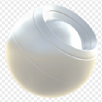

# 鏽蝕風化

<table>
<tr style="border: 0;">
<td style="border: 0;" valign="top">

{width="128px"}

## 鏽蝕風化

**收錄於：***網狀發電機**/風化*

**複合體**

</td>
<td style="border: 0;" valign="top">

## 說明

## 參數

### 輸入

* **環境遮蔽**： *灰階輸入*\
  烘焙貼圖用於內部效果和遮罩。
* **曲率**： *灰階輸入*\
  烘焙貼圖用於內部效果和遮罩。
* **位置**： *顏色輸入*
* **遮罩** ： *灰階輸入*\
  遮罩槽用於遮蔽節點的效果。 可以用「遮罩」參數切換。

### 參數

* **頻道**
  * 在這個群組中切換材質通道，例如使用鏡面/光澤貼圖而非金屬/粗糙度時。
* **進階**
  * **一般格式**： *DirectX、OpenGL*\
    切換不同的法線貼圖格式（反轉綠色通道）。
  * **面具**： *虛假/真實*\
    切換面具地圖的使用開關。
* **影響**
  * **鏽蝕擴散**： *0.0 - 1.0*
  * **擴散平滑度**： *0.0 - 1.0*
  * **Vernish 傷害等級**： *0.0 - 1.0*
  * **滴注強度**： *0.0 - 1.0*
  * **滴注樣本量**： *0 - 32*
  * **滴水順滑度**： *0.0 - 1.0*
* **混合**
  * **擴散強度**： *0.0 - 1.0*\
    擴散劑的混合強度。
  * **基色強度**： *0.0 - 1.0*\
    底色的混合強度。
  * **正常強度**： *0.0 - 32.0*\
    融合正常的力量。
  * **鏡面強度**： *0.0 - 1.0*\
    鏡面的融合強度。
  * **光澤度強度**： *0.0 - 1.0*\
    融合光澤的強度。
  * **粗糙度強度**： *0.0 - 1.0*\
    融合粗糙度的強度。
  * **金屬強度**： *0.0 - 1.0*\
    融合金屬的強度。
  * **環境遮蔽強度**： *0.0 - 1.0*\
    融合環境遮蔽的強度。
  * **身高強度**： *0.0 - 1.0*\
    融合高度強度。

## 範例圖片

</td>
</tr>
</table>
