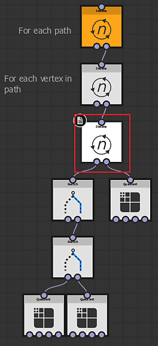

# 路徑格式規範

本頁說明路徑格式，並提供使用路徑工具中功能操作該格式資料的指引。

## 格式規格

<table>
<tr style="border: 0;">
<td width="100.00%" style="border: 0;" valign="top">

本節說明路徑文件</b>（或影像）如何<b>編碼：

Paths 文件是一串路徑的清單，每條路徑描述一個段落列表，並以 <b>32 位元浮點色彩紋理</b>編碼。

材質分為「上層」（*$pos.y*&lt; 0.5）和「下方」（*$pos.y > 0.5*）兩部分。

任何位於「上方」像素的資料，在語意上都與「下方」部分的對應像素密切相關，反之亦然。

</td>
<td width="33.33%" style="border: 0;" valign="top">

</td>
</tr>
</table>

>[!NOTE]
>
> 路徑資料需要32位元的精度，使用較低位元深度會產生錯誤結果。
> 
> 因此，請務必將產生路徑資料的節點的「Ouptut 格式」參數設為「HDR 高精度（32F）」。

設 `*uv\_pos*` 為「頂端」像素的二維位址（如 *$pos*）。

在本文件其餘部分：

* <b>top[uv\_pos]。XYZW</b> 指的是儲存在頂部像素中的 4 個浮點點數。\
  top[uv\_pos] == sample\_color（路徑，UV\_pos）
* <b>bottom[uv\_pos]。XYZW</b> 指的是底部相符像素中儲存的 4 個浮點數。\
  bottom[uv\_pos] == sample\_color（paths， uv\_pos + Float2（0， 0.5））

top[uv\_pos] 和 bottom[uv\_pos] 共同構成文件的語意單元 U[uv\_pos]，由 8 個浮點子組成。

### 文件標頭

每份 Paths 文件都以文件標頭開頭。 它是第一個語意單元 U[（0,0）]：

+++頂端
<b>X</b>

路徑數量（應為 [0; 16777216]中的正整數）。

如果有些路徑是空的，這裡仍然算數。 所以你可以把它想像成「要解碼的路徑標頭數量」。

<b>YZ</b>

本文件的像素大小（即精確 `Float2(1,1) / $size`的 ）。

這在讀取來自像素處理器](../../../../../../compositing-graphs/nodes-reference-for-com/atomic-nodes/pixel-processor/pixel-processor.md)或 [Fx-Map](../../../../../../compositing-graphs/nodes-reference-for-com/atomic-nodes/fx-map/fx-map.md) 的路徑[時非常有用，因為輸出大小不同。

<b>W</b>

1/16 = 0.0625（標頭旗標）

+++

+++底部
<b>XY</b>

本文件中定義的最後一個頂點的位址。 這對於新增資料很有幫助。

因此，它實際上可以是任何位於掃描線順序中大於最後一個頂點位址的位址。 它必須在範圍內 ]0， 1[×]0，.5[

<b>ZW</b>

未使用，應該是 Float2（0， 1）

+++

### 路徑標頭

文件標頭後緊接 number-of-paths = top[（0,0）]。X 條路徑標頭，依語意單元排列。\
E.g. 如果文件中有三條路徑，它們會儲存在 U[（0,1）\*pixel\_size]、U[（0,2）\*pixel\_size] 和 U[（0,3）\*pixel\_size]（其中 pixel\_size = top[（0,0）]）。YZ）。

若路徑數量超過一行像素所能容納的範圍，則其餘路徑標頭依掃描線順序寫入下一行。\
允許使用空路徑標頭（`top[...].XYZW = Float4(0,0,0,0)`;該路徑仍可視為一條空路徑。

第 N 條路徑的路徑標頭將定義於位址 `path\_addr` ，定義為：

+++頂端
<b>X</b>

這條路徑上的頂點數。 必須在[0， 16777216]範圍內。

如果封閉路徑的起點與終點位置相同，仍計入兩個頂點。\
頂點為 0 的路徑本身就是有效的路徑。

<b>Y</b>

*I\_closed* 旗標：若路徑封閉（例如圓形），則為 0（例如直線）。

<b>Z</b>

路徑索引 *N.* 必須與路徑\_addr*完全匹配*（見下方註解）。

<b>W</b>

標頭旗標：1/16 = 0.0625。

+++

+++底部
<b>XY</b>

起始（或第一個）頂點地址。

<b>ZW</b>

末尾（或最後一個）頂點的位址。

+++

>[!NOTE]
>
> 你可以用 paths\_tools.sbs 中的函數`Utils/pixel\_index\_to\_position`從 N 計算`path\_addr`：`path\_addr = pixel\_index\_to\_position(N+1)`

### 頂點資訊

頂點可以在影像中標頭（文件標頭或路徑標頭）之後的任何地方找到。 頂點可以有不同的「類型」（起始、中或結束），並透過兩個位址指標（「連結」）明確連結。

<b>起始</b> 頂點與 <b>結束</b> 頂點在這方面特別：為了表示封閉路徑或任意連結的路徑網絡，其中一個連結實際上被用來形成一個循環前向鏈結串列，包含所有代表同一頂點的其他開始或結束頂點。 這些彼此匹配的頂點稱為「兄弟姊妹」。 [歡迎插圖]

形式上，每個位址上的 `*vert\_addr*` 頂點定義如下：

+++頂端
<b>XY</b>

頂點位置。 座標可以是任何非 NaN 或 ±inf 的浮點數值。 在這個層級沒有鋪磚的概念（可由每個濾波器的實作來處理或不處理），因此路徑應該在歐幾里得平面上定義。

<b>Z</b>

頂點路徑指標。 頂點只能屬於一條路徑。 （如前所述，起始頂點與結束頂點可以有兄弟節點。） 路徑索引可以用來取得路徑標頭（見上文的 Section Path 標頭），因此務必保持同步。

<b>W</b>

頂點類型。 它分為值的符號與絕對值：

在符號部分，值為 0 表示這裡其實沒有頂點（其他分量也應該是 0）。 負值表示頂點被標記為「角落」;正值表示頂點是「光滑」。 角頂點與光滑頂點是純粹且孤立的屬性，對其他路徑編碼沒有影響或意義。

在絕對值部分，會編碼像素種類（起始、中或結束）及另一個旗標（平凡_link）：

* *0.125*：終點（圖形的最後一個頂點;總是非平凡的連結，詳見下文）

* *0.25*：起始頂點（圖形的第一個頂點;總是非平凡的連結，詳見下文）

* *0.5*：具有非平凡連結的中頂點

* *1*：具有平凡連結的中頂點

「平凡連結」指的是當前路徑頂點列表中的前一個頂點分別儲存在左側像素（vert\_addr-（0，pixel\_size））和右側像素（vert\_addr+（0，pixel\_size））中，而「非平凡連結」則表示至少有一個頂點被儲存在其他地方。

+++

+++底部
不論連結的「瑣碎性」如何，連結的可信值都儲存在底部：

<b>XY</b>

此路徑前一個頂點的位址。 對於起始頂點，這指向下一個兄弟頂點。\
若 |top[vert\_addr]。W|= 1，則 bottom[vert\_addr]。XY = vert\_addr - （0，pixel\_size）

<b>ZW</b>

這是這條路徑下一個頂點的位址。 對於 End 頂點，這指向下一個兄弟頂點。\
若 |top[vert\_addr]。W|= 1，則 bottom[vert\_addr]。ZW = vert\_addr + （0，像素\_size）

+++

## 閱讀與書寫路徑資訊

如果你想自己做路徑處理節點，你有好幾種工具。

基礎功能由 [Paths 頂點處理器](../../../../../../compositing-graphs/nodes-reference-for-com/node-library/spline-paths-tools/path-tools/paths-vertex-processor/paths-vertex-processor.md) 與 [Paths 頂點處理器簡單](../../../../../../compositing-graphs/nodes-reference-for-com/node-library/spline-paths-tools/path-tools/paths-vertex-processor-1/paths-vertex-processor-simple.md) 節點提供，基本上可 [與像素處理器](../../../../../../compositing-graphs/nodes-reference-for-com/atomic-nodes/pixel-processor/pixel-processor.md)相同使用。

如果你需要 Paths 頂點處理器節點以外的功能（更多輸入紋理，或更多前前或下一個頂點），複製這個圖的實作可能是個不錯的起點（假設你用自訂處理取代 <b>Get（“%perVertex”）</b> 節點）。

但如果你想做比套用每個頂點函數更陌生的事，這裡有一份詳細說明你可以使用的工具。 這些通常是小型輔助函式，與其他 Paths 節點（*paths\_tools.sbs）*&#x200B;在同一封裝中。 （這些函式並未暴露在 [<b>函式庫</b>](../../../../../../interface/the-library/the-library.md) 與 <b>節點選單</b>中。）

### 「讀取」功能

在資料夾 `Read` 下方，你可以找到幾個這樣的資料，有助於收集有關路徑的資訊：

有些能提供特定像素的資訊。 它們都把 \*top\* 部分的取樣 Float4 值當作輸入。 如果你看他們的實作，非常簡單。 他們的重點是傳達比原子節點更多的意義：

+++is_header
檢查目前取樣的值是路徑標頭還是文件標頭。

+++

+++path_is_closed
檢查路徑標頭中的 Is\_Closed 旗標（.Y）。 它假設你已經勾選過路徑， `is\_header` 結果 `current\_pixel\_is\_document\_header` 是 false。

+++

+++is_vertex
檢查目前取樣的值是否為頂點，也就是說，不是標頭，也不是空像素。

+++

+++is_start_vertex
檢查 \*top-part sampled\* 值是否為 Start 頂點（不需要先檢查 `is\_vertex` ）。

+++

+++is_mid_vertex
檢查 \*top-part sampled\* 值是否不是 Start 或 End 頂點（不需要先檢查 `is\_vertex` ）。

+++

+++is_end_vertex
檢查 \*top-part sampled\* 值是否為 End 頂點（不需要先確認 `is\_vertex` ）。

+++

+++is_segment_start
簡寫為 `is\_start\_vertex || is\_mid\_vertex`。 對於 [基於 Fx-Map](../../../../../../compositing-graphs/nodes-reference-for-com/atomic-nodes/fx-map/fx-map.md) 的處理來說更實用，因為每個區段最多處理一次。

+++

+++is_corner
檢查頂點的角旗（不需要先確認 `is\_vertex` ：如果答案為真，你肯定是在頂點上）。 請提醒，這個旗標目前尚未被官方節點部分支援。

+++

+++has_trivial_links
如果那是頂點，就能判斷你是否能在不取樣底部的情況下，輕易推斷前一個和下一個頂點的位置。 （註：非頂點總是回傳 false。）

你可能不想直接用這個功能，而是用 `sample\_next\*` 其中一個 or `sample\_prev\*` 函式，他們會幫你處理這部分。

+++

+++sample_next，sample_prev
給定取樣的頂 `*sampled*` 端值及其位置 `*sampled\_position*`，回傳下一個（分別是前一個）頂點取樣值，並將 Float2 變數 `*next\_sampled\_pos*` 設為該鄰居的頂端位置（即 &lt;returned value=&quot;&quot;> = SampleColor（next\_sampled\_pos， image0））。 &lt;/returned>`*input0PixSize*`必須等於路徑的像素大小（top[（0,0）]。YZ）。

如果目前像素（`*sampled*`）是 <b>起始</b> 頂點， *sample\_prev* 會回傳該頂點的下一個兄弟節點;同樣地，如果是 <b>結束</b> 頂點， *sample\_next* 會回傳該頂點的下一個兄弟節點（也就是說，可能不是你想要的）。 請參考 `*sample\_next\_advanced*` 以下內容 `*sample\_prev\_advanced*` 來解決這個問題。

請注意，為簡化起見， <b>路徑資訊假設儲存在 input0！</b> 另外，跟函式文件說的不一樣，你不需要事先宣告 `*next\_sampled\_pos*`。 `*[out]next\_sampled\_pos*` 是一個虛擬參數，提醒你這個第二個「回傳值」的存在。

你可以在第 3 次迭代節點的迭代參數中查看 `*paths\_trace*` [Fx-Map](../../../../../../compositing-graphs/nodes-reference-for-com/atomic-nodes/fx-map/fx-map.md)，裡面有個使用範例。

+++

+++sample_next_advanced，sample_prev_advanced
此設計旨在解決封閉路徑。 對於開放路徑，Start 或 End 頂點沒有兄弟節點，在這種情況下兩個函數回傳的是相同且唯一的鄰居。 對於有多個兄弟節點的開始頂點或結束頂點（以網路形式連接的路徑），這會回傳鏈結串列中下一個兄弟節點的鄰近頂點。

+++

### 「寫入」函式

在資料夾`Write`下方，你會找到一些小型輔助工具，可以建立一個 Float4，讓 <b>[Fx-Map]（../../../../../../compositing-graphs/nodes-reference-for-com/atomic-nodes/fx-map/fx-map.md）。</b>

事實上， [Fx-Map](../../../../../../compositing-graphs/nodes-reference-for-com/atomic-nodes/fx-map/fx-map.md) 在繪製前會將 RGB 乘以 Alpha，因此實際值會被取消預乘以補償這點。 如果你想在 Pixel 處理器](../../../../../../compositing-graphs/nodes-reference-for-com/atomic-nodes/pixel-processor/pixel-processor.md)中使用這些函式，我們建議你自己重新套用預乘法，或是寫一個自訂版本（更[符合你的使用情境且更易使用）。

+++document_header
建立文件標頭的上半部，並宣告你提供的路徑數量。

+++

+++document_last_vertex_spec
建立文件標頭的 \*bottom\* 部分，指定最後一個頂點位址（見 A.1.）。

+++

+++path_header
根據路徑 `*nbVertices*`中的頂點數、 `*isClosed*` 旗標 `*pathIndex*`和 來建立路徑標頭的頂端。

+++

+++start_vertex，mid_vertex，end_vertex
建立頂點的上半部，並相應地設定位置、類型及其他選項。

大約 *在 mid\_vertex* 以及 *hasTrivialLinks* 參數：理想狀況下你應該設定適當的值，但如果你因為某些原因無法判斷連結是否平凡，你可以安全地將它設為 false（但代價是你產生的路徑處理速度會變慢）。

+++

路徑標頭和頂點都沒有底部部分建構器：兩者都編碼兩個連結到頂部部分，因此這個函式本質上是從兩個 Float2 中構建出的向量 Float4 構造子。 如果你用 Fx-Map](../../../../../../compositing-graphs/nodes-reference-for-com/atomic-nodes/fx-map/fx-map.md) 來寫[，別忘了把 XYZ 除以 W（W 是地址的 Y，絕對不應該是 null）。

你可以在托管 [Paths 多邊形](../../../../../../compositing-graphs/nodes-reference-for-com/node-library/spline-paths-tools/path-tools/paths-polygon/paths-polygon.md)節點的 path\_polygon.sbs </b>*套件中找到如何使用這些函式<b>*&#x200B;的相關範例。

### 處理路徑的方法

你很可能會使用像素處理器或 Fx-Map 來實作自訂處理，這兩者各有優缺點：

+++效果圖
[當執行需要全域知識整條路徑或累積路徑（例如減量或鑲嵌後重新包裝頂點）的高階運算時，通常偏好基於 Fx-Map](../../../../../../compositing-graphs/nodes-reference-for-com/atomic-nodes/fx-map/fx-map.md) 的解決方案。它也是最容易上手的，所以如果你第一次做自訂處理，可能會想用 Fx-Map，雖然 *速度可能會* 比較慢。

你首先需要熟悉 Fx-Map。 如果不是這樣，請查看 [具體文件](../../../../../../compositing-graphs/nodes-reference-for-com/atomic-nodes/fx-map/fx-map.md)。

我們建議你參考 paths\_trace.sbs 中的&#x200B;<b>*預覽路徑](../../../../../../compositing-graphs/nodes-reference-for-com/node-library/spline-paths-tools/path-tools/preview-paths/preview-paths.md)實作[，以及 [paths\_polygon.sbs*</b> 中的&#x200B;<b>*路徑多邊形](../../../../../../compositing-graphs/nodes-reference-for-com/node-library/spline-paths-tools/path-tools/paths-polygon/paths-polygon.md)，了解如何使用 Fx-Map 分別讀取與寫入*</b>&#x200B;路徑。

+++

+++像素處理器
[如果你只需要「本地」資訊，Pixel 處理器](../../../../../../compositing-graphs/nodes-reference-for-com/atomic-nodes/pixel-processor/pixel-processor.md)的解決方案會很適合你。這裡的「局部」不是空間上的（元素之間的距離），而是拓撲上的（連接在一起的頂點）。 這就是頂點處理器的實作方式。 像素處理器通常比 Fx-Map 快速，因為每個像素的功能會平行評估，且存取的資料量有限。 不過實作上的努力可能更重要，因為你只能修改目前的像素。

我們不會詳細說明，因為要說的還有很多，但首先要做的是確認你所在的位置：

你是不是在頂端（$pos.y &lt; 0.5) or bottom ($pos.y > 0.5）那段？ 我們建議記得，在專用變數（例如 `*isTop*`），並且你建立 `*vert.addr*` Float2 時，這些值分別是 `*$pos*` 上半部分和 `$pos - (0,0.5)` 下半部分的值。

vert.addr *是什麼*？取樣後檢查是否有（W ！= 0），如果有，具體是什麼？ 標頭（W = 0.0625）（ `*Read/is\_header*`用 檢查）還是頂點（用 `Read/is\_vertex`檢查）？ 如果是標頭，是文件標頭還是路徑標頭？ （你可以用 `*Read/current\_pixel\_is\_document\_header*` 來檢查那個。） 使用一個或多個輔助功能來匹配你感興趣的內容。

+++
