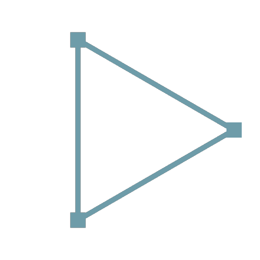

# 路徑多邊形

<table>
<tr style="border: 0;">
<td width="33.33%" style="border: 0;" valign="top">

<b>收錄於：</b> 樣條與路徑工具 > 路徑工具

</td>
<td width="100.00%" style="border: 0;" valign="top">

## 說明

以 Paths 格式產生一個基本元（多邊形）。

使用 [Path 2D Transform](../../../../../../compositing-graphs/nodes-reference-for-com/node-library/spline-paths-tools/path-tools/path-2d-transform/path-2d-transform.md) 節點來精確定位原件。

</td>
</tr>
</table>

## 輸出連接器

<b>路徑</b> *顏色*\
包含一條編碼路徑的清單，描述一個編碼段的清單。\
此資訊不允許直接使用或修改。 搜尋路徑以尋找相容節點。

## 參數

<b>整數邊數</b>* *\
提示：輸入介於100到1000之間的數字以產生圓圈。

## 範例

<table>
<tr style="border: 0;">
<td style="border: 0;" valign="top">

</td>
<td style="border: 0;" valign="top">

</td>
</tr>
</table>
