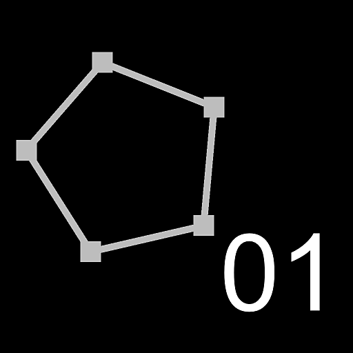

# 路徑頂點處理器簡單

<table>
<tr style="border: 0;">
<td width="33.33%" style="border: 0;" valign="top">

<b>收錄於：</b> 樣條與路徑工具 > 路徑工具

</td>
<td width="100.00%" style="border: 0;" valign="top">

## 說明

對輸入 <b>路徑</b>頂點位置施加轉換。

1. 編輯 <b>每個頂點函</b> 數參數函式;
1. 使用 <b>Get Float2</b> 節點 vertex.pos ** 變數;
1. 對此值進行一些運算（例如，乘以擴展路徑）;
1. 將你的計算結果設為輸出。

</td>
</tr>
</table>

你可以使用輸入影像並從函數中取樣。 你必須先連接一個能從函數取樣的輸入。 （請注意，第一個輸入是 *圖片 1*！）\
你也可以存取 *頂點* 角（bool）和 *path.id* （float）變數。

>[!TIP]
>
> 對於進階使用者， [路徑格式規範](../../../../../../compositing-graphs/nodes-reference-for-com/node-library/spline-paths-tools/path-tools/paths-format-spe/paths-format-specifications.md) 說明了路徑資料如何編碼成彩色影像，並提供直接操作這些資料的技巧。

>[!NOTE]
>
> 另 [見路徑頂點處理器](../../../../../../compositing-graphs/nodes-reference-for-com/node-library/spline-paths-tools/path-tools/paths-vertex-processor/paths-vertex-processor.md)。

## 輸入

|  |  |
|:---|:---|
| <b>路徑</b> <i>顏色</i> | 一份編碼段路徑列表。 將此輸入連接到 Mask to Paths](../../../../../../compositing-graphs/nodes-reference-for-com/node-library/spline-paths-tools/path-tools/mask-to-paths/mask-to-paths.md) 的結果[，或是連接到另一個 Path-processing 節點。 |
| <b>輸入#</b> <i>彩色/灰階</i> | 應該在 <b>每個頂點函</b> 數參數函數中取樣的影像輸入。 |

## 輸出

|  |  |
|:---|:---|
| <b>路徑</b> <i>顏色</i> | 變形的路徑。 你可以使用[預覽路徑來了解結果代表什麼，使用其他路徑處理節點，或[輸入](../../../../../../compositing-graphs/nodes-reference-for-com/node-library/spline-paths-tools/path-tools/preview-paths/preview-paths.md)到路徑到樣條線（Paths to Spline](../../../../../../compositing-graphs/nodes-reference-for-com/node-library/spline-paths-tools/path-tools/paths-to-spline/paths-to-spline.md)）中，進一步以樣條線處理。 |

## 參數

|  |  |
|:---|:---|
| <b>影像輸入計數</b> <i>整數</i> | 用於連接應在每個頂點函</b>數參數函數中<b>取樣的影像的可見 <b>Input #</b> 輸入連接器數量。 當你設定好所有想要的取樣後，可以透過將這個參數的值降回 0 來隱藏未使用的腳位。 如果你需要更多輸入，可以改用 [Paths 頂點處理器](../../../../../../compositing-graphs/nodes-reference-for-com/node-library/spline-paths-tools/path-tools/paths-vertex-processor/paths-vertex-processor.md) 。 |
| <b>每個頂點函數</b> <i>Float2</i> | 每個頂點都套用了函數。 必須回傳新的頂點位置。 請參閱 <b>本頁的說明</b> 部分以獲得指引。 |

## 範例

<table>
<tr style="border: 0;">
<td style="border: 0;" valign="top">

</td>
<td style="border: 0;" valign="top">

</td>
</tr>
</table>
