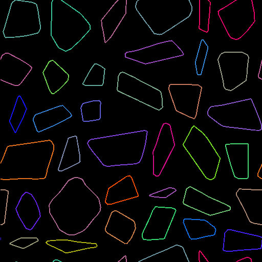

# 路徑扭曲

<table>
<tr style="border: 0;">
<td width="33.33%" style="border: 0;" valign="top">

<b>收錄於：</b> 樣條與路徑工具 > 路徑工具

</td>
<td width="100.00%" style="border: 0;" valign="top">

## 說明

根據梯度輸入</b>變形輸入<b>路徑。（與曲速](../../../../../../compositing-graphs/nodes-reference-for-com/atomic-nodes/warp/warp.md)節點的效果[相同。）

</td>
</tr>
</table>

## 輸入

|  |  |
|:---|:---|
| <b>路徑</b> <i>顏色</i> | 一份編碼段路徑列表。 將此輸入連接到 Mask to Paths](../../../../../../compositing-graphs/nodes-reference-for-com/node-library/spline-paths-tools/path-tools/mask-to-paths/mask-to-paths.md) 的結果[，或是連接到另一個 Path-processing 節點。 |
| <b>梯度輸入</b> <i>灰階</i> | 高度狀的輸入控制變形的量與方向。 （與曲速](../../../../../../compositing-graphs/nodes-reference-for-com/atomic-nodes/warp/warp.md)節點的效果[相同。） |

## 輸出

|  |  |
|:---|:---|
| <b>路徑</b> <i>顏色</i> | 變形的路徑。 你可以使用[預覽路徑來了解結果代表什麼，使用其他路徑處理節點，或[輸入](../../../../../../compositing-graphs/nodes-reference-for-com/node-library/spline-paths-tools/path-tools/preview-paths/preview-paths.md)到路徑到樣條線（Paths to Spline](../../../../../../compositing-graphs/nodes-reference-for-com/node-library/spline-paths-tools/path-tools/paths-to-spline/paths-to-spline.md)）中，進一步以樣條線處理。 |

## 參數

|  |  |
|:---|:---|
| <b>強度</b> <i>浮標</i> | <b>強度</b>參數決定了經速的強度。 |
| <b>步驟數</b> <i>整數</i> | 使用較大的值來將輸入路徑多重小幅度扭曲。 這能防止路徑自交，尤其是在使用高 <b>強度</b> 值時。 |

## 範例

<table>
<tr style="border: 0;">
<td style="border: 0;" valign="top">

<table>
  <tr>
    <td>
      
       <i>之前</i>
    </td>
    <td>
      
       <i>之後</i>
    </td>
  </tr>
</table>

</td>
<td style="border: 0;" valign="top">

<table>
  <tr>
    <td>
      
       <i>之前</i>
    </td>
    <td>
      
       <i>之後</i>
    </td>
  </tr>
</table>

</td>
</tr>
</table>

<table>
<tr style="border: 0;">
<td style="border: 0;" valign="top">

</td>
<td style="border: 0;" valign="top">

</td>
</tr>
</table>
