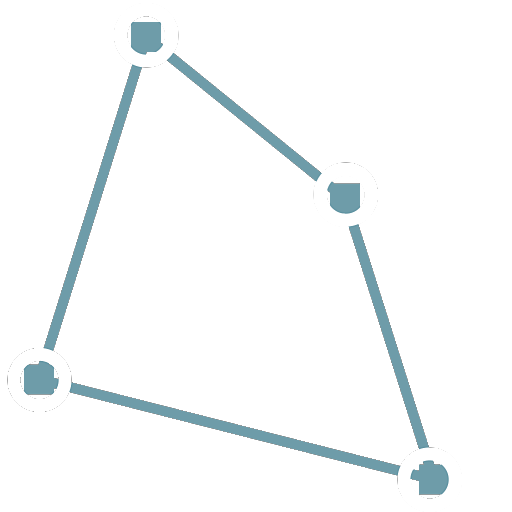
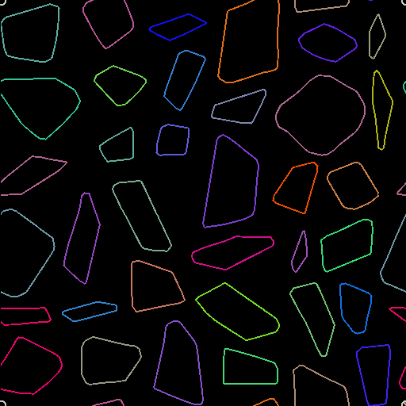

# 路徑上的四邊變換

<table>
<tr style="border: 0;">
<td width="33.33%" style="border: 0;" valign="top">

<b>收錄於：</b> 樣條與路徑工具 > 路徑工具

</td>
<td width="100.00%" style="border: 0;" valign="top">

## 說明

用四個 handle 來變形路徑。

</td>
</tr>
</table>

## 輸入

|  |  |
|:---|:---|
| <b>路徑</b> <i>顏色</i> | 一份編碼段路徑列表。 將此輸入連接到 Mask to Paths[&#128279;](../../../../../../compositing-graphs/nodes-reference-for-com/node-library/spline-paths-tools/path-tools/mask-to-paths/mask-to-paths.md) 的結果，或是連接到另一個 *Path-processing* 節點。 |

## 輸出

|  |  |
|:---|:---|
| <b>路徑</b> <i>顏色</i> | 變形的路徑。 你可以使用[&#128279;](../../../../../../compositing-graphs/nodes-reference-for-com/node-library/spline-paths-tools/path-tools/paths-to-spline/paths-to-spline.md)預覽路徑來了解結果代表什麼，使用其他路徑處理節點，或[輸入](../../../../../../compositing-graphs/nodes-reference-for-com/node-library/spline-paths-tools/path-tools/preview-paths/preview-paths.md)到路徑到樣條線（Paths to Spline）中，進一步以樣條線處理。 |

## 參數

|  |  |
|:---|:---|
| <b>p00</b> <i>Float2</i> | 左上角把手的位置。 |
| <b>第01頁</b> <i>Float2</i> | 右上方把手的位置。 |
| <b>第2頁</b> <i>Float2</i> | 左下角把手的位置。 |
| <b>第3頁</b> <i>Float2</i> | 右下角把手的位置。 |

## 範例

<table>
<tr style="border: 0;">
<td style="border: 0;" valign="top">

<table>
  <tr>
    <td>
      
       <i>之前</i>
    </td>
    <td>
      
       <i>之後</i>
    </td>
  </tr>
</table>

</td>
<td style="border: 0;" valign="top">

<table>
  <tr>
    <td>
      
       <i>之前</i>
    </td>
    <td>
      
       <i>之後</i>
    </td>
  </tr>
</table>

</td>
</tr>
</table>

<table>
<tr style="border: 0;">
<td style="border: 0;" valign="top">

</td>
<td style="border: 0;" valign="top">

</td>
</tr>
</table>
