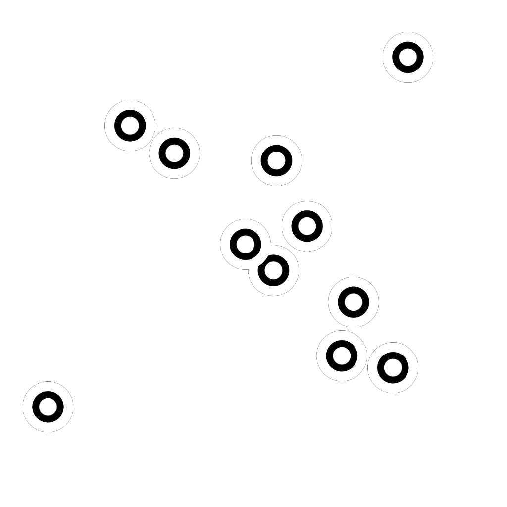

# 點數列表

<table>
<tr style="border: 0;">
<td width="33.33%" style="border: 0;" valign="top">

<b>收錄於：</b> 樣條與路徑工具 > 樣條鍵工具

</td>
<td width="100.00%" style="border: 0;" valign="top">

## 說明

產生一份樣條曲線要遍歷的點清單。

如果提供現有的點清單給 <b>點</b> 輸入，產生的清單會附加到輸入清單中。

</td>
</tr>
</table>

>[!TIP]
>
> 此節點可用來向樣條（多元二次）[&#128279;](../../../../../../compositing-graphs/nodes-reference-for-com/node-library/spline-paths-tools/spline-tools/spline-poly-quadratic/spline-poly-quadratic.md)節點提供點，以建立樣條曲線。

>[!IMPORTANT]
>
> <b>點表<b></b>與點數</b>連接器&#x200B;*與花鍵</b>座標、<b>花鍵資料</b>及<b>花鍵數量</b>連接器不相容*<b>，因為它們依賴不同的資料。

## 輸入

|  |  |
|:---|:---|
| <b>預覽</b> <i>灰階</i> | 點預覽為灰階影像。 |
| <b>點列表輸入</b> <i>顏色</i> | 編碼於彩色影像 RGBA 通道中的輸入點列表： <b>R</b> - X 位置 <b>G</b> - Y 位置 <b>B</b> - 高度 <b>A</b> - 打包資料： * 整數部分：平滑度; * 分數部分：厚度。 |
| <b>點數輸入</b> <i>整數</i> | 輸入點的數量。 |

## 輸出

|  |  |
|:---|:---|
| <b>預覽</b> <i>灰階</i> | 點預覽為灰階影像。 |
| <b>點數列表</b> <i>顏色</i> | 彩色影像 RGBA 通道中編碼的點的輸出清單： <b>R</b> - X 位置 <b>G</b> - Y 位置 <b>B</b> - 高度 <b>A</b> - 打包資料： * 整數部分：平滑度; * 分數部分：厚度。 |
| <b>點數</b> <i>整數</i> | 輸出的點數。 |

## 參數

|  |  |
|:---|:---|
| <b>點數</b> <i>整數</i> | 產生的分數。 |
| <b>全域平滑度調整</b> <i>浮標</i> | 對所有點的平滑值施加均勻偏移。 所得的平滑度值會被夾在[0;1] 範圍內。 |
| <b>點的性質</b> |  |
| <b>p# 性質</b> <i>Float3</i> | 設定 p# 點的性質。 *- 高度：* 調整點的高度，當值越低代表位置越低或越深; *- 平滑度：* 偏移樣條曲線在 p# 平滑起點的起點，值為 0 時為硬軌跡，在完全光滑軌跡中為 1; *- 厚度：* 調整樣鍵在 p# 處的厚度。 厚度則由特定的樣條節點使用。 |
| <b>點座標</b> |  |
| <b>p#</b> <i>Float2</i> | 設定 p# 點在貼圖空間中的位置。 |
| <b>預覽</b> |  |
| <b>節目標籤</b> <i>布林值</i> | 對於每個點，會在「預覽」輸出中旁邊顯示該點的名稱。 |
| <b>標籤尺寸</b> <i>浮動</i> （當「顯示標籤」設為「真實」時可用） | 貼圖空間中每個點的標籤大小，0.1 是貼圖寬度的十分之一。 |
| <b>節目重點</b> <i>布林值</i> | 顯示「預覽」輸出中的點數。 |
| <b>積分大小</b> <i>浮動（</i> 當「顯示點數」設為「真實」時可用） | 貼圖空間中點的半徑，0.1 是貼圖寬度的十分之一。 |

## 範例

<table>
<tr style="border: 0;">
<td style="border: 0;" valign="top">

</td>
<td style="border: 0;" valign="top">

</td>
</tr>
</table>
