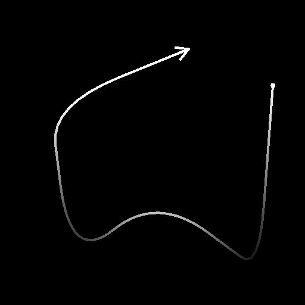
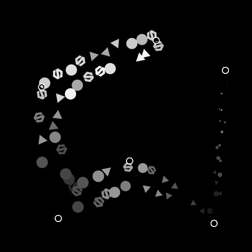

# 樣條灰階上的散射

<table>
<tr style="border: 0;">
<td width="33.33%" style="border: 0;" valign="top">

<b>收錄於：</b> 樣條與路徑工具 > 樣條鍵工具

</td>
<td width="100.00%" style="border: 0;" valign="top">

## 說明

沿著輸入樣條線在輸入背景上繪製指定的圖案。

</td>
</tr>
</table>

節點提供深度自訂選項，以控制圖案的散布方式。

散射的某些面向可透過圖中其他節點的影像來控制，以進一步強化結果的動態特性。

>[!NOTE]
>
> 另 [見樣條色](../../../../../../compositing-graphs/nodes-reference-for-com/node-library/spline-paths-tools/spline-tools/scatter-on-spline-color/scatter-on-spline-color.md)上的散射。

## 輸入連接器

<b>背景&#x200B;</b>*灰階（主階）灰階*&#x200B;影像，應繪製樣條曲線。

<b>樣條座標</b> *色彩*&#x200B;輸入樣條點的座標編碼在彩色影像的 RGBA 通道中：\
<b>R</b> - X 位置\
<b>G</b> - Y 位置\
<b>B</b> - 身高\
    <b>A</b> - 打包資料：\
* 符號：樣條鍵為閉（負）或開（正）;\
* 絕對值：厚度 + 1。

<b>樣條資料</b> *色彩*&#x200B;輸入樣條的額外資料編碼於彩色影像的 RGBA 通道中。\
<b>R</b> - 切線 X\
<b>G</b> - 切線 Y\
<b>B</b> - 未上場\
<b>A</b> - 未上場

<b>樣條量</b> *整數*：輸入樣條的數量。

<b>圖案輸入#</b> *灰階*：應該散布在樣條線上的圖案。

<b>比例尺地圖</b> *灰階*&#x200B;控制散落圖案比例的地圖。 此地圖的效果由「比例圖輸入乘數」參數控制，並與「尺寸」組中其他參數結合使用。

<b>高度圖</b> *灰階*&#x200B;控制散布圖案高度的地圖。 此映射的效果由「高度輸入乘數」參數控制，並與「色彩」組中其他「色彩」參數結合。

<b>面具地圖</b> *灰階*&#x200B;控制散布圖案遮罩的地圖。 此映射的效果由「遮罩映射閾值」參數控制，並與其他「遮罩」參數合併於「顏色」群組中。

## 輸出連接器

<b>產出</b> *灰階*：代表沿輸入樣條線散佈於輸入背景上的圖案的影像。

## 參數

<b>花鍵輸入</b> *整數*&#x200B;選擇用於散射圖案的樣條的方法：
* *所有樣條線*：使用輸入列表中的所有樣條線;
* *單樣條線*：僅使用輸入清單中指定的樣條線;
* *樣條線範圍*：只使用輸入列表中指定範圍內的樣條線。

<b>樣條指數</b> *整數* （當「樣條輸入」設為「單樣條」時可用）應用於散射圖案的樣條線清單索引。

<b>樣條範圍</b> *Integer2* （當「樣條輸入」設為「樣條範圍」時可用）包括應該用於散射圖案的樣條曲線的列表索引範圍。

<b>散射模式</b> *整數*&#x200B;將圖案沿著樣條線散佈的方法，會影響每個樣條線上的圖案數量：
* 形狀數量：均勻分布的圖案數量依規定數量分散;
* 形狀間距：圖案數量會自動調整以符合指定的均勻間距。\
  在這兩種情況下，第一個和最後一個圖案分別恰好落在每個樣條的起點和結尾。

<b>形狀量</b> *整數* （當「散佈模式」設為「形狀量」時可用）：每條樣條線上均勻分布的圖案數量。

<b>形狀分布沿樣條曲線</b> *整數* （當「散佈模式」設為「形狀量」時可用）沿著樣條線分布圖案的方法：
* *來源*：圖案間距受樣條點切線影響，形狀在切線較長的點附近距離較遠;
* *均勻*&#x200B;性：無論樣條線的切線與軌跡如何，圖案均均勻分布。

<b>形狀間距</b> *浮動* （當「散佈模式」設為「形狀間距」時可用）：圖案在樣條線上應該間隔的最短距離，同時仍能將第一個和最後一個圖案分別落在每個樣條的起點和結束點。

<b>開始</b> *浮點*&#x200B;偏移點是從樣條起點開始的點。 該值為每個樣條的正規化長度。

<b>結束</b> *浮點*&#x200B;偏移點是樣條線起點點，散射結束。 該值為每個樣條的正規化長度。

<b>形狀樞軸</b> *Float2*&#x200B;在樣條切空間中偏移圖案 X 和 Y 的樞軸。\
考慮到樞軸是放置在花鍵上的部分，這實際上使花鍵沿線或垂直的圖案相偏移。\
注意：樞軸的位置會影響「縮放」與「旋轉（樞軸）」參數的影響。

+++圖樣
<b>模式</b> *整數*&#x200B;應該散佈在樣條線上的模式：\
*- 模式輸入*：使用提供給「模式輸入 #」的模式;\
*- 方形;
* 圓盤;
* 拋物面;
* 貝爾;
* 高斯分布;
* 索恩;
* 金字塔;
* 布里克;
* 漸進;
* 波浪;
* 半鐘;
* 瑞奇德·貝爾;
* 新月;
* 膠囊;
* 錐形;
* 漸變 w。 偏移;
* 半球。*

<b>模式輸入編號</b> *整數* （當「Pattern」設定為「Pattern Input」時可用）選擇輸入圖樣的索引，該索引應被分散。

<b>模式輸入分布</b> *整數* （當「Pattern」設為「Pattern Input」時可用）選擇在給定樣條線上散布哪些輸入模式的方法：\
*- 隨機*&#x200B;模式：隨機選擇模式;\
*- 沿樣條*&#x200B;曲線：圖案指數沿樣條線逐漸增加;\
*- 模式索引*：沿每個樣條線的輸入模式索引環繞;\
*- 樣條索引*：在輸入樣條線列表中，從一個樣條線循環到下一個樣條線的輸入圖案索引。

<b>分布抖動</b> *浮動* （當「圖案輸入分布」設定為「沿樣條線」時可用）隨機增加或減少樣條上所選圖案的索引。

<b>覆寫第一模式</b> *布林：*&#x200B;手動選擇應該放在每個樣條線起點的圖案索引。

<b>第一模式輸入索引</b> *整數* （當「覆蓋第一模式」設為「True」時可用）應放置於每個樣條線起始處的模式索引。

<b>覆寫最後模式</b> *布林：*&#x200B;手動選擇應該放在每個樣條線末端的圖案索引。

<b>最後模式輸入索引</b> *整數* （當「覆寫最後一個圖案」設為「真」時可用）應置於每個樣條線末尾的圖案索引。

+++

+++重複作品
<b>分配模式</b> *整數*&#x200B;放置重複圖案的方法：\
*- 線性：*&#x200B;重複件沿著樣條法線從圖案原始位置均勻分布;\
*- 圓形*：重複排列於以樣條曲線為中心的虛擬圓，位於圖案的原始位置。

<b>重複數量</b> *整數*：重複圖案的數量。

<b>偏移</b> *Float2* （當「分配模式」設為「線性」時可用）對重複件沿著樣條線（平行）和法線（垂直）的位置施加偏移。\
樣條曲線兩側的重複件會朝相反方向移動。

<b>偏移中心</b> *Float2* （當「分配模式」設為「線性」時可用）對樣條線上 X （平行）和 Y（垂直）上的重複件套用偏移。

<b>擴散角</b> *浮動* （當「分配模式」設為「圓形」時可用）虛擬圓的弧線，重複物分布在虛擬圓上，以該弧的角度表示，其中1為完整圓。

<b>偏移距離</b> *浮動* （當「分配模式」設為「圓形」時可用）：虛擬圓圈的半徑，重複的分布點。

<b>旋轉</b> *浮動*&#x200B;會旋轉虛擬圓圈，重複的圓圈會沿著它分布。

<b>偏移開始/結束衰減</b> *Float2*&#x200B;在對重複件套用偏移量時，會考慮從樣條線中點到起點與結束點的距離。\
這表示靠近樣條線端點的重複件會減少偏移量。

<b>厚度偏移衰減</b> *浮點*&#x200B;在對重複件套用偏移量時，會考慮花鍵的厚度。\
這表示在樣條中厚度較小的部分重複的偏移量會減少。

+++

+++大小
<b>尺寸模式</b> *整數*&#x200B;設定散佈圖案大小的方法：\
*- 法線*：大小以全域「縮放」參數統一控制;\
*- 使用花鍵厚度：尺寸由花鍵*&#x200B;厚度決定。

<b>厚度影響</b> *整數* （當「尺寸模式」設定為「從樣條中取厚度」時可用）指定圖案縮放軸應由樣條厚度驅動：
* X 與 Y：厚度與 X 軸與 Y 軸的尺寸相乘;\
  - X：厚度僅乘以X軸的尺寸;
* Y：厚度僅與 Y 軸的尺寸相乘。\
  當未乘以時，圖案的原始比例就是影像的整個範圍。\
  這表示在「X」模式下，Y軸的大小是影像的整個範圍，需要透過尺寸參數來調整。 使用 &#39;Y&#39; 模式時，X 軸的尺寸也同樣適用。

<b>規模</b> *Float2*&#x200B;在其他參數調整前，X 和 Y 中圖案的原始大小。

<b>隨機大小</b> *Float2*&#x200B;會套用隨機乘數，最高可達指定值，以減少 X 與 Y 中圖案的大小。

<b>厚度尺度</b> *浮動* （當「尺寸模式」設定為「從樣條鍵使用厚度」時可用）當花鍵厚度驅動時，圖案比例的額外倍數。

<b>規模</b> *浮點* （當「尺寸模式」設為「正常」時可用）一個全域控制，用於所有圖案的大小，其中 1 是影像的整個範圍。\
縮放是相對於圖案的樞軸來調整。 樞軸位置可以透過「形狀樞軸」參數來偏移。

<b>量表隨機</b> *浮點*&#x200B;將隨機乘數套用至指定值，以減少圖案大小。

<b>比例圖輸入倍增器</b> *浮點*&#x200B;控制縮尺貼圖輸入的強度。 此映射作為當前圖案大小的乘數。\
此地圖的效果與「大小」組中的其他參數結合。

<b>比例輸入取樣模式</b> *貼圖空間*&#x200B;將縮放映射中的值映射到樣條曲線的方法：\
*- 貼圖空間*：這些值會套用到樣條（spline）上，若使用貼圖的 UV 座標放置於貼圖中，該點樣條會放在的位置。 這實際上將值套用到「已就位」的樣條曲線上;\
*- 水平沿樣條線*：數值直接套用到編碼的樣條座標（參見樣條座標輸入），每列從上到下分別套用到不同的樣條曲線;\
*- 霍爾。 沿樣條曲線（蘭德。 偏移量 X）：*&#x200B;這些值直接套用到編碼後樣條的座標（參見樣條座標輸入），每個樣條曲線（即樣條座標中的每一列）在縮放映射中隨機進行水平偏移;\
*- 霍爾。 沿樣條曲線（蘭德。 偏移 Y）：*&#x200B;這些值直接套用到編碼後樣條的座標（參見樣條座標輸入），每個樣條曲線（即樣條座標中的每一列）在縮放映射中隨機垂直偏移。

<b>開始/結束衰減</b> *Float2*&#x200B;在縮放圖案時會考慮從樣條線中點到起點和結束點的距離。\
這表示靠近樣條端的圖案尺寸會被縮小。

+++

+++位置
<b>局部偏移</b> *Float2*&#x200B;對樣條線切線（平行）和法線（垂直）位置施加偏移。

<b>局部偏移隨機</b> *Float2*&#x200B;對樣條線切線（平行）和法線（垂直）位置施加額外的隨機偏移。

<b>地方偏移隨機中心</b> *Float2*&#x200B;偏移隨機偏移中心，由局部偏移隨機參數沿樣條線的切線（平行）與法線（垂直）施加。

<b>局部偏移開始/結束衰減</b> *Float2*&#x200B;在對圖案套用位置偏移時，會考慮從樣條線中點到起點和結束點的距離。\
這表示靠近樣條線端端的圖案偏移量會減少。

<b>局部偏移厚度衰減</b> *浮點*&#x200B;在對圖案套用偏移時，會考慮花鍵的厚度。\
這表示在樣條中厚度較小的部分重複的偏移量會減少。

<b>樣條鍵上的偏移量</b> *浮動*&#x200B;對樣條線上的圖案施加位置偏移。

<b>樣條上的隨機偏移</b> *浮動*&#x200B;對樣條曲線上的圖案施加額外的位置偏移。

+++

+++旋轉
<b>與切線（Tangent）保持一致</b> *布林*&#x200B;旋轉圖案以匹配樣條曲線在位置的方向。

<b>旋轉（樞軸）</b> *浮動*&#x200B;旋轉圖案繞著它們的樞軸。\
樞軸位置可以透過「形狀樞軸」參數來偏移。

<b>旋轉隨機（樞軸）</b> *浮動*&#x200B;會對其樞軸周圍的圖案施加額外的隨機旋轉。\
樞軸位置可以透過「形狀樞軸」參數來偏移。

<b>旋轉隨機中心（樞軸）</b> *浮動*&#x200B;旋轉繞著圖案的樞軸軸點旋轉，該中心由旋轉隨機參數套用。

<b>輪轉（中鋒）</b> *浮動*&#x200B;將圖案繞中心旋轉。

<b>旋轉隨機（中間）</b> *漂浮*&#x200B;對中心圖案施加額外的隨機旋轉。

<b>旋轉隨機中心（中心）</b> *浮動*&#x200B;旋轉繞圖案中心旋轉，旋轉隨機參數所施加的隨機旋轉中心。

+++

+++顏色
<b>混合模式</b> *整數*&#x200B;將圖案顏色與背景及其他重疊圖案混合的方法：\
*- 最大*：使用最亮的顏色;\
*- 加法*：將顏色相加。

<b>形狀底色</b> *浮動*&#x200B;圖案的底色。

<b>形狀基色倍增器</b> *浮動*&#x200B;圖案的強度 形狀 底色。\
注意：輸出顏色是所有色彩乘數的加權結果。

<b>樣條厚度倍增器</b> *浮點*&#x200B;每個圖案顏色與樣條厚度相乘的強度。\
注意：輸出顏色是所有色彩乘數的加權結果。

<b>形狀指數乘數</b> *浮點*&#x200B;每個圖案顏色相乘其正規化指數的強度。\
注意：輸出顏色是所有色彩乘數的加權結果。

<b>半球高度模式</b> *整數* （當「圖案」設為「半球」時可用）樣條線高度對散布在其上的半球圖案的影響：\
*- 偏移*：樣條高度加到半球高度上;\
*- 比例：*&#x200B;樣條高度與半球高度相乘。

<b>花鍵高度倍數</b> *浮動*&#x200B;指每個圖案顏色與樣條線在該位置高度相乘的強度。\
注意：輸出顏色是所有色彩乘數的加權結果。

<b>形狀尺度倍增器</b> *浮動*&#x200B;每個圖案顏色相乘於其比例的強度。\
注意：輸出顏色是所有色彩乘數的加權結果。

<b>隨機亮度</b> *浮點*&#x200B;在降低圖案亮度時，會隨機加乘數至指定值。\
注意：輸出顏色是所有色彩乘數的加權結果。

<b>高度輸入倍數</b> *浮點*&#x200B;控制高度圖輸入的強度。 此映射作為圖案當前亮度的乘數。\
此映射的效果與「顏色」組中其他參數結合。\
注意：輸出顏色是所有色彩乘數的加權結果。

<b>高度圖輸入取樣模式</b> *整數*&#x200B;將高度映射中值映射到樣條的方法：\
*- 貼圖空間*：這些值會套用到樣條（spline）上，若使用貼圖的 UV 座標放置於貼圖中，該點樣條會放在的位置。 這實際上將值套用到「已就位」的樣條曲線上;\
*- 水平沿樣條線*：數值直接套用到編碼的樣條座標（參見樣條座標輸入），每列從上到下分別套用到不同的樣條曲線;\
*- 霍爾。 沿樣條曲線（蘭德。 偏移量 X）：*&#x200B;這些值直接套用到編碼後樣條的座標（參見樣條座標輸入），每個樣條曲線（即樣條座標中的每一列）在縮放映射中隨機進行水平偏移;\
*- 霍爾。 沿樣條曲線（蘭德。 偏移 Y）：*&#x200B;這些值直接套用到編碼後樣條的座標（參見樣條座標輸入），每個樣條曲線（即樣條座標中的每一列）在縮放映射中隨機垂直偏移。

<b>面具隨機</b> *浮動*&#x200B;調整隨機遮罩圖案的範圍，0表示沒有遮罩圖案，1表示所有圖案都遮蔽。

<b>遮罩貼圖閾值</b> *遮罩貼圖中低於此閾值的浮點*&#x200B;數值會被處理為黑色，而高於閾值的數值則被處理為白色。\
這表示遮罩貼圖中低於此值的所有區域圖案都會被遮罩。

<b>遮罩圖譜輸入取樣模式</b> *整數*&#x200B;將遮罩映射中的值映射到樣條的方法：\
*- 貼圖空間*：這些值會套用到樣條（spline）上，若使用貼圖的 UV 座標放置於貼圖中，該點樣條會放在的位置。 這實際上將值套用到「已就位」的樣條曲線上;\
*- 水平沿樣條線*：數值直接套用到編碼的樣條座標（參見樣條座標輸入），每列從上到下分別套用到不同的樣條曲線;\
*- 霍爾。 沿樣條曲線（蘭德。 偏移量 X）：*&#x200B;這些值直接套用到編碼後樣條的座標（參見樣條座標輸入），每個樣條曲線（即樣條座標中的每一列）在縮放映射中隨機進行水平偏移;\
*- 霍爾。 沿樣條曲線（蘭德。 偏移 Y）：*&#x200B;這些值直接套用到編碼後樣條的座標（參見樣條座標輸入），每個樣條曲線（即樣條座標中的每一列）在縮放映射中隨機垂直偏移。

<b>反轉遮罩地圖</b> *布林運算*&#x200B;會使用「一減」運算（1 - x）反轉遮罩映射的值。

<b>面具反轉</b> *布林會*&#x200B;反轉這些模式的遮蔽。

+++

<b>非平方修正</b> *布林：*&#x200B;調整點的位置，以在非平方解析度下保留樣條曲線形狀。

## 範例

<table>
<tr style="border: 0;">
<td style="border: 0;" valign="top">

<table>
  <tr>
    <td>
      
       <i>之前</i>
    </td>
    <td>
      
       <i>之後</i>
    </td>
  </tr>
</table>

</td>
<td style="border: 0;" valign="top">

<table>
  <tr>
    <td>
      
       <i>之前</i>
    </td>
    <td>
      
       <i>之後</i>
    </td>
  </tr>
</table>

</td>
</tr>
</table>

<table>
<tr style="border: 0;">
<td style="border: 0;" valign="top">

</td>
<td style="border: 0;" valign="top">

</td>
</tr>
</table>
