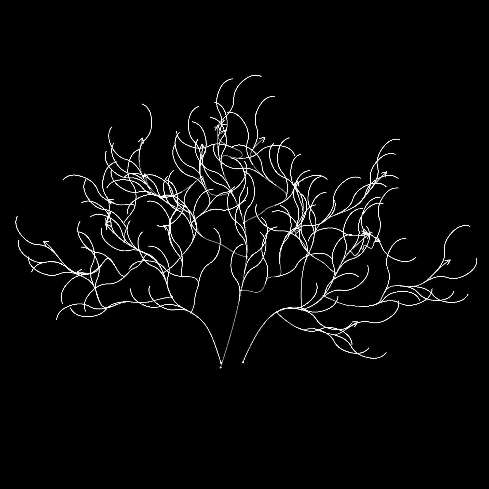

# 樣條上的散射樣條

<table>
<tr style="border: 0;">
<td width="33.33%" style="border: 0;" valign="top">

<b>收錄於：</b> 樣條與路徑工具 > 樣條鍵工具

</td>
<td width="100.00%" style="border: 0;" valign="top">

## 說明

在輸入父樣條上放置樣條曲線。

節點提供深度自訂選項，控制樣條線的散佈方式，讓你可以散布簡單的直線樣條，或是你自己的自訂樣條。

這個節點讓你可以用樣條曲線映射[&#128279;](../../../../../../compositing-graphs/nodes-reference-for-com/node-library/spline-paths-tools/spline-tools/spline-mapper-grayscale/spline-mapper-grayscale.md)器節點來建立複雜的結構來映射顏色和影像，或作為骨[架用散佈在樣條](../../../../../../compositing-graphs/nodes-reference-for-com/node-library/spline-paths-tools/spline-tools/scatter-spline-grayscale/scatter-on-spline-grayscale.md)鍵上放置形狀。

</td>
</tr>
</table>

<table>
<tr style="border: 0;">
<td style="border: 0;" valign="top">

### 教學

點擊右側圖片即可進入我們 <b>專門的教學</b>，導覽節點的功能及其在樣條（Spline）工作流程中的應用。

</td>
<td style="border: 0;" valign="top">

</td>
</tr>
</table>

## 輸入

|  |  |
|:---|:---|
| <b>預覽</b> *灰階* | 輸入樣條線預覽為灰階影像。 |
| <b>樣條座標</b> *顏色* | 編碼在彩色影像 RGBA 通道中的父樣條點座標：  <b>R</b> - X 位置  <b>G</b> - Y 位置  <b>B</b> - 高度  <b>A</b> - 填充資料：- 符號：樣條線為閉（負）或開（正）- 絕對值：厚度 + 1 |
| <b>樣條資料</b> *顏色* | 編碼在彩色影像 RGBA 通道中的父樣條的額外資料：  <b>R</b> - 切線 X  <b>G</b> - 切線 Y  <b>B</b> - 切線 Z  <b>A</b> - 未使用 |
| <b>樣條量</b> *整數* | 父樣條的數量。 |
| <b>自訂樣條座標</b> *顏色* | 彩色影像 RGBA 通道中編碼的自訂樣條點座標：  <b>R</b> - X 位置  <b>G</b> - Y 位置  <b>B</b> - 高度  <b>A</b> - 打包資料：- 符號：樣條線為閉合（負）或開（正） - 絕對值：厚度 + 1 |
| <b>自訂樣條資料</b> *顏色* | 彩色影像RGBA通道中編碼的自訂樣條線額外資料：  <b>R</b> - 切線 X  <b>G</b> - 切線 Y  <b>B</b> - 切線 Z  <b>A</b> - 未使用 |
| <b>自訂樣鍵數量</b> *整數* | 自訂樣條的數量。 |
| <b>比例尺地圖</b> *灰階* | 灰階地圖控制散布樣條的比例尺。  此地圖的效果由<b>縮尺地圖輸入乘數</b>參數控制，並與尺寸</b>組中<b>的其他參數結合。 |
| <b>旋轉地圖</b> *灰階* | 灰階映射控制散布樣條的旋轉。  此映射的效果由<b>旋轉映射輸入乘法</b>參數控制，並與旋轉</b>組中的<b>其他參數結合。 |

## 輸出

|  |  |
|:---|:---|
| <b>預覽</b> *灰階* | 散布樣條的預覽畫面為灰階影像。 |
| <b>樣條座標</b> *顏色* | 彩色影像RGBA通道中編碼的散射樣條點座標：  <b>R</b> - X 位置  <b>G</b> - Y 位置  <b>B</b> - 高度  <b>A</b> - 填充資料：- 符號：樣條鍵閉合（負）或開（正） - 絕對值：厚度 + 1 |
| <b>樣條資料</b> *顏色* | 彩色影像RGBA通道中編碼的散射樣條的額外資料：  <b>R</b> - 切線 X  <b>G</b> - 切線 Y  <b>B</b> - 未使用 <b>A</b> - 未使用 |
| <b>樣條量</b> *整數* | 散落樣條的數量。 |

## 參數

|  |  |
|:---|:---|
| <b>側邊</b> *整數* | 控制：樣條曲線應該分散在父樣條的哪一側，因為「前」是父&#x200B;*樣條曲線的*&#x200B;方向：  - <b>左</b> 將樣條線放在左側。 - <b>右</b> 將樣條曲線放在右側。 - <b>左 + 右</b> 樣條曲線放在兩側。 - <b>左 / 右 - 交替</b>放置樣條線 交替擺放左邊或右邊（例如每隔一邊）。 - <b>左 / 右 - 隨機</b> 隨機選擇每個樣條線的邊。 |
| <b>數量模式</b> *整數* | 沿著母樣條線散布樣條的方法，會影響每個父樣條上的散布樣條數量：  - <b>每個樣條</b> 鍵數量固定 分配均勻間隔的樣條量。 - <b>間距</b> 樣條數會自動調整以符合指定的均勻間距。  在這兩種情況下，第一和最後一個散布樣條分別恰好落在每個父樣條的起點和結尾。 |
| <b>花鍵數量</b> *整數* | 每個父樣條均勻分布的樣條數量。 |
| <b>花鍵間距</b> *浮標* | 在父樣條線上應該間隔的最小距離，同時使第一個和最後一個樣條線分別落在每個父樣條的起點和結束點。 |
| <b>花鍵類型</b> *整數* | 選擇在父樣條線上散布的樣條類型：  - 直線</b> 一種簡單直線樣條 。- <b>自訂樣條鍵</b> 提供給<b>自訂樣條</b>輸入的<b>樣條鍵。多重樣條在附加於列表時會被支援。 |
| <b>自訂樣條鍵選擇</b> *整數* | 當多個自訂樣條線附加於列表中時，此參數允許你選擇這些樣條線在散佈中的分布方式。  - 整個清單</b> 所有樣條線作為一組散布在一起。 - <b>順序式</b> 每個樣條線依序散布，繞行列表。 - <b>隨機</b> 每個散布樣條線從列表中隨機抽取一個<b>樣條線。 |
| <b>開始</b> *浮標* | 偏移母樣條起點的散射起點。 該值為每個父樣條線的正規化長度。 |
| <b>結束</b> *浮標* | 偏移母樣條起點，該點是散射結束。 該值為每個父樣條線的正規化長度。 |
| <b>翻轉方向</b> *布林值* | 將散布樣條的方向反轉。 |
| <b>左右對稱模式</b> *整數* | 對母樣條線兩側散布的樣條鍵的對稱性方法。- 禁用 不套用對稱性，樣條線透過簡單旋轉放置在兩側。 - <b>左對稱</b> 左邊的樣條相對於母樣條與右邊的樣條對稱。 - <b>右對稱</b> 右邊的樣條相對母樣條與左邊的樣條對稱。</b> <b>   |
| <b>左/右隨機連結</b> *布林值* | 控制父樣條曲線兩側的樣條曲線在使用隨機旋轉、隨機縮放等時是否應該使用相同的數值。換句話說：  - 假：</i>每個樣條線使用不同的隨機值 - <i>真：</i>兩個樣條線<i>共享相同的隨機值 |
| <b>花鍵樞軸模式</b> *整數* | 設定了放置散佈樣條軸點的方法，影響旋轉與縮放。 請注意，樞軸 *總是放在父樣條上* ，其控制項會影響散射樣條。 換句話說：樞軸不會移動，而是散布樣條移動並相對地與之縮放。  - <b>沿樣條</b> 曲線位置 沿著散布樣條移動樞軸。 - <b>絕對位置</b> 為樞軸設定任意位置。 |
| <b>沿樣條鍵的樞軸位置</b> *浮標* | 樞軸在散布樣條上的正規化位置，0為起點，1為終點。 請注意，樞軸會跟隨 *散射樣條的方向* ，且樣條的方向可能會改變，以保持樞軸的位置和相對母樣條的位置與旋轉。 |
| <b>樞軸絕對位置</b> *Float2* | 樞軸在紫外空間中的位置。 |
| <b>非平方修正</b> *布林值* | 調整樣條曲線的位置與厚度，以保持非正方形解析度下的形狀。注意：使用自訂樣條時，自訂樣條曲線應使用&#x200B;*與散</b>射樣條節點上的散佈樣條相同的影像比例*<b>。</i> <i> |
| <b>規模</b> |  |
| <b>樣條尺度</b> *浮標* | 一個全域控制，涵蓋所有樣條曲線的大小，其中 1 是它們的原始大小。 縮放是相對於樣鍵的樞軸進行。 樞軸位置可利用 <b>樣條樞軸</b> 參數進行偏移。 |
| <b>樣條尺度隨機</b> *浮標* | 對樣條大小施加隨機乘數，最高可達指定值。 |
| <b>比例圖輸入倍增器</b> *浮標* | 控制比例貼圖</b>輸入的<b>強度。此映射作為當前圖案大小的乘數。 此映射的效果與尺寸</b>組中<b>其他參數結合。 |
| <b>比例圖輸入取樣模式</b> *整數* | 將縮放貼圖中<b>值映射到樣條曲線的方法：  - <b>紋理空間</b> 這些值會套用到樣條曲線上，若使用貼圖的 UV 座標放置於貼圖中，該點數會被套用到貼圖</b>中。這實際上將值套用到「原位」 的樣條曲線—— <b>沿樣條</b> 曲線的水平值 這些值直接套用到編碼後樣條的座標（參見 <b>樣條座標</b> 輸入），每列從上到下 分別套用到不同的樣條曲線—— <b>Hor。 沿樣條曲線（蘭德。 偏移量 X）</b>這些值直接套用到編碼後樣條的座標（參見<b>樣條</b>座標輸入），並在縮尺圖</b>中<b>對每個樣條曲線（即樣條座標</b>中的<b>每一列）隨機進行水平偏移—— <b>Hor。沿樣條曲線（蘭德。 偏移量 Y）</b> 這些值直接套用到編碼後樣條的座標（參見<b>樣條座標</b>輸入），每個樣條曲線（即樣條座標</b>中的每一列<b>）在縮尺圖</b>中隨機垂直偏移<b> |
| <b>開始/結束衰減</b> *Float2* | 在縮放樣條時，會考慮從樣條線中點到起 <b>點</b> 和 <b>終點</b> 的距離。 這表示樣條曲線靠近樣條端的尺寸會被縮小。 |
| <b>職位</b> |  |
| <b>局部偏移</b> *Float2* | 對樣條曲線沿母樣條線的切線（平行）和法線（垂直）位置施加偏移。 |
| <b>花鍵範圍內的偏移量</b> *整數* | 設定母樣條線上散布樣條所施加的偏移範圍。- 區間</b> 範圍跨越每個散布樣條之間的&#x200B;*區間*。 - <b>父樣條</b> 範圍&#x200B;*涵蓋父樣條的全長*。 <b>   |
| <b>樣條鍵上的偏移量</b> *浮標* | 對母樣條曲線的樣條線施加位置偏移。 |
| <b>隨機偏移範圍</b> *整數* | 設定隨機偏移範圍，應用於母樣條線上散布樣條的範圍。- 區間</b>範圍 跨越每個散布樣條之間的&#x200B;*區間*。 - <b>父樣條</b> 範圍涵蓋&#x200B;*父樣條的整個長度*。 <b>   |
| <b>樣條上的隨機偏移</b> *浮標* | 對母樣條曲線的樣條線施加額外的位置偏移。 |
| <b>厚度偏移</b> *浮標* | 對散布的樣條線沿父樣條曲線的法線，直到父樣條曲線的厚度為止，施加偏移。 實際上，值為 1 時，可以將散布的樣條線放置在 *父樣條包絡的表面* 上。 |
| <b>旋轉</b> |  |
| <b>自訂花鍵對齊</b> *整數* | 控制自訂樣條曲線在父樣條曲線上的初始方向。  - <b>第一點切樣</b> 條曲線依其第一點的切線來定向。 換句話說，它們沿著母樣條曲線的第一個點設定的方向移動。 - <b>影像空間</b> 樣條曲線依原始外觀放置，位置或方向不需額外調整，彷彿代表它們的影像正停留在母樣條上。 |
| <b>旋轉模式</b> *整數* | 設定散布樣條的初始方向。  - <b>從樣條</b>曲線 樣條曲線的方向與母樣條曲線在位置的法線&#x200B;*相符*。 - <b>絕對曲線</b> 樣條&#x200B;**&#x200B;的方向相同，無論父樣條曲線的方向如何。 |
| <b>旋轉</b> *浮標* | 以旋轉的樣條繞其樞軸旋轉，並以轉數為單位。 樞軸位置可利用 <b>樣條樞軸</b> 參數進行偏移。 |
| <b>旋轉隨機</b> *浮標* | 對繞軸點的樣條施加額外的隨機旋轉，以旋轉數計算。 樞軸位置可利用 <b>樣條樞軸</b> 參數進行偏移。 |
| <b>左角/右角</b> *浮標* | 控制母樣條兩側樣條所施加的對稱旋轉角度，以轉數計。 |
| <b>左/右角隨機</b> *浮標* | 在母樣條曲線的每側，以旋轉數為單位，隨機增加對稱旋轉量。 |
| <b>旋轉映射輸入乘法</b> *浮標* | 控制旋轉地圖</b>輸入的<b>強度。此映射作為當前圖案旋轉的乘數。 此映射的效果與旋轉</b>組中的<b>其他參數結合。 |
| <b>旋轉映射輸入取樣模式</b> *整數* | 將旋轉貼圖中的<b>值映射到樣條線的方法：  - <b>貼圖空間</b> 這些值會套用到樣條曲線中，若使用貼圖的 UV 座標放置於貼圖中，該</b>位置。這實際上將值套用到「原位 」樣條曲線，- <b>沿樣條線</b> 水平 值直接套用到編碼樣條的座標（參見 <b>樣條座標</b> 輸入），每列從上到下分別套用到不同的樣條曲線， - <b>Hor. 沿樣條曲線（蘭德。 偏移量 X）</b>這些值直接套用到編碼後樣條的座標（參見<b>樣條座標</b>輸入），每個樣條曲線（即樣條座標</b>中的每一列<b>）在旋轉映射</b>中<b>隨機進行水平偏移。 - <b>Hor.沿樣條曲線（蘭德。 偏移量 Y）</b> 這些值直接套用到編碼後樣條線的座標上（參見<b>樣條座標</b>輸入），每個樣條線（即樣條座標</b><b>中的每一列<b>）在<b>旋轉圖</b>中隨機產生垂直偏移。</b> |
| <b>旋轉貼圖輸入影響</b> *整數* | 選擇受旋轉映射影響<b>的旋轉參數：  - <b>樣條曲線旋轉</b> 該映射影響樣條曲線的全域順時針旋轉。 - <b>左/右角</b> 映射影響<b>左/右</b>樣條曲線的對稱</b>旋轉。 |
| <b>高度</b> |  |
| <b>起始高度模式</b> *整數* | 計算散布樣條起始高度的方法。- 手動 為所有散布樣條設定相同的絕對值。 - <b>從父樣條線（+ 自訂樣條）</b>使用父樣條線的高度，然後使用<b>自訂樣條線起始高度 mult 加入自訂樣條線的高度。</b></b> <b>   參數。 - <b>從自訂樣條</b>線直接使用自訂樣條的高度。  <i>注意：</i>將樣條類型</b>設<b>為「自訂樣條」，並連接<b>自訂樣條</b>輸入以使用自訂樣條的高度。 |
| <b>自訂花鍵起始高度多重。</b> *浮標* | 控制自訂樣條曲線自身起始高度對散佈樣條曲線起始高度的貢獻，其中 1 表示使用自訂樣條的全高度。 自訂樣條鍵的高度會根據所選<b>的起始高度模式</b> 不同：- <i>從父樣條曲線（+ 自訂樣條</i>）：高度會加到父樣條 曲線上- <i>自訂樣條</i>曲線：高度直接使用 |
| <b>起始高度偏移</b> *浮標* | 對散射樣條的起始高度施加絕對偏移。 |
| <b>起始高度</b> *浮標* | 設定散布樣條起始高度的絕對值。 |
| <b>終端高度模式</b> *整數* | 計算散布樣條結束高度的方法。- 手動 為所有散布樣條設定相同的絕對值。 - <b>從父樣條線（+ 自訂樣條</b>）使用父樣條的高度，然後使用<b>自訂樣條線末點高度 Mult 加入自訂樣條線的高度。</b></b> <b>   參數。 - <b>從自訂樣條</b>線直接使用自訂樣條線的高度。  <i>注意：</i>將樣條類型</b>設<b>為自訂樣條，並連接<b>自訂樣條</b>線輸入以使用自訂樣條的高度。 |
| <b>客製化花鍵端高度多大。</b> *浮標* | 控制自訂樣條線自身結束高度對散落樣條曲線終點高度的貢獻，其中 1 表示使用自訂樣條的全部高度。 自訂樣條曲線的高度會根據所選<b>的終端高度模式 </b>不同：- <i>從父樣條曲線（+ 自訂樣條</i>）：高度會加到父模板 曲線上- <i>自訂樣條曲線：</i>高度直接使用 |
| <b>端高度偏移</b> *浮標* | 對散射樣條的終點高度施加絕對偏移。 |
| <b>端高度</b> *浮標* | 設定散布樣條線末端高度的絕對值。 |
| <b>厚度</b> |  |
| <b>開始厚度模式</b> *整數* | 計算散佈樣條起始厚度的方法。- 手動 對所有散布樣條設定相同的絕對值。 - <b>從父樣條</b>線 使用父樣條的厚度。 - <b>從自訂樣條</b>線 使用自訂樣條的厚度。  <i>注意：</i>將樣條類型</b>設<b>為自訂樣條，並連接<b>自訂樣條</b>輸入以使用自訂樣條的厚度。</b> <b>   |
| <b>起始厚度倍增器</b> *浮標* | 縮放散射樣條的起始厚度，其中 1 為全厚度。 |
| <b>起始厚度偏移</b> *浮標* | 會對散射樣條的起始厚度施加絕對偏移。 |
| <b>起始厚度</b> *浮標* | 設定散射樣條起始厚度的絕對值。 |
| <b>端厚模式</b> *整數* | 計算散射樣條曲線末端厚度的方法。- 手動 將所有散布樣條的絕對值設定相同。 - <b>從父樣條</b>線 使用父樣條的厚度。 - <b>從自訂樣條</b> 使用自訂樣條曲線的厚度。  <i>注意：</i>將樣條類型</b>設<b>為自訂樣條曲線，並連接<b>自訂樣條</b>輸入以使用自訂樣條曲線的厚度。</b> <b>   |
| <b>端厚倍器</b> *浮標* | 縮放散射樣條的起始厚度，其中 1 為全厚度。 |
| <b>端厚偏移</b> *浮標* | 對散射樣條的末端厚度施加絕對偏移。 |
| <b>端部厚度</b> *浮標* | 設定散射樣條的末端厚度絕對值。 |
| <b>預覽</b> |  |
| <b>節目指導助理</b> *布林值* | 在預覽</b>輸出中，樣條曲線起始顯示一個點，末尾<b>顯示箭頭。 |
| <b>顯示厚度包絡</b> *布林值* | 在樣鍵厚度邊緣顯示額外線條。 |
| <b>厚度（px）</b> *浮標* | 調整預覽輸出中<b></b>樣條線視覺化的厚度，以像素數為單位。 |
| <b>分段數量</b> *整數* | 調整預覽輸出中繪製樣條視覺化<b></b>所需的段數。數值越高，線條越平滑。 |
| <b>背景強度</b> *浮標* | 預覽輸出視覺化中<b></b>預覽輸入的強度<b></b>。 |

## 範例

<table>
<tr style="border: 0;">
<td style="border: 0;" valign="top">

{zoomable="yes"}

</td>
<td style="border: 0;" valign="top">

{zoomable="yes"}

</td>
</tr>
</table>

<table>
<tr style="border: 0;">
<td style="border: 0;" valign="top">

{zoomable="yes"}

</td>
<td style="border: 0;" valign="top">

{zoomable="yes"}

</td>
</tr>
</table>

## 演算

<table>
<tr style="border: 0;">
<td style="border: 0;" valign="top">

{zoomable="yes"}

</td>
<td style="border: 0;" valign="top">

{zoomable="yes"}

</td>
</tr>
</table>

{zoomable="yes"}
