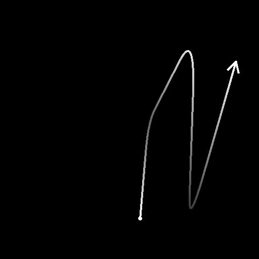

# 樣條二維轉換

<table>
<tr style="border: 0;">
<td width="33.33%" style="border: 0;" valign="top">

<b>收錄於：</b> 樣條與路徑工具 > 樣條鍵工具

</td>
<td width="100.00%" style="border: 0;" valign="top">

## 說明

對所有輸入樣條套用全域變換，包括反轉其方向。

</td>
</tr>
</table>

## 輸入連接器

<b>預覽</b> *灰階*&#x200B;輸入樣條的預覽為灰階影像。

<b>樣條座標</b> *色彩*&#x200B;輸入樣條點的座標編碼在彩色影像的 RGBA 通道中：\
<b>    R</b> - X 位置\
<b>    G</b> - Y 位置\
<b>    B</b> - 身高\
<b>A</b> - 打包資料：\
* 符號：樣條鍵為閉（負）或開（正）;\
* 絕對值：厚度 + 1。

<b>樣條資料</b> *色彩*&#x200B;輸入樣條的額外資料編碼於彩色影像的 RGBA 通道中。\
<b>    R</b> - 切線 X\
<b>    G</b> - 切線 Y\
<b>    B</b> - 未上場\
<b>    A</b> - 未上場

<b>樣條量</b> *整數*：輸入樣條的數量。

## 輸出連接器

<b>預覽</b> *灰階*&#x200B;輸出樣條的預覽作為灰階影像。

<b>樣條座標</b> *顏色*&#x200B;指編碼在彩色影像RGBA通道中的輸出樣條點座標。\
<b>R</b> - X 位置\
<b>G</b> - Y 位置\
<b>B</b> - 身高\
<b>A</b> - 打包資料：\
* 符號：樣條鍵為閉（負）或開（正）;\
* 絕對值：厚度 + 1。

<b>樣條資料</b> *色彩*&#x200B;輸出樣條的額外資料編碼於彩色影像的RGBA通道中。\
<b>R</b> - 切線 X\
<b>G</b> - 切線 Y\
<b>B</b> - 未上場\
<b>A</b> - 未上場

<b>樣條量</b> *整數*：輸出樣條的數量。

## 參數

<b>翻轉方向</b> *布林值*&#x200B;則是將樣條曲線的方向反轉。

<b>轉換矩陣</b> *Float4*&#x200B;套用到樣條上的變換矩陣。\
編輯矩陣參數有三種模式：\
*- 轉換裝置*：當選擇 Spline 2D 轉換節點時，調整 2D 視圖中顯示裝置的手柄;\
*- 旋轉/拉伸*：個別控制花鍵的旋轉與拉伸。 請注意，數值總是相對於電流變換來套用。 例如，將 50% 寬度重複應用會得到 25% 寬度;\
*- 矩陣值*：點擊「編輯矩陣值」按鈕，直接輸入矩陣的原始數值。

<b>偏移</b> *Float2*&#x200B;對 X 的樣條線（水平）和 Y（垂直）套用位置偏移。

+++預覽
<b>節目指導助理</b> *布林值*&#x200B;在預覽輸出中會在樣條曲線的起始處顯示一個點，在末端顯示一個箭頭。

<b>顯示厚度包絡</b> *布林值*\
在樣鍵厚度邊緣顯示額外線條。

<b>分段數量</b> *整數*&#x200B;調整預覽輸出中繪製樣條曲線視覺化所使用的段數。\
數值越高，線條越平滑。

<b>厚度（px）</b> *浮點*&#x200B;調整預覽輸出中樣條曲線的厚度（像素數）。

+++

## 範例

<table>
<tr style="border: 0;">
<td style="border: 0;" valign="top">

<table>
  <tr>
    <td>
      
       <i>之前</i>
    </td>
    <td>
      
       <i>之後</i>
    </td>
  </tr>
</table>

</td>
<td style="border: 0;" valign="top">

<table>
  <tr>
    <td>
      
       <i>之前</i>
    </td>
    <td>
      
       <i>之後</i>
    </td>
  </tr>
</table>

</td>
</tr>
</table>

<table>
<tr style="border: 0;">
<td style="border: 0;" valign="top">

</td>
<td style="border: 0;" valign="top">

</td>
</tr>
</table>
