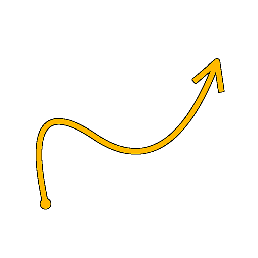

# 樣條二維轉換

<table>
<tr style="border: 0;">
<td width="33.33%" style="border: 0;" valign="top">

<b>收錄於：</b> 樣條與路徑工具 > 樣條鍵工具

</td>
<td width="100.00%" style="border: 0;" valign="top">

## 說明

對所有輸入樣條套用全域變換，包括反轉其方向。

</td>
</tr>
</table>

## 輸入

|  |  |
|:---|:---|
| <b>預覽</b> <i>灰階</i> | 輸入樣條線預覽為灰階影像。 |
| <b>樣條座標</b> <i>顏色</i> | 彩色影像RGBA通道中編碼的輸入樣條點座標： <b>R</b> - X 位置 <b>G</b> - Y 位置 <b>B</b> - 高度 <b>A</b> - 填充資料： 符號：樣條線為閉合（負）或開（正）; - 絕對值：厚度 + 1。 |
| <b>樣條資料</b> <i>顏色</i> | 彩色影像的 RGBA 通道中編碼的輸入樣條線額外資料。 <b>R</b> - 切線 x <b>G</b> - 切線 y <b>B</b> - 未使用 <b>A</b> - 未使用 |
| <b>樣條量</b> <i>整數</i> | 輸入樣條的數量。 |

## 輸出

|  |  |
|:---|:---|
| <b>預覽</b> <i>灰階</i> | 輸出時條線預覽為灰階影像。 |
| <b>樣條座標</b> <i>顏色</i> | 輸出樣條點的座標編碼在彩色影像的 RGBA 通道中。 <b>R</b> - X 位置 <b>G</b> - Y 位置 <b>B</b> - 高度 <b>A</b> - 打包資料： 符號：樣條線為閉合（負）或開（正）; - 絕對值：厚度 + 1。 |
| <b>樣條資料</b> <i>顏色</i> | 彩色影像RGBA通道中編碼的輸出樣條額外資料。 <b>R</b> - 切線 x <b>G</b> - 切線 y <b>B</b> - 未使用的 <b>A</b> - 未使用的 |
| <b>樣條量</b> <i>整數</i> | 輸出花鍵的數量。 |

## 參數

|  |  |
|:---|:---|
| <b>翻轉方向</b> <i>布林值</i> | 會反轉花鍵的方向。 |
| <b>轉換矩陣</b> <i>Float4</i> | 將變換矩陣套用到樣條上。 有三種編輯矩陣參數的模式：  - 轉換裝置</i>：當選擇樣條 2D 轉換節點時，調整 2D 視圖中顯示裝置的把手; - <i>旋轉/拉伸</i>：分別控制樣條的<i>旋轉與拉伸。請注意，數值總是相對於電流變換來套用。 例如，兩次套用 50% 寬度會得到 25% 寬度; - <i>矩陣值</i>：點擊「編輯矩陣值」按鈕，直接輸入矩陣的原始數值。 |
| <b>偏移</b> <i>Float2</i> | 對 X 的樣條線（水平）和 Y（垂直）套用位置偏移。 |
| <b>預覽</b> |  |
| <b>節目指導助理</b> <i>布林值</i> | 在預覽輸出中，樣條曲線起始顯示一個點，末尾顯示箭頭。 |
| <b>顯示厚度包絡</b> <i>布林值</i> | 在樣鍵厚度邊緣顯示額外線條。 |
| <b>分段數量</b> <i>整數</i> | 調整預覽輸出中繪製樣條視覺化所需的段數。 數值越高，線條越平滑。 |
| <b>厚度（px）</b> <i>浮標</i> | 調整預覽輸出中樣條曲線的厚度（像素數）。 |

## 範例

<table>
<tr style="border: 0;">
<td style="border: 0;" valign="top">

<table>
  <tr>
    <td>
      
       <i>之前</i>
    </td>
    <td>
      
       <i>之後</i>
    </td>
  </tr>
</table>

</td>
<td style="border: 0;" valign="top">

<table>
  <tr>
    <td>
      
       <i>之前</i>
    </td>
    <td>
      
       <i>之後</i>
    </td>
  </tr>
</table>

</td>
</tr>
</table>

<table>
<tr style="border: 0;">
<td style="border: 0;" valign="top">

</td>
<td style="border: 0;" valign="top">

</td>
</tr>
</table>
