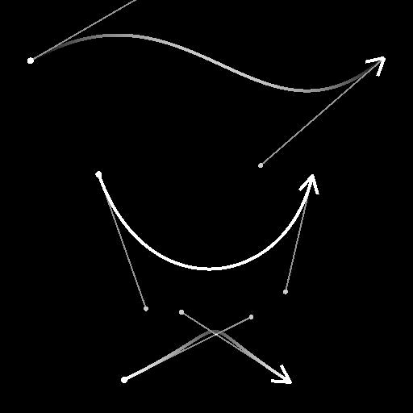

# 花鍵橋（列表）

<table>
<tr style="border: 0;">
<td width="33.33%" style="border: 0;" valign="top">

<b>收錄於：</b> 樣條與路徑工具 > 樣條鍵工具

</td>
<td width="100.00%" style="border: 0;" valign="top">

## 說明

產生樣條曲線，遍歷輸入列表中所有樣條曲線，沿著這些樣條曲線。

產生的樣條可以是線性（直線）或二次貝茲曲線（曲面）。

</td>
</tr>
</table>

>[!TIP]
>
> 產生的樣條從列表中第一個樣條線到最後一個樣條線，並嚴格依照列表中這些樣條線的順序遍歷中間樣條線。
> 
> 因此，你應該事先注意樣條的附加順序。

## 輸入連接器

<b>預覽</b> *灰階*&#x200B;輸入樣條的預覽為灰階影像。

<b>樣條座標</b> *色彩*&#x200B;輸入樣條點的座標編碼在彩色影像的 RGBA 通道中：\
<b>    R</b> - X 位置\
<b>    G</b> - Y 位置\
<b>    B</b> - 身高\
<b>A</b> - 打包資料：\
* 符號：樣條鍵為閉（負）或開（正）;\
* 絕對值：厚度 + 1。

<b>樣條資料</b> *色彩*&#x200B;輸入樣條的額外資料編碼於彩色影像的 RGBA 通道中。\
<b>    R</b> - 切線 X\
<b>    G</b> - 切線 Y\
<b>    B</b> - 未上場\
<b>    A</b> - 未上場

<b>樣條量</b> *整數*：輸入樣條的數量。

## 輸出連接器

<b>預覽</b> *灰階*&#x200B;輸出樣條的預覽作為灰階影像。

<b>樣條座標</b> *顏色*&#x200B;指編碼在彩色影像RGBA通道中的輸出樣條點座標。\
<b>R</b> - X 位置\
<b>G</b> - Y 位置\
<b>B</b> - 身高\
<b>A</b> - 打包資料：\
* 符號：樣條鍵為閉（負）或開（正）;\
* 絕對值：厚度 + 1。

<b>樣條資料</b> *色彩*&#x200B;輸出樣條的額外資料編碼於彩色影像的RGBA通道中。\
<b>R</b> - 切線 X\
<b>G</b> - 切線 Y\
<b>B</b> - 未上場\
<b>A</b> - 未上場

<b>樣條量</b> *整數*：輸出樣條的數量。

## 參數

<b>橋式樣條量</b> *整數*：在輸入樣條上產生的樣條數。

<b>橋式樣鍵類型</b> *整數*&#x200B;產生的樣條類型：
* 線性：一條尖銳樣條連接中間樣條，從起點到終點的直線軌跡;
* 二次貝茲：一種曲線樣條，連接從起點到終點的中間樣條，軌跡平滑。\
  注意：計算二次貝茲樣條至少需三個輸入樣條。

<b>輸入樣條為封閉式</b> *布林值*&#x200B;控制輸入樣條的第一點與最後兩點是否應作為單一點處理。 這樣可以避免重複第一個和最後一個穿越樣條。

<b>翻轉方向</b> *布林值*&#x200B;則是將樣條曲線的方向反轉。

<b>閉橋樣鍵</b> *布林：*&#x200B;將遍歷樣條線延伸回輸入列表中的第一個樣條線。

<b>第一橋式樣條偏移&#x200B;</b>*Float2*&#x200B;對所有穿越樣條的起始點施加偏移。 該值為輸入樣條的正規化長度。\
產生的樣條與遍歷樣條的起點或終點相交的樣條會留在那裡。

<b>最後橋式花鍵偏移&#x200B;</b>*浮點2*\
在所有穿越樣條的末端套用偏移量。 該值為輸入樣條的正規化長度。\
產生的樣條與遍歷樣條的起點或終點相交的樣條會留在那裡。

<b>隨機偏移範圍</b> *整數*：隨機偏移量施加於樣條曲線的最大距離。\
*- 母樣條：* 使用父樣條的全長。 可能會造成重疊。\
*- 間隔：* 使用橋式樣鍵之間的間隔。 這樣可以減少重疊。 隨著橋樑樣鍵數量增加，這個距離會逐漸減少。

<b>開始隨機偏移</b> *浮動* A 乘數，表示對橋式樣條起始位置施加的隨機偏移，最大距離由 <b>隨機偏移範圍</b> 參數決定。

<b>結束隨機偏移</b> *浮點* A 乘數，表示對橋式樣條端點施加的隨機偏移量，最大距離由 <b>隨機偏移範圍</b> 參數決定。

<b>全域隨機偏移量</b> *浮點*&#x200B;乘數：橋&#x200B;*式樣條的起始與終點位置施加**等量*&#x200B;的隨機偏移，最大距離由<b>隨機偏移範圍</b>參數決定。

<b>均勻分布</b> *布林值*&#x200B;當為真時，產生的樣條曲線點從開始到結束均勻分布。

+++厚度
<b>厚度模式</b> *整數*&#x200B;取得橋式樣條厚度值的方法。\
*- 繼承自母樣條：* 使用橋式樣條起始與結束位置母樣條的厚度\
*- 覆寫：*&#x200B;使用厚度參數中<b></b>指定的任意值

<b>厚度</b> *浮動*&#x200B;施加在橋式樣鍵上的絕對厚度值。

<b>厚度隨機</b> *浮點*&#x200B;一個隨機乘法器，用於橋式樣鍵的厚度，該乘法器所施加的初始厚度由 <b>厚度模式</b> 參數指定。

+++

+++高度
<b>高度模式</b> *整數*&#x200B;取得橋式樣條高度值的方法。\
*- 繼承自父樣條曲線：* 使用橋式樣條起始與結束位置的父樣條高度\
*- 覆寫：*&#x200B;使用你在高度</b>參數中<b>指定的任意值

<b>身高偏移</b> *浮動*&#x200B;指在將該高度套用到橋接樣條之前，對繼承自父樣條的高度所施加的偏移量。

<b>高度</b> *浮動*&#x200B;是施加在橋式樣條上的絕對高度值。

<b>高度隨機</b> *浮動*&#x200B;對橋式樣鍵高度的隨機調整，該調整取決於所選 <b>的高度模式</b> 參數：\
*- 繼承自父樣條：* 該值為繼承高度的乘數。\
*- 覆寫：* 此值是高度的偏移量加分。

+++

<b>非平方修正&#x200B;</b>*布林*

調整點的位置與厚度，以在非正方形解析度下保留樣條形狀。\
這也影響均勻分布。

+++預覽
<b>節目指導助理</b> *布林值*&#x200B;在預覽輸出中會在樣條曲線的起始處顯示一個點，在末端顯示一個箭頭。

<b>顯示厚度包絡</b> *布林值*\
在樣鍵厚度邊緣顯示額外線條。

<b>分段數量</b> *整數*&#x200B;調整預覽輸出中繪製樣條曲線視覺化所使用的段數。\
數值越高，線條越平滑。

<b>厚度（px）</b> *浮點*&#x200B;調整預覽輸出中樣條曲線的厚度（像素數）。

<b>背景預覽強度</b> *浮動*&#x200B;預覽視覺化的強度。

+++

## 範例

<table>
<tr style="border: 0;">
<td style="border: 0;" valign="top">

<table>
  <tr>
    <td>
      
       <i>之前</i>
    </td>
    <td>
      
       <i>之後</i>
    </td>
  </tr>
</table>

</td>
<td style="border: 0;" valign="top">

</td>
</tr>
</table>

