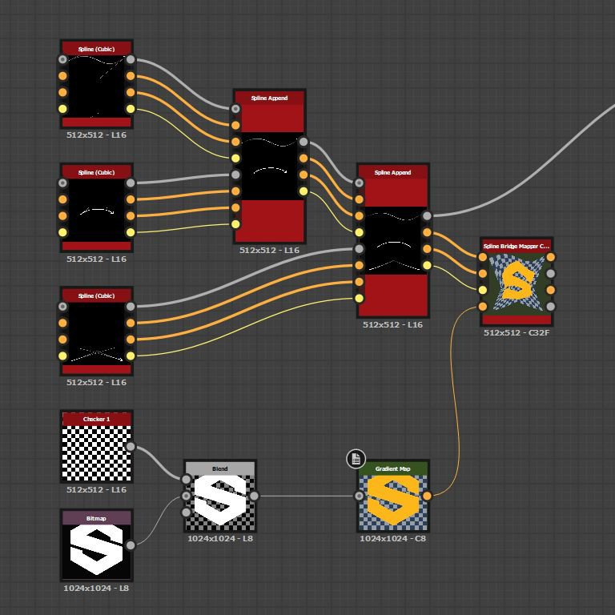

# 樣條橋映射器顏色

<table>
<tr style="border: 0;">
<td width="33.33%" style="border: 0;" valign="top">

<b>收錄於：</b> 樣條與路徑工具 > 樣條鍵工具

</td>
<td width="100.00%" style="border: 0;" valign="top">

## 說明

將彩色影像映射到輸入樣條列中，使影像依序遍歷樣條曲線。

</td>
</tr>
</table>

>[!TIP]
>
> 映射從列表中第一個樣條線到最後一個樣條線，並嚴格依照列表中這些樣條線的順序遍歷中間樣條線。
> 
> 因此，你應該事先注意樣條的附加順序。

>[!NOTE]
>
> 另 [見樣條橋映射灰階](../../../../../../compositing-graphs/nodes-reference-for-com/node-library/spline-paths-tools/spline-tools/spline-bridge-mapper-gra/spline-bridge-mapper-grayscale.md)。

## 輸入

|  |  |
|:---|:---|
| <b>樣條座標</b> <i>顏色</i> | 彩色影像RGBA通道中編碼的輸入樣條點座標： <b>R</b> - X 位置 <b>G</b> - Y 位置 <b>B</b> - 高度 <b>A</b> - 填充資料： 符號：樣條線為閉合（負）或開（正）; - 絕對值：厚度 + 1。 |
| <b>樣條資料</b> <i>顏色</i> | 彩色影像的 RGBA 通道中編碼的輸入樣條線額外資料。 <b>R</b> - 切線 x <b>G</b> - 切線 y <b>B</b> - 未使用 <b>A</b> - 未使用 |
| <b>樣條量</b> <i>整數</i> | 輸入樣條的數量。 |
| <b>色彩地圖</b> <i>顏色</i> | 應該映射到輸入樣條線的輸入色彩影像。 |

## 輸出

|  |  |
|:---|:---|
| <b>顏色</b> <i>灰階</i> | 將輸入的彩色影像映射到背景上的樣條曲線，作為彩色影像的結果。 |
| <b>高度</b> <i>灰階</i> | 樣條曲線的高度映射成灰階影像。 |
| <b>紫外線</b> <i>顏色</i> | 映射影像的 UV（即座標），編碼在彩色影像的紅色（U）和綠色（V）通道中。 |
| <b>面具</b> <i>灰階</i> | 一個樣條曲線映射的遮罩。 |

## 參數

|  |  |
|:---|:---|
| <b>分段數量</b> <i>整數</i> | 樣條會被簡化成段，然後影像座標會穿越它們。 線段越多，曲線上的映射就越平滑。 |
| <b>減少紫外線拉伸</b> <i>布林值</i> | 調整從一個樣條線插值到下一個樣條座標的方法，以減少樣條間距離不均時的拉伸。 |
| <b>紫外線尺度</b> <i>Float2</i> | 調整影像座標的比例。 數值越高，圖塊越密集。 |
| <b>紫外線旋轉</b> <i>浮標</i> | 會將影像座標繞中心旋轉。 |
| <b>背景色</b> <i>Float4</i> | 輸出影像中背景的顏色。 |

## 範例

<table>
<tr style="border: 0;">
<td style="border: 0;" valign="top">

<table>
  <tr>
    <td>
      
       <i>之前</i>
    </td>
    <td>
      
       <i>之後</i>
    </td>
  </tr>
</table>

</td>
<td style="border: 0;" valign="top">

</td>
</tr>
</table>

<table>
<tr style="border: 0;">
<td style="border: 0;" valign="top">

</td>
<td style="border: 0;" valign="top">

</td>
</tr>
</table>
