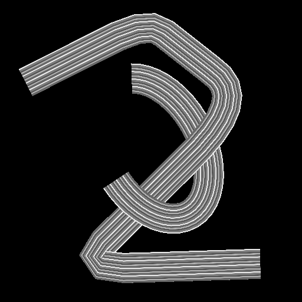

# 樣條映射器灰階

<table>
<tr style="border: 0;">
<td width="33.33%" style="border: 0;" valign="top">

<b>收錄於：</b> 樣條與路徑工具 > 樣條鍵工具

</td>
<td width="100.00%" style="border: 0;" valign="top">

## 說明

將輸入的灰階影像映射到沿輸入樣條線拉伸的原始圖形上。

原始形狀可以是平面、半圓柱或圓柱。 圓柱可沿樣條扭轉，以相應地變形映射影像。

</td>
</tr>
</table>

節點會輸出映射影像為灰階影像，並提供高度、UV（即影像座標）及獨立選擇每個映射樣條的 ID 遮罩等資訊。

>[!IMPORTANT]
>
> 使用非常低厚度值時，結果可能會在樣條包絡外出現不想要的雜訊。 這是已知的問題。

>[!NOTE]
>
> 另 [見樣條映射器顏色](../../../../../../compositing-graphs/nodes-reference-for-com/node-library/spline-paths-tools/spline-tools/spline-mapper-color/spline-mapper-color.md)。

## 輸入

|  |  |
|:---|:---|
| <b>樣條座標</b> <i>顏色</i> | 彩色影像RGBA通道中編碼的輸入樣條點座標： <b>R</b> - X 位置 <b>G</b> - Y 位置 <b>B</b> - 高度 <b>A</b> - 打包資料： - 符號：樣條線為閉合（負）或開（正）; - 絕對值：厚度 + 1。 |
| <b>樣條資料</b> <i>顏色</i> | 彩色影像的 RGBA 通道中編碼的輸入樣條線額外資料。 <b>R</b> - 切線 x <b>G</b> - 切線 y <b>B</b> - 未使用 <b>A</b> - 未使用 |
| <b>樣條量</b> <i>整數</i> | 輸入樣條的數量。 |
| <b>色彩地圖</b> <i>灰階</i> | 應該沿著輸入樣條線映射的輸入灰階影像。 |
| <b>高度圖</b> <i>灰階</i> | 輸入的灰階高度圖應該沿著輸入樣條線映射。 |
| <b>扭轉曲線</b> <i>灰階</i> | 描述曲線的圖像，利用其第一排像素的值。 當 <b>Shape</b> 參數設為 <i>半圓柱</i> 或 <i>半圓柱</i>時，這個輸入用來控制 UV 在形狀周圍的扭轉。 其影響由 Twist UV 的曲線乘法</b>參數控制<b>。 曲線提供沿樣條曲線的旋轉量輪廓，列中的第一個像素是樣條曲線起始的旋轉，最後一個像素是末端的旋轉。 灰階值代表彎道數。 你可以用 [Curve](../../../../../../compositing-graphs/nodes-reference-for-com/atomic-nodes/curve/curve.md) 節點來撰寫曲線。 |

## 輸出

|  |  |
|:---|:---|
| <b>顏色</b> <i>灰階</i> | 將輸入的彩色影像映射到輸入樣條上的結果，形成灰階影像。 |
| <b>高度</b> <i>灰階</i> | 這是將輸入的高度影像映射到輸入樣條上的灰階影像結果。 |
| <b>紫外線</b> <i>顏色</i> | 輸入樣條曲線映射的 UV（即座標），以彩色影像編碼。 |
| <b>身分證</b> <i>灰階</i> | 一個沿輸入樣條曲線映射的影像遮罩，白色值從一個樣條線遞增1，讓每個形狀可以獨立選擇。 |

## 參數

|  |  |
|:---|:---|
| <b>分段數量</b> <i>整數</i> | 樣條在影像座標穿越前 會被簡化成段。線段越多，曲線上的映射就越平滑。 |
| <b>自動縮放 UV</b> <i>布林值</i> | 自動調整座標縮放，使在沿樣條線映射時仍保持方形影像。 |
| <b>紫外線尺度</b> <i>Float2</i> | 調整映射座標在 X 軸（水平）和 Y 軸（垂直）的縮放。 值越高，影像拼貼越密集。 |
| <b>模式</b> <i>整數</i> | 選擇圖像應依據的樣條曲線的方法： - <i>繪製樣條曲線清單</i>：輸入列表中的所有樣條線皆被使用; - <i>繪製單樣條曲線</i>：僅使用 指定索引的樣條;- <i>繪製樣條曲線範圍</i>：僅使用該範圍內包含索引的樣條曲線。 |
| <b>繪製樣條指數</b> <i>整數</i> | （當「模式」設為「繪製單樣條鍵」時可用）影像應沿此映射的樣條曲線索引。 |
| <b>拉取樣條範圍</b> <i>整數2</i> | （當「模式」設為「繪製樣條範圍」時可用）影像應依照的樣條曲線索引範圍。 |
| <b>開始</b> <i>浮標</i> | 偏移樣條曲線中應該映射的部分起始位置。 該值代表樣條的正規化長度。 |
| <b>結束</b> <i>浮標</i> | 偏移應該映射的樣條曲線末端。 該值代表樣條的正規化長度。 |
| <b>厚度模式</b> <i>整數</i> | 設定映射影像厚度的方法： - <i>手動</i>：以任意值明確設定厚度; - <i>從樣條</i>曲線：使用樣條的厚度。 |
| <b>厚度</b> <i>浮標</i> | （當「厚度模式」設為「手動」時可用）映射影像沿樣條線的任意厚度值。 |
| <b>厚度倍增器</b> <i>浮標</i> | （當「厚度模式」設為「從樣條線」時可用）一個全域乘法器，表示映射影像沿樣條曲線的厚度，當該厚度由樣條曲線驅動時。 |
| <b>形狀</b> <i>整數</i> | 用來將影像座標映射到樣條曲線上的原始形狀：- 平面：座標映射到平面; - <i>半圓柱</i>：座標映射到底圓軸沿樣條方向的半圓柱; - <i>圓柱</i>：座標映射到底圓軸沿樣條方向的圓柱。</i><i>  |
| <b>汽缸高度倍增器</b> <i>浮標</i> | （當「形狀」設定為「半圓柱體」或「圓柱體」時可用）一個乘數，表示圓柱體高度貢獻在高度輸出中的強度。 高度調整是累積的。 |
| <b>汽缸高度偏移</b> <i>浮標</i> | （當「形狀」設定為「半圓柱」或「圓柱體」時可用）將圓柱形或半圓柱形輪廓的中心從花鍵表面偏移到表面下方一個直徑處。 |
| <b>扭曲紫外線強度</b> <i>浮標</i> | （當「形狀」設定為「半圓柱」或「圓柱」時可用）影像座標繞圓柱旋轉，以旋轉數計算。 扭轉是指僅旋轉花鍵末端的圓柱。 接著沿著樣條線插值旋轉。 |
| <b>扭曲 UV 曲線倍數</b> <i>浮標</i> | （當「形狀」設定為「半圓柱」或「圓柱」時可用）扭轉曲線輸入對圓柱扭轉的貢獻強度乘數。 曲線提供沿樣條曲線的旋轉量輪廓，列中的第一個像素是樣條曲線起始的旋轉，最後一個像素是末端的旋轉。 灰階值代表彎道數。 |
| <b>扭曲 UV 曲線偏移</b> <i>浮標</i> | （當「形狀」設定為「半圓柱」或「圓柱」時可用）對扭轉曲線提供的旋轉值套用全域偏移，以轉數為單位。 |
| <b>花鍵高度倍數</b> <i>浮標</i> | 調整花鍵高度輸入對高度輸出的貢獻強度。 高度調整是累積的。 |
| <b>輸入高度倍增器</b> <i>浮標</i> | 調整高度圖輸入對高度輸出的強度。 高度調整是累積的。 |
| <b>非平方修正</b> <i>布林值</i> | 調整點的位置與厚度，以在非正方形解析度下保留樣條形狀。 這也影響均勻分布。 |

## 範例

<table>
<tr style="border: 0;">
<td style="border: 0;" valign="top">

<table>
  <tr>
    <td>
      
       <i>之前</i>
    </td>
    <td>
      
       <i>之後</i>
    </td>
  </tr>
</table>

</td>
<td style="border: 0;" valign="top">

</td>
</tr>
</table>

<table>
<tr style="border: 0;">
<td style="border: 0;" valign="top">

</td>
<td style="border: 0;" valign="top">

</td>
</tr>
</table>
