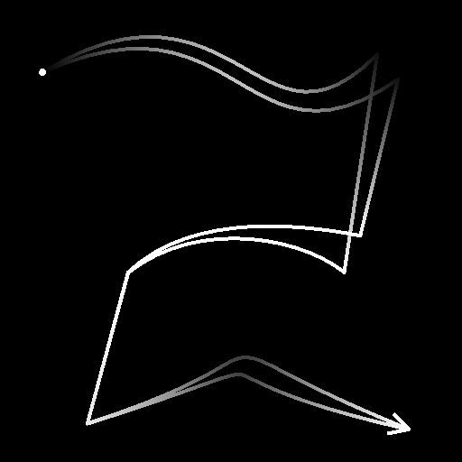

# 樣條合併列表

<table>
<tr style="border: 0;">
<td style="border: 0;" valign="top">

<table>
<tr style="border: 0;">
<td width="33.33%" style="border: 0;" valign="top">

<b>收錄於：</b> 樣條與路徑工具 > 樣條鍵工具

</td>
<td width="100.00%" style="border: 0;" valign="top">

## 說明

將輸入清單中的所有樣條線合併成單一樣條線。

</td>
</tr>
</table>

## 輸入連接器

<b>樣條座標</b> *色彩*&#x200B;輸入樣條點的座標編碼在彩色影像的 RGBA 通道中：\
<b>    R</b> - X 位置\
<b>    G</b> - Y 位置\
<b>    B</b> - 身高\
<b>A</b> - 打包資料：\
* 符號：樣條鍵為閉（負）或開（正）;\
* 絕對值：厚度 + 1。

<b>樣條資料</b> *色彩*&#x200B;輸入樣條的額外資料編碼於彩色影像的 RGBA 通道中。\
<b>    R</b> - 切線 X\
<b>    G</b> - 切線 Y\
<b>    B</b> - 未上場\
<b>    A</b> - 未上場

<b>樣條量</b> *整數*：輸入樣條的數量。

## 輸出連接器

<b>預覽</b> *灰階*&#x200B;合併樣條線的預覽影像為灰階影像。

<b>樣條座標</b> *顏色*：合併後樣條點的座標編碼在彩色影像的RGBA通道中。\
<b>R</b> - X 位置\
<b>G</b> - Y 位置\
<b>B</b> - 身高\
<b>A</b> - 打包資料：\
* 符號：樣條鍵為閉（負）或開（正）;\
* 絕對值：厚度 + 1。

<b>樣條資料</b> *色彩*&#x200B;合併樣條線的額外資料編碼於彩色影像的 RGBA 通道中。\
<b>R</b> - 切線 X\
<b>G</b> - 切線 Y\
<b>B</b> - 未上場\
<b>A</b> - 未上場

<b>樣條量</b> *整數*：合併樣條的數量。

## 參數

<b>封閉樣條距離閾值</b> *浮點*：在貼圖空間中，將同一樣條曲線的兩端作為一個收斂該樣條線的單一點處理的距離。\
這可避免在散射形狀或將影像映射到樣條曲線時產生重疊。

+++預覽
<b>分段數量</b> *整數*&#x200B;調整預覽輸出中繪製樣條曲線視覺化所使用的段數。\
數值越高，線條越平滑。

<b>節目指導助理</b> *布林值*&#x200B;在預覽輸出中會在樣條曲線的起始處顯示一個點，在末端顯示一個箭頭。

<b>顯示厚度包絡</b> *布林值*\
在樣鍵厚度邊緣顯示額外線條。

<b>厚度（px）</b> *浮點*&#x200B;調整預覽輸出中樣條曲線的厚度（像素數）。

+++

## 範例

<table>
<tr style="border: 0;">
<td style="border: 0;" valign="top">

<table>
  <tr>
    <td>
      
       <i>之前</i>
    </td>
    <td>
      
       <i>之後</i>
    </td>
  </tr>
</table>

</td>
<td style="border: 0;" valign="top">

<table>
  <tr>
    <td>
      
       <i>之前</i>
    </td>
    <td>
      
       <i>之後</i>
    </td>
  </tr>
</table>

</td>
</tr>
</table>

</td>
<td style="border: 0;" valign="top">

</td>
<td style="border: 0;" valign="top">

</td>
</tr>
</table>
