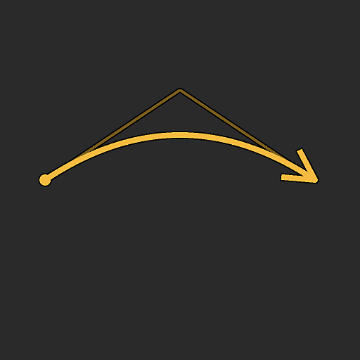
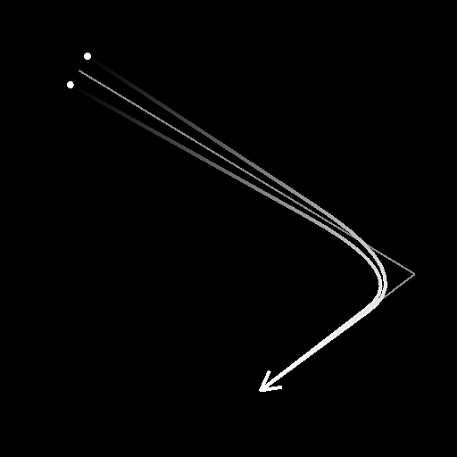
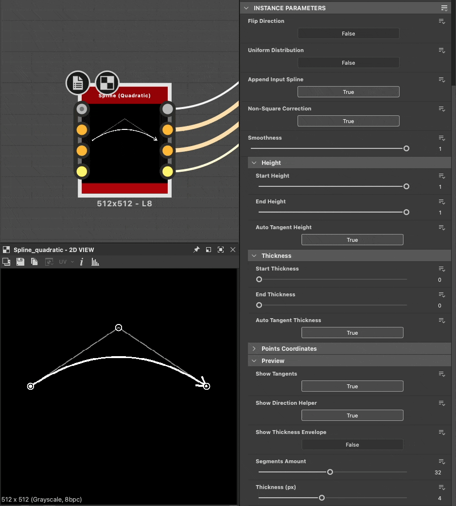

# 樣條曲線（二次曲線）

<table>
<tr style="border: 0;">
<td width="33.33%" style="border: 0;" valign="top">

<b>收錄於：</b> 樣條與路徑工具 > 樣條鍵工具

</td>
<td width="100.00%" style="border: 0;" valign="top">

## 說明

在任意位置的兩點 <b>p1</b> 與 <b>p3</b> 之間產生單一樣條曲線。

樣條的軌跡由 p1 的<b>「出」切線和 p3</b> 的<b>「入」切線控制，兩者&#x200B;*皆*&#x200B;由單一點 <b>p3</b></b> 控制。

樣條所形成的弧度跨度可 *調整*，使其從兩端部分軌跡保持直線。

</td>
</tr>
</table>

## 輸入

|  |  |
|:---|:---|
| <b>預覽</b> <i>灰階</i> | 輸入樣條線預覽為灰階影像。 |
| <b>樣條座標</b> <i>顏色</i> | 彩色影像RGBA通道中編碼的輸入樣條點座標： <b>R</b> - X 位置 <b>G</b> - Y 位置 <b>B</b> - 高度 <b>A</b> - 打包資料： - 符號：樣條線為閉合（負）或開（正）; - 絕對值：厚度 + 1。 |
| <b>樣條資料</b> <i>顏色</i> | 彩色影像RGBA通道中編碼的輸入樣條額外資料： <b>R</b> - 切線 X <b>G</b> - 切線 Y <b>B</b> - 切線 Z <b>A</b> - 未使用 |
| <b>樣條量</b> <i>整數</i> | 輸入樣條的數量。 |

## 輸出

|  |  |
|:---|:---|
| <b>預覽</b> <i>灰階</i> | 輸出時條線預覽為灰階影像。 |
| <b>樣條座標</b> <i>顏色</i> | 彩色影像RGBA通道中編碼的輸出樣條點座標： <b>R</b> - X 位置 <b>G</b> - Y 位置 <b>B</b> - 高度 <b>A</b> - 填充資料： - 符號：樣條為閉合（負）或開（正）; - 絕對值：厚度 + 1。 |
| <b>樣條資料</b> <i>顏色</i> | 彩色影像RGBA通道中編碼的輸出樣條額外資料： <b>R</b> - 切線 X <b>G</b> - 切線 Y <b>B</b> - 切線 Z <b>A</b> - 未使用 |
| <b>樣條量</b> <i>整數</i> | 輸出花鍵的數量。 |

## 參數

|  |  |
|:---|:---|
| <b>翻轉方向</b> <i>布林值</i> | 會反轉花鍵的方向。 |
| <b>均勻分布</b> <i>布林值</i> | 當為真</i>時<i>，樣鍵的點從開始到結束均勻分布...... |
| <b>附加輸入樣條線</b> <i>布林值</i> | 將產生的樣條曲線加入連接樣條</b>輸入的樣條<b>曲線清單末尾。 |
| <b>非平方修正</b> <i>布林值</i> | 調整點的位置與厚度，以在非正方形解析度下保留樣條形狀。 這也影響均勻分布。 |
| <b>平滑度</b> <i>浮標</i> | 調整 <i>樣鍵形成弧度的跨度</i> ，1表示樣鍵全長為弧形，0則表示樣鍵完全直線。 弧線從點 <b>p3</b> 沿著樣條線延伸至其端點。 |
| <b>高度</b> |  |
| <b>起始高度</b> <i>浮標</i> | 調整p1</b>點的高度<b>，當值越低代表位置越低或越深。 這會影響花鍵在 p1</b> 處<b>的高度。 |
| <b>端高度</b> <i>浮標</i> | 調整p3</b>點的高度<b>，值越低表示位置越低或越深。 這會影響 p3</b> 處<b>花鍵的厚度。 |
| <b>自動切線高度</b> <i>布林值</i> | 調整p3</b>點的高度<b>，值越低表示位置越低或越深。 這會影響 p3</b> 處<b>花鍵的厚度。 |
| <b>切線高度</b> <i>浮標</i> | 調整由 <b>p2</b> 點控制的切線驅動的高度。 這會影響樣條<b>曲線從 p1</b> 畫出並進入 <b>p3</b> 的高度。 <i>注意：</i>此參數僅在自動切線高度</b>設為「False」時可用<b>。 |
| <b>厚度</b> |  |
| <b>起始厚度</b> <i>浮標</i> | 調整 p1</b> 尖端的<b>厚度。這會影響 p1</b> 處<b>樣條鍵的厚度。 <i>注意：</i>厚度用於特定的樣條節點。 |
| <b>端部厚度</b> <i>浮標</i> | 調整 p3</b> 尖端的<b>厚度。這會影響花鍵在 p3</b> 處<b>的厚度。 <i>注意：</i>厚度用於特定的花鍵節點。 |
| <b>自動切線厚度</b> <i>布林值</i> | 自動設定樣條切線的厚度，從起始厚度</b>線性插值<b>到<b>終點厚度</b>。 <i>注意：</i>厚度用於特定樣條節點。 |
| <b>切線厚度</b> <i>浮標</i> | 調整由 <b>p2</b> 點控制的切線驅動的厚度。 這會影響樣條線從 p1</b> 拉遠<b>進入 <b>p3</b> 時的厚度。 <i>注意：</i>厚度是特定花條節點使用的。 <i>註 2：</i>此參數僅在自動切線厚度</b>設為「False」時可用<b>。 |
| <b>點座標</b> |  |
| <b>第1頁</b> <i>Float2</i> | 設定 p1</b> 點在貼圖空間中的位置<b>。 |
| <b>第二頁</b> <i>Float2</i> | 設定 p2</b> 點在貼圖空間中的位置<b>。 <b>p2</b> 點控制 <i></i> p1</b> 和 <b>p3</b> 點的<b>切線。 |
| <b>第三頁</b> <i>Float2</i> | 設定 p3</b> 點在貼圖空間中的位置<b>。 |
| <b>預覽</b> |  |
| <b>節目旁線</b> <i>布林值</i> | 在預覽</b>輸出中顯示 <b>p1</b> 點「出」切線和 <b>p3</b> 點「入」切線<b>。會反轉花鍵的方向。 |
| <b>顯示方向助手</b> <i>布林值</i> | 在預覽</b>輸出中，樣條曲線起始顯示一個點，末尾<b>顯示箭頭。 |
| <b>顯示厚度包絡</b> <i>布林值</i> | 在樣鍵厚度邊緣顯示額外線條。 |
| <b>分段數量</b> <i>整數</i> | 調整預覽輸出中繪製樣條<b></b>曲線視覺化所需的線段數。 數值越高，線條越平滑。 |
| <b>厚度（px）</b> <i>浮標</i> | 調整預覽輸出中<b></b>樣條曲線的像素厚度。 |

## 範例

<table>
<tr style="border: 0;">
<td style="border: 0;" valign="top">

{zoomable="yes"}

</td>
<td style="border: 0;" valign="top">

{zoomable="yes"}

</td>
</tr>
</table>

<table>
<tr style="border: 0;">
<td style="border: 0;" valign="top">

{zoomable="yes"}

</td>
<td style="border: 0;" valign="top">

</td>
</tr>
</table>
