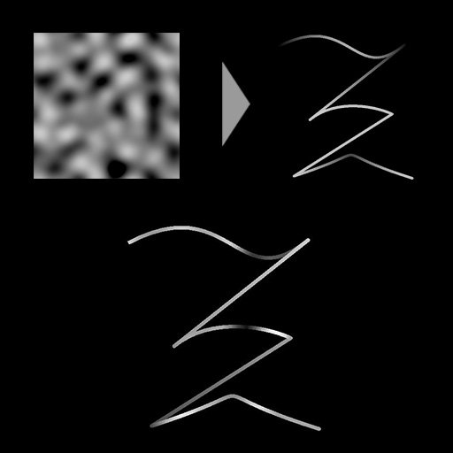

# 樣條樣本高度

<table>
<tr style="border: 0;">
<td style="border: 0;" valign="top">

<table>
<tr style="border: 0;">
<td width="33.33%" style="border: 0;" valign="top">

<b>收錄於：</b> 樣條與路徑工具 > 樣條鍵工具

</td>
<td width="100.00%" style="border: 0;" valign="top">

## 說明

透過將輸入的高度貼圖映射到輸入樣條上來修改其高度。

映射高度圖的效果可以透過改變混合模式及效果的不透明度來調整。

</td>
</tr>
</table>

## 輸入連接器

<b>預覽</b> *灰階*&#x200B;輸入樣條的預覽為灰階影像。

<b>樣條座標</b> *色彩*&#x200B;輸入樣條點的座標編碼在彩色影像的 RGBA 通道中：\
<b>R</b> - X 位置\
<b>G</b> - Y 位置\
<b>B</b> - 身高\
    <b>A</b> - 打包資料：\
* 符號：樣條鍵為閉（負）或開（正）;\
* 絕對值：厚度 + 1。

<b>樣條資料</b> *色彩*&#x200B;輸入樣條的額外資料編碼於彩色影像的 RGBA 通道中。\
<b>R</b> - 切線 X\
<b>G</b> - 切線 Y\
<b>B</b> - 未上場\
<b>A</b> - 未上場

<b>樣條量</b> *整數*：輸入樣條的數量。

<b>高度圖</b> *灰階*&#x200B;輸入灰階影像用於改變輸入樣條線的高度。

## 輸出連接器

<b>預覽</b> *灰階*&#x200B;輸出樣條的預覽作為灰階影像。

<b>樣條座標</b> *顏色*&#x200B;指編碼在彩色影像RGBA通道中的輸出樣條點座標。\
    <b>R</b> - X 位置\
    <b>G</b> - Y 位置\
    <b>B</b> - 身高\
    <b>A</b> - 打包資料：\
* 符號：樣條鍵為閉（負）或開（正）;\
* 絕對值：厚度 + 1。

<b>樣條資料</b> *色彩*&#x200B;輸出樣條的額外資料編碼於彩色影像的RGBA通道中。\
    <b>R</b> - 切線 X\
    <b>G</b> - 切線 Y\
    <b>B</b> - 未上場\
    <b>A</b> - 未上場

<b>樣條量</b> *整數*：輸出樣條的數量。

## 參數

<b>取樣模式</b> *整數*&#x200B;將高度映射中值映射到樣條的方法：\
*- 貼圖空間*：這些值會套用到樣條（spline）上，若使用貼圖的 UV 座標放置於貼圖中，該點樣條會放在的位置。 這實際上將值套用到「已就位」的樣條曲線上;\
*- 水平沿樣條線*：數值直接套用到編碼的樣條座標（參見樣條座標輸入），每列從上到下分別套用到不同的樣條曲線;\
*- 霍爾。 沿樣條曲線（蘭德。 偏移量 X）：*&#x200B;這些值直接套用到編碼後樣條的座標（參見樣條座標輸入），每個樣條曲線（即樣條座標中的每一列）在縮放映射中隨機進行水平偏移;\
*- 霍爾。 沿樣條曲線（蘭德。 偏移 Y）：*&#x200B;這些值直接套用到編碼後樣條的座標（參見樣條座標輸入），每個樣條曲線（即樣條座標中的每一列）在縮放映射中隨機垂直偏移。

<b>不透明度</b> *浮點* A 乘數表示高度圖輸入對樣條線高度的強度貢獻。<b></b>

<b>混合模式</b> *整數*&#x200B;將高度圖資料與輸入樣條線高度混合的方法：\
*- 複製*：用 Height Map 值覆寫樣條線的高度;\
*- 新增*：將高度貼圖值加入樣條線的高度;\
*- 減法*：將高度貼圖值減去樣條線的高度;\
*- 乘法*：將高度圖值與樣條線高度相乘。

+++預覽
<b>分段數量</b> *整數*&#x200B;調整預覽輸出中繪製樣條曲線視覺化所使用的段數。\
數值越高，線條越平滑。

<b>節目指導助理</b> *布林值*&#x200B;在預覽輸出中會在樣條曲線的起始處顯示一個點，在末端顯示一個箭頭。

<b>顯示厚度包絡</b> *布林值*\
在樣鍵厚度邊緣顯示額外線條。

<b>厚度（px）</b> *浮點*&#x200B;調整預覽輸出中樣條曲線的厚度（像素數）。

+++

## 範例

<table>
<tr style="border: 0;">
<td style="border: 0;" valign="top">

<table>
  <tr>
    <td>
      
       <i>之前</i>
    </td>
    <td>
      
       <i>之後</i>
    </td>
  </tr>
</table>

</td>
<td style="border: 0;" valign="top">

<table>
  <tr>
    <td>
      
       <i>之前</i>
    </td>
    <td>
      
       <i>之後</i>
    </td>
  </tr>
</table>

</td>
</tr>
</table>

<table>
<tr style="border: 0;">
<td style="border: 0;" valign="top">

</td>
<td style="border: 0;" valign="top">

</td>
</tr>
</table>

</td>
<td style="border: 0;" valign="top">

</td>
<td style="border: 0;" valign="top">

</td>
</tr>
</table>
