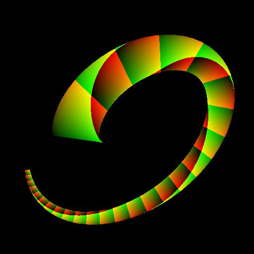
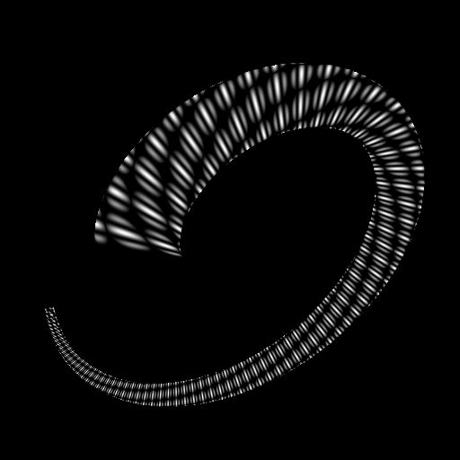

# UV 映射器灰階

<table>
<tr style="border: 0;">
<td width="33.33%" style="border: 0;" valign="top">

<b>收錄於：</b> 樣條與路徑工具 > 樣條鍵工具

</td>
<td width="100.00%" style="border: 0;" valign="top">

## 說明

利用 UV 輸入提供的座標映射輸入的灰階影像。

</td>
</tr>
</table>

>[!NOTE]
>
> 另 [見 UV 映射器色彩](../../../../../../compositing-graphs/nodes-reference-for-com/node-library/spline-paths-tools/spline-tools/uv-mapper-color/uv-mapper-color.md)。

## 輸入

|  |  |
|:---|:---|
| <b>紫外線</b> <i>顏色</i> | 影像座標編碼於彩色影像的紅色（U）與綠色（V）通道中。 |
| <b>輸入</b> <i>顏色</i> | 灰階影像應該映射到 UV 輸入中提供的座標。 |

## 輸出

|  |  |
|:---|:---|
| <b>產出</b> <i>顏色</i> | 這是將輸入影像利用輸入 UV 座標映射成灰階影像的結果。 |

## 範例

<table>
<tr style="border: 0;">
<td style="border: 0;" valign="top">

<table>
  <tr>
    <td>
      
       <i>之前</i>
    </td>
    <td>
      
       <i>之後</i>
    </td>
  </tr>
</table>

</td>
<td style="border: 0;" valign="top">

<table>
  <tr>
    <td>
      
       <i>之前</i>
    </td>
    <td>
      
       <i>之後</i>
    </td>
  </tr>
</table>

</td>
</tr>
</table>

