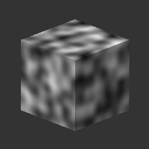

# 3D Perlin 雜訊

<table>
<tr style="border: 0;">
<td width="33.33%" style="border: 0;" valign="top">

{width="200px"}

<b>收錄於：</b> 貼圖產生器>噪音

</td>
<td width="100.00%" style="border: 0;" valign="top">

## 說明

<b>3D Perlin 噪聲</b>節點根據位置圖</b>輸入在三維空間<b>中產生 Perlin 噪聲。

此節點可用 Cube 3D GBuffers[&#128279;](../../../../../../compositing-graphs/nodes-reference-for-com/node-library/texture-generators/patterns/cube-3d-gbuffers/cube-3d-gbuffers.md) 作為輸入，取代實際烘焙的貼圖（如下方範例圖片所示）進行測試。

</td>
</tr>
</table>

>[!WARNING]
>
> 這種雜訊僅用於 <i>GPU 引擎</i>（例如 <b>Direct3D</b> 或 <b>OpenGL）。</b>到 <b>工具>切換引擎......</b> 或按 <b>F9</b> 鍵選擇想要的引擎。

## 參數

|  |  |
|:---|:---|
| <b>倒轉</b> <i>布林值</i> | 將輸出影像反轉。 |
| <b>規模</b> <i>浮標</i> | 控制 3D Perlin 雜訊的比例。 |
| <b>規模</b> <i>Float3</i> | 控制 X</b>、<b>Y</b> 和 <b>Z</b> 軸上 <b>3D Perlin 雜訊的大小。不均勻的數值會導致 <i>拉伸或壓縮</i> 效果。 |
| <b>偏移</b> <i>Float3</i> | 對 X</b>、<b>Y</b> 和 <b>Z</b> 軸上 3D Perlin 雜訊<b>的位置</i>施加偏移<i>。 |
| <b>失真強度</b> <i>浮標</i> | 控制對 3D Perlin 雜訊施加的扭曲效果</i>強度<i>。 |
| <b>失真尺度倍增器</b> <i>浮標</i> | 控制扭曲效果中變形圖案</i>的尺度<i>，由變形強度</b>控制<b>。 |
| <b>基線</b> <i>浮標</i> | 對3D Perlin雜訊值分布的基準亮度</i>值施加<i>偏移</i>。<i> |
| <b>對比</b> <i>浮標</i> | 調整 3D Perlin 雜訊的對比度。 |
| <b>絕對</b> <i>布林值</i> | 在 3D Perlin 雜訊中使用絕對值。 這實際上<i>是</i>反轉低於0.5</i>值<i>的值分布。 |
| <b>啟用平鋪</b> <i>布林值</i> | 調整 3D Perlin 雜訊，使其產生的圖案 <i>在 X、Y 和 Z 軸上重複</i> 出現。 |

## 範例

<table style="margin-top: 32px; margin-bottom: 32px">
    <tr style="border: 0">
        <td style="border: 0; background: transparent">
            
        </td>
        <td style="border: 0; background: transparent">
            
        </td>
        <td style="border: 0; background: transparent">
            
        </td>
    </tr>
</table>
