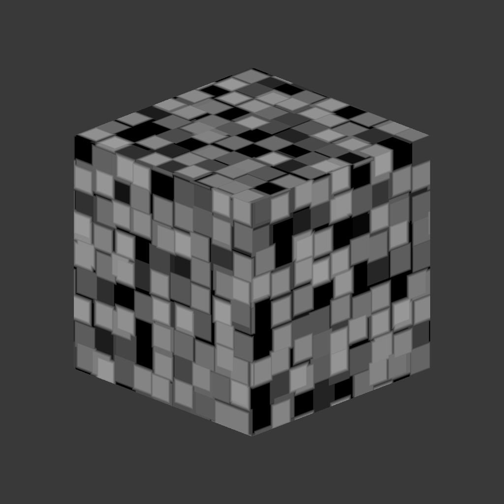

# 3D 沃羅諾伊

<table>
<tr style="border: 0;">
<td width="41.60%" style="border: 0;" valign="top">

{width="200px"}

**收錄於：***材質產生器**/噪音*

**中級**

</td>
<td width="58.30%" style="border: 0;" valign="top">

## 說明

**3D Voronoi** 節點根據位置圖&#x200B;**輸入在 3D 空間**&#x200B;中產生 Voronoi 雜訊。

此節點可用 Cube 3D GBuffers](../../../../../../compositing-graphs/nodes-reference-for-com/node-library/texture-generators/patterns/cube-3d-gbuffers/cube-3d-gbuffers.md) 作為輸入，取代實際烘焙的貼圖（如下方範例圖片所示）進行測試[。

>[!WARNING]
>
> 這種雜訊僅用於 *GPU 引擎*（例如 **Direct3D** 或 **OpenGL）。**&#x200B;到 **工具>切換引擎......** 或按 **F9** 鍵選擇想要的引擎。

</td>
</tr>
</table>

## 參數

* **反布***林*\
  將輸出影像反轉。
* **比例***浮球*\
  控制 3D Voronoi 噪音的比例。\
  *注意*：當&#x200B;**任一&#x200B;*軸啟用*平鋪**&#x200B;時，縮放調整會被&#x200B;*階梯調整*。這是預料之中的。
* **尺寸** *Float3*\
  控制 X **、** Y **和** Z **軸 3D Voronoi 雜訊**&#x200B;的大小。不均勻的數值會導致 *拉伸或壓縮* 效果。\
  *注意*：當&#x200B;**任一&#x200B;*軸啟用*平鋪**&#x200B;時，大小調整會是&#x200B;*階*&#x200B;梯式的。這是預料之中的。
* **偏移** *Float3*\
  對 3D Voronoi 雜訊在 X **、** Y **和** Z **軸的位置施加偏移&#x200B;**。**
* **混亂** *Float3*\
  隨機偏移的強度&#x200B;*，分別施加在X **軸、**Y **軸和**Z **軸的雜訊**點*&#x200B;上。
* **失真強度***浮球*\
  控制對 3D Voronoi 噪音施加的扭曲效果&#x200B;*強度*。
* **失真尺度乘法***浮點*\
  控制扭曲效果中變形圖案&#x200B;*的尺度*，由變形強度&#x200B;**控制**。
* **圓弧浮***球*\
  繞&#x200B;*過噪音的每個點，使斜*&#x200B;率&#x200B;*呈現*&#x200B;凸面。\
  *注意* ：當 **Style** 參數設為 *Edge* 時，此參數不可用。
* **距離刻度***浮點*\
  調整 *噪音點周圍梯度* 的距離。
* **距離模式***整數*\
  設定計算雜訊中每一點周圍距離梯度&#x200B;*的方法*：
  * *歐幾里得*
  * *曼哈頓*
  * *切比雪夫*
  * *明可夫斯基*
* **明可夫斯基數字***花車*\
  閔可夫斯基距離的階數 *p* 。 若將距離梯度劃分為象限，該數值對這些象限的影響如下：
  * p 恰好&#x200B;*是* 1：直線
  * p 小&#x200B;**&#x200B;於 1：凹面
  * p 大&#x200B;**&#x200B;於 1：凸\
    有趣的價值觀：\
    *- 1.0*：曼哈頓距離\
    *- 2.0*：歐幾里得距離\
    *- 無限大*：切比雪夫距離\
    *注意*：此參數僅在距離 **模式** 參數設為 *Minkowski* 時可用。
* **樣式***整數*&#x200B;設定&#x200B;**&#x200B;渲染 3D Voronoi 雜訊資料的方法，考慮雜訊基於三維空間中的一組點：
  * *F1*：三維空間中距離最近點&#x200B;*的*&#x200B;距離
  * *F2*：三維空間中第二接近點&#x200B;*的*&#x200B;距離
  * *F2-F1*- *F1\* F2 *-* F1/F2 *-*&#x200B;邊緣&#x200B;*：*&#x200B;三維空間中雜訊各單元* 之間的邊
  * *隨機顏色*：為三維空間中每個噪聲單元指派一個&#x200B;*隨機的平面色*
* **邊緣厚度***浮動*&#x200B;調整 3D Voronoi 雜訊單元間偵測到的邊緣厚度。邊緣在 X、Y 和 Z 軸上被偵測，因此根據細胞 *深度*&#x200B;不同，某些厚度可能增長得更快。\
  *注意*：此參數僅在 Style **參數設為 *Edge* 時可用**。
* **啟用平鋪布***林*\
  調整 3D Voronoi 噪音，使其產生的圖案 *在 X、Y 和 Z 軸重複* 出現。

## 範例圖片

<table>
<tr style="border: 0;">
<td style="border: 0;" valign="top">

{width="256px"}

</td>
<td style="border: 0;" valign="top">

{width="256px"}

</td>
<td style="border: 0;" valign="top">

{width="256px"}

</td>
<td style="border: 0;" valign="top">

{width="256px"}

</td>
<td style="border: 0;" valign="top">

{width="256px"}

</td>
<td style="border: 0;" valign="top">

{width="256px"}

</td>
</tr>
</table>
