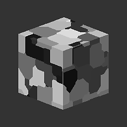
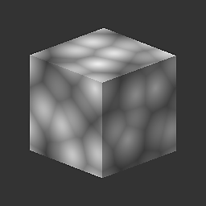

# 3D 沃利噪音

<table>
<tr style="border: 0;">
<td width="33.33%" style="border: 0;" valign="top">

{width="128px"}

<b>收錄於：</b> 貼圖產生器>噪音

</td>
<td width="100.00%" style="border: 0;" valign="top">

## 說明

它是函式庫中最多功能且先進的噪音之一，根據輸入位置映射在三維空間中產生 Worley 噪音。 有很多選項，讓它比標準 [的 Cells](../../../../../../compositing-graphs/nodes-reference-for-com/node-library/texture-generators/noises/cells-1/cells-1.md)或 [距離](../../../../../../compositing-graphs/nodes-reference-for-com/atomic-nodes/distance/distance.md)噪音更有力。

</td>
</tr>
</table>

## 參數

|  |  |
|:---|:---|
| <b>規模</b> <i>1 - 64</i> | 設定效果的全域尺度。 |
| <b>規模</b> <i>0.0 - 1.0</i> | 分別對 X、Y 和 Z 軸進行非均勻縮放。 |
| <b>模式</b> <i>歐幾里得、曼哈頓、切比雪夫、明可夫斯基</i> | 改變距離指標。 這樣可以產生非常不同的噪音類型。 |
| <b>明可夫斯基數</b> <i>0.0 - 20.0</i> | 只有明可夫斯基距離指標才會如此。 混合不同指標類型。 |
| <b>風格</b> <i>F1、F2、F2-F1、邊框、隨機顏色</i> | 設定公制組合的數學。 這樣可以有更多組合。 |
| <b>邊界寬度</b> <i>0.0 - 1.0</i> | 當邊框組合數學啟動時，會控制邊界的寬度。 |
| <b>圓頂</b> <i>0.0 - 1.0</i> | 僅支援 F1、F2 及 F2-F1 模式。 將水平設定在中間位置。 |
| <b>倒轉</b> <i>錯誤/真實</i> | 結果會被反轉。 |

## 範例

<table style="margin-top: 32px; margin-bottom: 32px">
    <tr style="border: 0">
        <td style="border: 0; background: transparent">
            
        </td>
        <td style="border: 0; background: transparent">
            
        </td>
        <td style="border: 0; background: transparent">
            
        </td>
        <td style="border: 0; background: transparent">
            
        </td>
    </tr>
</table>
