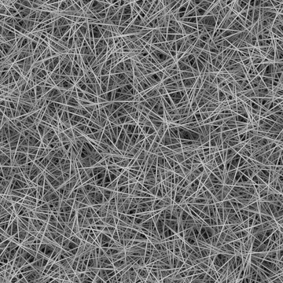

# 方向刮擦

<table>
<tr style="border: 0;">
<td width="33.33%" style="border: 0;" valign="top">

{width="200px"}

<b>收錄於：</b> 貼圖產生器>噪音

</td>
<td width="100.00%" style="border: 0;" valign="top">

## 說明

隨機散落的刮痕圖案，角度和大小可調整。

</td>
</tr>
</table>

## 輸出

|  |  |
|:---|:---|
| <b>產出</b> <i>灰階</i> | 產生的雜訊以灰階位圖形式呈現。 |

## 參數

|  |  |
|:---|:---|
| <b>規模</b> <i>整數</i> | 用來產生噪音磚塊的網格細分。    數值越高，抽到的方塊越多，噪音也越密集。 |
| <b>混亂</b> <i>浮標</i> | 取代噪音的成分。    這可以用來動畫噪音。 |
| <b>無序速度</b> <i>浮標</i> | 調整由 <b>無序</b> 參數所施加的位移距離。    這可用於控制噪聲動畫時的位移速度。 |
| <b>無序各向異性</b> <i>浮標</i> | 控制無序</b>參數所施加<b>的位移方向範圍，值越高，方向越窄且更明確。方向由 <b>無序各向異性角度</b> 參數控制。 |
| <b>無序各向異性角</b> <i>浮標</i> | 控制無序</b>參數施加位移<b>的方向，當<b>無序各向</b>異性參數非零時。 |
| <b>角度</b> <i>浮標</i> | 角度用來設定刮痕方向，從水平向右開始轉彎數。 |
| <b>角度隨機</b> <i>浮標</i> | 隨機變化的最大幅度應用於 <b>角度</b> 值，以匝數計。 |
| <b>圖案數量</b> <i>浮標</i> | 這是散落在刮痕圖案數量上的乘數。 |
| <b>圖案尺寸</b> <i>Float2</i> | 抓刮圖的邊界盒大小。    Y 值控制刮痕的最大長度。 |
| <b>圖案大小隨機</b> <i>Float2</i> | 這是針對刮痕隨機降比例的乘數。    Y 值是用來計算刮痕長度的。 |
| <b>磁磚偏移</b> <i>Float2</i> | 控制用於渲染噪音的無限平面部分的位置。 |
| <b>非平方展開</b> <i>布林值</i> | 在非正方形影像中，保持產生的磁磚方正，並將雜訊產生擴展到影像的範圍。 |

## 範例

<table>
<tr style="border: 0;">
<td style="border: 0;" valign="top">

{zoomable="yes"}

</td>
<td style="border: 0;" valign="top">

{zoomable="yes"}

</td>
</tr>
</table>

<table>
<tr style="border: 0;">
<td style="border: 0;" valign="top">

{zoomable="yes"}

</td>
<td style="border: 0;" valign="top">

{zoomable="yes"}

</td>
</tr>
</table>

<table>
<tr style="border: 0;">
<td style="border: 0;" valign="top">

{zoomable="yes"}

</td>
<td style="border: 0;" valign="top">

</td>
</tr>
</table>
