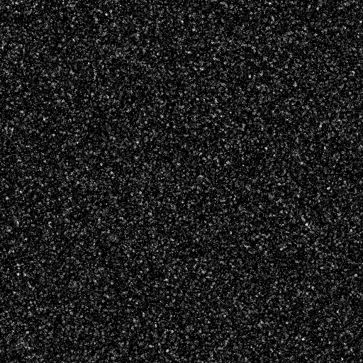
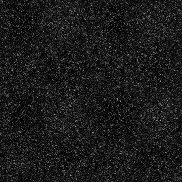

# 泥土5

<table>
<tr style="border: 0;">
<td width="33.33%" style="border: 0;" valign="top">

{width="200px"}

<b>收錄於：</b> 貼圖產生器>噪音

</td>
<td width="100.00%" style="border: 0;" valign="top">

## 說明

這是顆粒 <b>感十足的 Dirt</b> 聲音的變奏。

另見： [Dirt 1](../../../../../../compositing-graphs/nodes-reference-for-com/node-library/texture-generators/noises/dirt-1/dirt-1.md)、 [Dirt 2](../../../../../../compositing-graphs/nodes-reference-for-com/node-library/texture-generators/noises/dirt-2/dirt-2.md)、 [Dirt 3](../../../../../../compositing-graphs/nodes-reference-for-com/node-library/texture-generators/noises/dirt-3/dirt-3.md)、 [Dirt 4](../../../../../../compositing-graphs/nodes-reference-for-com/node-library/texture-generators/noises/dirt-4/dirt-4.md)、 [Dirt 漸變](../../../../../../compositing-graphs/nodes-reference-for-com/node-library/texture-generators/noises/dirt-gradient/dirt-gradient.md)

</td>
</tr>
</table>

## 輸出

|  |  |
|:---|:---|
| <b>產出</b> <i>灰階</i> | 產生的雜訊以灰階位圖形式呈現。 |

## 參數

|  |  |
|:---|:---|
| <b>規模</b> <i>整數</i> | 用來產生噪音磚塊的網格細分。    數值越高，抽到的方塊越多，噪音也越密集。 |
| <b>混亂</b> <i>浮標</i> | 取代噪音的成分。    這可以用來動畫噪音。 |
| <b>無序速度</b> <i>浮標</i> | 調整由 <b>無序</b> 參數所施加的位移距離。    這可用於控制噪聲動畫時的位移速度。 |
| <b>無序各向異性</b> <i>浮標</i> | 控制無序</b>參數所施加<b>的位移方向範圍，值越高，方向越窄且更明確。方向由 <b>無序各向異性角度</b> 參數控制。 |
| <b>無序各向異性角</b> <i>浮標</i> | 控制無序</b>參數施加位移<b>的方向，當<b>無序各向</b>異性參數非零時。 |
| <b>磁磚偏移</b> <i>Float2</i> | 控制用於渲染噪音的無限平面部分的位置。 |
| <b>非平方展開</b> <i>布林值</i> | 在非正方形影像中，保持產生的磁磚方正，並將雜訊產生擴展到影像的範圍。 |

## 範例

<table>
<tr style="border: 0;">
<td style="border: 0;" valign="top">

{zoomable="yes"}

</td>
<td style="border: 0;" valign="top">

{zoomable="yes"}

</td>
</tr>
</table>

<table>
<tr style="border: 0;">
<td style="border: 0;" valign="top">

{zoomable="yes"}

</td>
<td style="border: 0;" valign="top">

{zoomable="yes"}

</td>
</tr>
</table>
