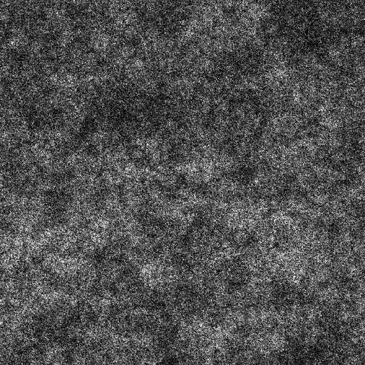

# 分形和 2

<table>
<tr style="border: 0;">
<td width="33.33%" style="border: 0;" valign="top">

{width="200px"}

<b>收錄於：</b> 貼圖產生器>噪音

</td>
<td width="100.00%" style="border: 0;" valign="top">

## 說明

分形和</b>音的變體<b>。

另見： [分形和基底](../../../../../../compositing-graphs/nodes-reference-for-com/node-library/texture-generators/noises/fractal-sum-base/fractal-sum-base.md)、 [分形和 1](../../../../../../compositing-graphs/nodes-reference-for-com/node-library/texture-generators/noises/fractal-sum-1/fractal-sum-1.md)、 [分形和 3](../../../../../../compositing-graphs/nodes-reference-for-com/node-library/texture-generators/noises/fractal-sum-3/fractal-sum-3.md)、 [分形和 4](../../../../../../compositing-graphs/nodes-reference-for-com/node-library/texture-generators/noises/fractal-sum-4/fractal-sum-4.md)

</td>
</tr>
</table>

## 輸出

|  |  |
|:---|:---|
| <b>產出</b> <i>灰階</i> | 產生的雜訊以灰階位圖形式呈現。 |

## 參數

|  |  |
|:---|:---|
| <b>混亂</b> <i>浮標</i> | 取代噪音的成分。    這可以用來動畫噪音。 |
| <b>無序速度</b> <i>浮標</i> | 調整由 <b>無序</b> 參數所施加的位移距離。    這可用於控制噪聲動畫時的位移速度。 |
| <b>非平方展開</b> <i>布林值</i> | 在非正方形影像中，保持產生的磁磚方正，並將雜訊產生擴展到影像的範圍。 |

## 範例

<table style="table-layout:fixed">
    <tr style="border: 0;">
        <td style="border: 0;">
            
        </td>
        <td style="border: 0;">
            
        </td>
        <td style="border: 0;"></td>
    </tr>
</table>
