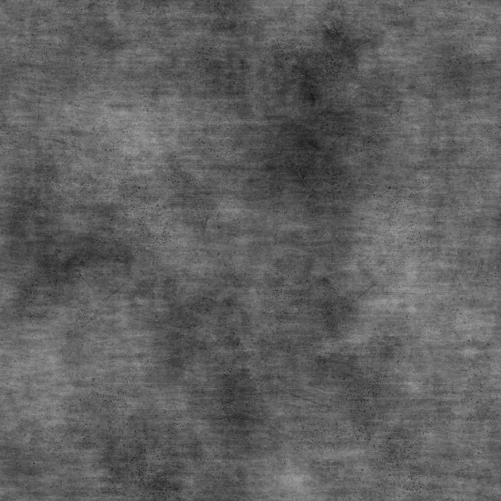

# 垃圾混凝土

<table>
<tr style="border: 0;">
<td width="33.33%" style="border: 0;" valign="top">

{width="200px"}

<b>收錄於：</b> 貼圖產生器>噪音

</td>
<td width="100.00%" style="border: 0;" valign="top">

## 說明

**Grunge Concrete** 節點會產生類似混凝土表面高度圖的 grunge 地圖。

</td>
</tr>
</table>

## 參數

|  |  |
|:---|:---|
| <b>平衡</b> <i>浮標</i> | 調整明暗的平衡。 |
| <b>對比</b> <i>浮標</i> | 調整影像的對比度。 |
| <b>倒轉</b> <i>布林值</i> | 透過運算 `1-x` 反轉影像輸出。 |
| <b>非平方展開</b> <i>布林值</i> | 能以非平方比率補償擠壓與拉伸。 |
| <b>進階</b> |  |
| <b>基底噪聲</b> <i>浮標</i> | 調整基底材質的雜訊。 |
| <b>泥斑不透明度</b> <i>浮標</i> | 調整髒污點的透明度。 |
| <b>反轉泥土</b> <i>布林值</i> | 反轉那些塵埃點的衝擊。 |
| <b>刮痕不透明度</b> <i>浮標</i> | 可以調整刮痕的不透明度。 |
| <b>磨利</b> <i>浮標</i> | 調整施加在影像上的銳化效果強度。 |
| <b>大變異強度</b> <i>浮標</i> | 調整套用到基底紋理的大規模（低頻）變化。 |

## 範例

<table style="margin-top: 32px; margin-bottom: 32px">
    <tr style="border: 0">
        <td style="border: 0; background: transparent">
            
        </td>
    </tr>
</table>
