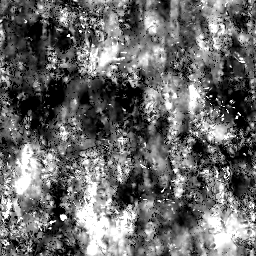
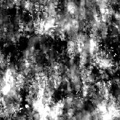

# 垃圾搖滾地圖 013

<table>
<tr style="border: 0;">
<td width="33.33%" style="border: 0;" valign="top">

{width="128px"}

<b>收錄於：</b> 貼圖產生器>噪音

</td>
<td width="100.00%" style="border: 0;" valign="top">

## 說明

這會產生一個複雜的綜合噪聲圖。 它作為詳細程序式非常有用，但要注意這類程序非常耗效能，因此生成速度較慢。

</td>
</tr>
</table>

## 參數

|  |  |
|:---|:---|
| <b>平衡</b> <i>0.0 - 1.0</i> | 它會像調整亮度一樣，將結果的平衡從黑到白。 |
| <b>對比</b> <i>0.0 - 1.0</i> | 調整結果的對比度。 |
| <b>倒轉</b> <i>錯誤/真實</i> | 結果會被反轉。 |
| <b>刷子圖案</b> <i>0.0 - 1.0</i> | 在邊緣加裝遮罩，方便用作刷子 alpha 使用。 |
| <b>非平方展開</b> <i>錯誤/真實</i> | 能以非平方比率補償擠壓與拉伸。 |

## 範例

<table style="margin-top: 32px; margin-bottom: 32px">
    <tr style="border: 0">
        <td style="border: 0; background: transparent">
            
        </td>
    </tr>
</table>
