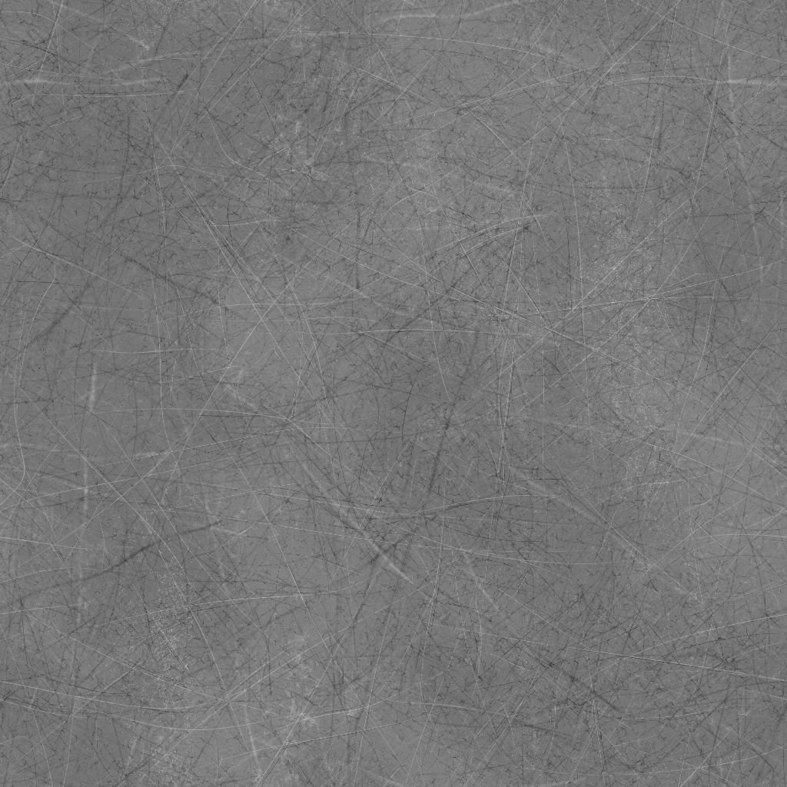

# 垃圾搖滾刮痕髒兮兮

<table>
<tr style="border: 0;">
<td width="33.33%" style="border: 0;" valign="top">

{width="200px"}

<b>收錄於：</b> 貼圖產生器>噪音

</td>
<td width="100.00%" style="border: 0;" valign="top">

## 說明

**Grunge Scratches Dirty** 節點會產生一張類似細刮髒表面的 grunge 地圖。

</td>
</tr>
</table>

## 參數

|  |  |
|:---|:---|
| <b>平衡</b> <i>浮標</i> | 調整明暗的平衡。 |
| <b>對比</b> <i>浮標</i> | 調整影像的對比度。 |
| <b>倒轉</b> <i>布林值</i> | 透過運算 `1-x` 反轉影像輸出。 |
| <b>非平方展開</b> <i>布林值</i> | 能以非平方比率補償擠壓與拉伸。 |
| <b>進階</b> |  |
| <b>基礎垃圾搖滾強度</b> <i>浮標</i> | 調整套用到底面的 grunge 貼圖強度。 |
| <b>刮痕強度</b> <i>浮標</i> | 調整底面刮痕的強度。 |

## 範例

<table style="table-layout:fixed">
    <tr style="border: 0;">
        <td style="border: 0;">
            
        </td>
        <td style="border: 0;">
            
        </td>
        <td style="border: 0;"></td>
    </tr>
</table>
