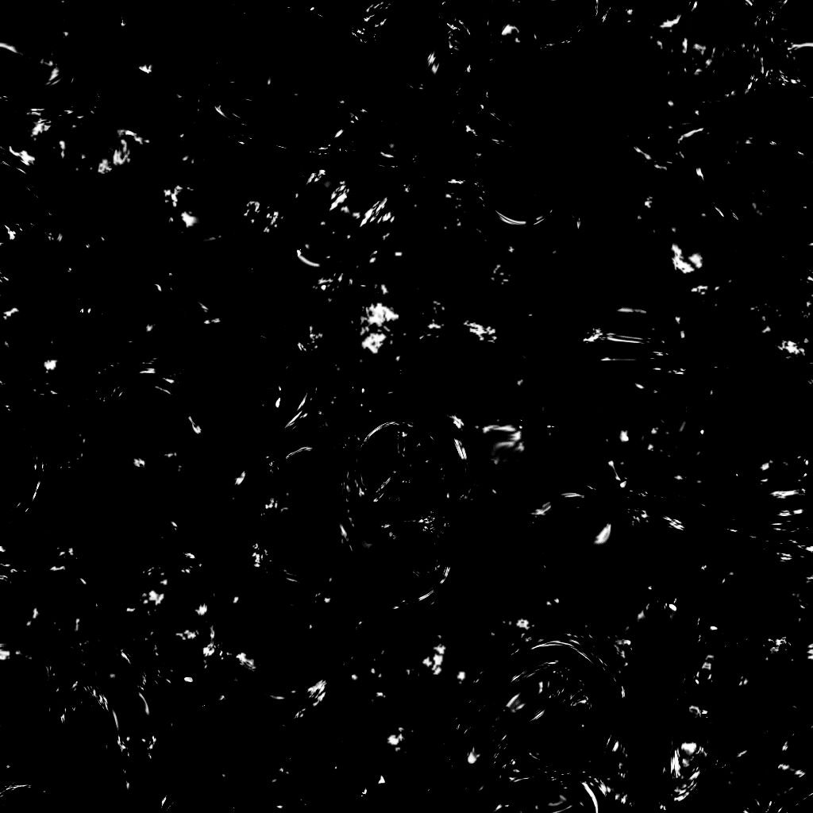

# 垃圾搖滾辨識骯髒

<table>
<tr style="border: 0;">
<td width="41.60%" style="border: 0;" valign="top">

{width="200px"}

**收錄於：***材質產生器**/噪音*

**很簡單**

</td>
<td width="58.30%" style="border: 0;" valign="top">

## 說明

**Grunge Spots Dirty** 節點會產生一張類似泥土斑點的 grunge 地圖。

</td>
</tr>
</table>

## 參數

* **平衡***浮動*&#x200B;調整暗與亮之間的平衡。
* **對比***浮動*&#x200B;調整影像的對比度。
* **反演***布林運算*&#x200B;是透過一個`1-x`運算反轉影像的輸出。
* **非平方展開***布林*&#x200B;以非平方比率補償擠壓與拉伸。
* 進階
  * **覆蓋***浮球*&#x200B;調整泥土覆蓋範圍。
  * **比例***整數*&#x200B;調整泥土斑點的比例。數值越&#x200B;*高，斑*&#x200B;點越細&#x200B;**。

## 範例圖片

<table>
<tr style="border: 0;">
<td style="border: 0;" valign="top">

{width="256px"}

</td>
<td style="border: 0;" valign="top">

{width="256px"}

</td>
</tr>
</table>
