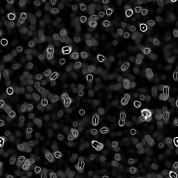

# 顯微鏡視角

<table>
<tr style="border: 0;">
<td width="33.33%" style="border: 0;" valign="top">

{width="128px"}

<b>收錄於：</b> 貼圖產生器>噪音

</td>
<td width="100.00%" style="border: 0;" valign="top">

## 說明

這會產生一種扭曲的聲音，看起來像是顯微鏡下的細菌或生物。

</td>
</tr>
</table>

## 參數

|  |  |
|:---|:---|
| <b>規模</b> <i>0 - 10</i> | 設定了效果的全球尺度。 |
| <b>曲速強度</b> <i>0.0 - 1.0</i> | 設定扭曲效果的強度。 記得你也可以選擇負數，雙擊輸入 -1。 |
| <b>混亂</b> <i>0.0 - 1.0</i> | 相位偏移以引入小幅變化 |
| <b>非平方展開</b> <i>錯誤/真實</i> | 能以非平方比率補償擠壓與拉伸。 |

## 範例

<table style="margin-top: 32px; margin-bottom: 32px">
    <tr style="border: 0">
        <td style="border: 0; background: transparent">
            
        </td>
    </tr>
</table>
