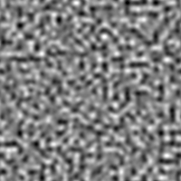

# Perlin 噪聲

<table>
<tr style="border: 0;">
<td style="border: 0;" valign="top">

<table>
<tr style="border: 0;">
<td width="33.33%" style="border: 0;" valign="top">

{width="200px"}

<b>收錄於：</b>貼圖產生器>噪音

</td>
<td width="100.00%" style="border: 0;" valign="top">

## 說明

產生Perlin雜訊，這是一種廣泛使用的灰階平滑分布。

</td>
</tr>
</table>

<table>
<tr style="border: 0;">
<td style="border: 0;" valign="top">

### 輸出

</td>
<td style="border: 0;" valign="top">

### 參數

</td>
<td style="border: 0;" valign="top">

### 範例

</td>
</tr>
</table>

## 輸出

|  |  |
| --- | --- |
| <b>產出</b> *灰階* | 產生的雜訊以灰階位圖形式呈現。 |

## 參數

|  |  |
| --- | --- |
| <b>尺度</b>  整數 | 用來產生噪音磚塊的網格細分。    數值越高，抽到的方塊越多，噪音也越密集。 |
| <b>混亂</b>  漂浮 | 取代噪音的成分。    這可以用來動畫噪音。 |
| <b>無序速度</b>  浮動 | 調整由<b>無序</b>參數所施加的位移距離。    這可用於控制噪聲動畫時的位移速度。 |
| <b>Tile offset</b>  Float2 | 控制用於渲染噪音的無限平面部分的位置。 |
| <b>非平方展開</b>  布林 | 在非正方形影像中，保持產生的磁磚方正，並將雜訊產生擴展到影像的範圍。 |

## 範例

<table>
<tr style="border: 0;">
<td style="border: 0;" valign="top">

{zoomable="yes"}

</td>
<td style="border: 0;" valign="top">

{zoomable="yes"}

</td>
</tr>
</table>

</td>
<td style="border: 0;" valign="top">

</td>
<td style="border: 0;" valign="top">

</td>
</tr>
</table>
