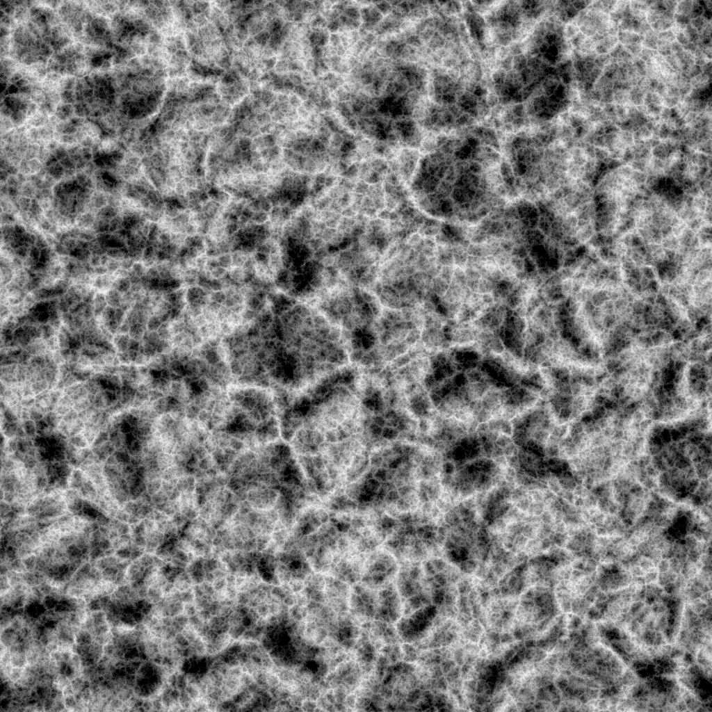

# 沃羅諾伊分形體

<table>
<tr style="border: 0;">
<td width="33.33%" style="border: 0;" valign="top">

{width="200px"}

<b>收錄於：</b> 貼圖產生器>噪音

</td>
<td width="100.00%" style="border: 0;" valign="top">

## 說明

**Voronoi 分形**&#x200B;節點會&#x200B;*產生分形* 3D Voronoi 雜訊，並利用 *Z-down 正交投影*&#x200B;映射到 2D 影像。

此節點可以 [Cube GBuffers](../../../../../../compositing-graphs/nodes-reference-for-com/node-library/texture-generators/patterns/cube-3d-gbuffers/cube-3d-gbuffers.md) 作為輸入測試，而非實際烘焙的映射（如下方範例圖片所示）。

>[!WARNING]
>
> 這種雜訊僅用於 *GPU 引擎*（例如 **Direct**&#x200B;或 **OpenGL）。**&#x200B;到 **工具>切換引擎......** 或按 **F9** 鍵選擇想要的引擎。

</td>
</tr>
</table>

## 參數

|  |  |
|:---|:---|
| <b>倒轉</b> <i>布林值</i> | 將輸出影像反轉。 |
| <b>規模</b> <i>浮標</i> | 控制分形 Voronoi 雜訊的縮放。  *注意：當&#x200B;**任一*軸啟用&#x200B;*平鋪**&#x200B;時，縮放調整會逐步*&#x200B;調整&#x200B;**。這是預料之中的。 |
| <b>規模</b> <i>Float3</i> | 控制分形 Voronoi 在 X **、** Y **和** Z **軸的**&#x200B;噪音大小。值不均勻會導致&#x200B;*拉伸或壓縮*&#x200B;效果。  *注意*：當&#x200B;**任一&#x200B;*軸啟用*平鋪**&#x200B;時，尺寸調整會是&#x200B;*階*&#x200B;梯式的。這是預料之中的。 |
| <b>偏移</b> <i>Float3</i> | 對分形 Voronoi 雜訊在 X **、** Y **和** Z **軸的位置施加偏移&#x200B;**。** |
| <b>混亂</b> <i>Float3</i> | 隨機偏移的強度&#x200B;*，分別施加在X **軸、**&#x200B;Y **軸和**&#x200B;Z **軸的雜訊**&#x200B;點*&#x200B;上。 |
| <b>失真強度</b> <i>浮標</i> | 控制對分形沃羅諾伊噪聲施加的扭曲效應&#x200B;*強度*。 |
| <b>失真尺度倍增器</b> <i>浮標</i> | 控制扭曲效果中變形圖案&#x200B;*的尺度*，由變形強度&#x200B;**控制**。 |
| <b>最低水準</b> <i>整數</i> | 分形圖案中使用的最低 *重複* 程度。 更寬的最小/最大範圍會產生 *更豐富的圖案* ，並在更多頻率範圍內變化。 |
| <b>最高等級</b> <i>整數</i> | 分形圖案中使用的最大 *重複* 程度。 更寬的最小/最大範圍會產生 *更豐富的圖案* ，並在更多頻率範圍內變化。 |
| <b>粗糙度</b> <i>浮標</i> | 控制&#x200B;*分形圖案中低與高*&#x200B;重複&#x200B;*的平衡*。  *注意*：值為 **0** 會產生與其他低值不一致&#x200B;*的輸出*。這是預料之中的。  *註 2*：此參數僅在混合 **模式** 參數設為 *Add* 時可用。 |
| <b>缺口</b> <i>浮標</i> | 控制施加的分形圖案 *如何填滿空間*。 *較高*&#x200B;的數值會導致&#x200B;*圖案間隙*&#x200B;較少，噪音&#x200B;*密度也更*&#x200B;高。 |
| <b>全域不透明度</b> <i>浮標</i> | 控制 *分形 Perlin 雜訊值的範圍* ，範圍從 0 開始。 |
| <b>圓弧</b> <i>浮標</i> | 在雜訊的每個點周圍將 *斜率* 四捨五入，使其 *凸*&#x200B;起。  *注意*：當 **Style** 參數設為 *Edge* 時，此參數無法使用。 |
| <b>距離尺度</b> <i>浮標</i> | 調整 *噪音點周圍梯度* 的距離。 |
| <b>距離模式</b> <i>整數</i> | 設定計算雜訊中每個點距離梯度的方法：- 歐幾里得&#x200B;* -*&#x200B;曼哈頓&#x200B;* -*&#x200B;切比雪夫&#x200B;* -*&#x200B;明可夫斯基 *  *** |
| <b>明可夫斯基數</b> <i>浮標</i> | 閔可夫斯基距離的階數 *p* 。 若將距離梯度分為象限，此數值對象限的影響如下：  - p 為&#x200B;** 1：直線  - p *小*&#x200B;於 1：凹  p *大於* 1：  凸 有趣值：  - *1.0*：曼哈頓距離  - *2.0*：歐幾里得距離  - *無限*：切比雪夫距離&#x200B;  *注意*：此參數僅在距離&#x200B;**模式**&#x200B;參數設為&#x200B;*明可夫斯基*。 |
| <b>混合模式</b> <i>整數</i> | 設定將空間中重疊格子值&#x200B;*混合的方法：  -*&#x200B;加法&#x200B;*：將值 相加-*&#x200B;最大&#x200B;*值：保留*&#x200B;最高&#x200B;*值 -*&#x200B;最小&#x200B;*值：保留*&#x200B;最低&#x200B;*值* |
| <b>風格</b> <i>整數</i> | 設定分形Voronoi雜訊資料的渲染方法&#x200B;*，考慮雜訊基於空間中的一組點：  -* F1 *：距離*&#x200B;空間中最近點 *的距離-* F2 *：距離*&#x200B;空間中第二近點&#x200B;* 的距離-* F2-F1 * -* F1\*F2* - *F1/F2* - *邊*：*空間 中雜訊各單元*&#x200B;之間的邊- *隨機顏色*：*為空間中每個噪聲格指派一個*&#x200B;隨機的平面色* |
| <b>邊緣厚度</b> <i>浮標</i> | 調整分形 Voronoi 雜訊中偵測到的格子間邊的厚度。 邊是在 X、Y 和 Z 軸偵測，因此根據格子&#x200B;*的深度*，某些厚度可能增長得更快。  *注意*：此參數僅在 Style **&#x200B;**&#x200B;參數設為 *Edge（邊緣*）時可用。 |
| <b>隨機色彩種子模式</b> <i>整數</i> | 設定每個格子顏色選擇的隨機種子獲取方法&#x200B;*：- 全域隨機種子*：使用節點 繼承&#x200B;*的種子*- *手動種子*：使用&#x200B;*離散*&#x200B;種子&#x200B;  *注意*：此參數僅在風格&#x200B;**&#x200B;**&#x200B;參數設為&#x200B;*隨機顏色*&#x200B;時可用。 *  * |
| <b>隨機色彩種子</b> <i>整數</i> | 每個格子顏色選擇應使用的離散隨機種子。  *注意*：此參數僅在風格&#x200B;**&#x200B;**&#x200B;參數設為&#x200B;*隨機色彩*&#x200B;且&#x200B;**隨機色彩種子模式**&#x200B;參數設為&#x200B;*手動種子*&#x200B;時可用。 |
| <b>啟用平鋪</b> <i>布林值</i> | 調整分形 Voronoi 雜訊，使其產生的圖案 *在 X、Y 和 Z 軸重複* 出現。 |

## 範例

<table style="margin-top: 32px; margin-bottom: 32px">
    <tr style="border: 0">
        <td style="border: 0; background: transparent">
            
        </td>
        <td style="border: 0; background: transparent">
            
        </td>
        <td style="border: 0; background: transparent">
            
        </td>
        <td style="border: 0; background: transparent">
            
        </td>
        <td style="border: 0; background: transparent">
            
        </td>
        <td style="border: 0; background: transparent">
            
        </td>
        <td style="border: 0; background: transparent">
            
        </td>
        <td style="border: 0; background: transparent">
            
        </td>
    </tr>
</table>
