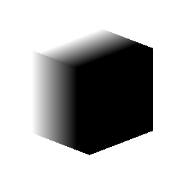

# 三維線性梯度

<table>
<tr style="border: 0;">
<td width="33.33%" style="border: 0;" valign="top">

{width="128px"}

<b>收錄於：</b> 紋理產生器>圖案

</td>
<td width="100.00%" style="border: 0;" valign="top">

## 說明

根據輸入位置貼圖建立體積梯度。 有效地在三維空間中產生從黑轉白的過渡。 本作只針對 GPU 引擎使用。

還有類似效果，請參考 [3D 體積遮罩](../../../../../../compositing-graphs/nodes-reference-for-com/node-library/texture-generators/patterns/3d-volume-mask/3d-volume-mask.md) 。

</td>
</tr>
</table>

## 參數

|  |  |
|:---|:---|
| <b>點位模式</b> <i>紫外線位置，世界空間位置</i> | 如果你想手動輸入精確位置，可以選擇在 UV 空間（設定在 2D 視圖時效果最佳）或在 3D 座標下運作。 |
| <b>第一點</b> | 梯度的起點。 可以是基於位置模式的二維或三維座標。 |
| <b>第二點</b> | 梯度的終點。 可以是基於位置模式的二維或三維座標。 |
| <b>對比</b> <i>0.0 - 1.0</i> | 調整結果的對比度。 |

## 範例

<table style="margin-top: 32px; margin-bottom: 32px">
    <tr style="border: 0">
        <td style="border: 0; background: transparent">
            
        </td>
    </tr>
</table>
