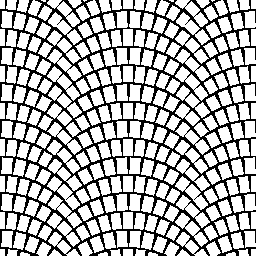

# 弧形鋪面

<table>
<tr style="border: 0;">
<td width="33.33%" style="border: 0;" valign="top">

<b>收錄於：</b> 紋理產生器>圖案

</td>
<td width="100.00%" style="border: 0;" valign="top">

## 說明

產生巴黎弧形路面圖案。 這種效果無法用標準 [的圖塊產生器](../../../../../../compositing-graphs/nodes-reference-for-com/node-library/texture-generators/patterns/tile-generator/tile-generator.md)或 [圖塊取樣](../../../../../../compositing-graphs/nodes-reference-for-com/node-library/texture-generators/patterns/tile-sampler/tile-sampler.md)器達成，因此有這個專用節點。

</td>
</tr>
</table>

## 參數

|  |  |
|:---|:---|
| <b>規模</b> <i>1 - 8</i> | 設定全域縮放/平鋪。 |
| <b>圖案數量</b> <i>1 - 32</i> | 每個篇章中會用到多少磚塊。 |
| <b>模式數量隨機</b> <i>0.0 - 1.0</i> | 每個弧線中磚塊數量隨機。 還有一個額外效果，就是讓磚塊有不同的比例。 |
| <b>圖案最低金額</b> <i>1 - 10</i> | 控制隨機劇情時的最小磚塊數量。 |
| <b>弧數</b> <i>0 - 20</i> | 設定垂直堆疊的弧線數量。 改變磚牆高度。 |
| <b>模式</b> <i>輸入影像、方形、圓盤、拋物面、鐘形、高斯分布、荊棘、金字塔、磚塊、漸變、波形、半鐘形、有脊形的鐘形、新月形、膠囊、圓錐</i> | 選擇要使用的圖案形狀。 |
| <b>輸入影像過濾</b> <i>雙線性 + 多元映射、雙線性、最近</i> |  |
| <b>圖案刻度</b> <i>0.0 - 1.0</i> | 為每個格子設定縮放。 |
| <b>圖案寬度</b> <i>0.0 - 1.0</i> | 為每塊地磚設定寬度。 |
| <b>圖案高度</b> <i>0.0 - 1.0</i> | 為每塊地磚設定高度。 |
| <b>圖案寬度隨機</b> <i>0.0 - 1.0</i> | 隨機化地磚寬度。 |
| <b>圖案高度隨機</b> <i>0.0 - 1.0</i> | 隨機化地塊高度。 |
| <b>全域圖案寬度隨機</b> <i>0.0 - 1.0</i> | 它會隨機調整圖塊寬度，但不會造成較大的空隙。 |
| <b>圖案高度降低</b> <i>0.0 - 1.0</i> | 控制每個弧線末端的格子高度壓縮。 |
| <b>顏色隨機</b> <i>0.0 - 1.0</i> | 隨機化方塊顏色。 |
| <b>非平方展開</b> <i>錯誤/真實</i> | 能以非平方比率補償擠壓與拉伸。 |

## 範例

<table style="margin-top: 32px; margin-bottom: 32px">
    <tr style="border: 0">
        <td style="border: 0; background: transparent">
            
        </td>
    </tr>
</table>
