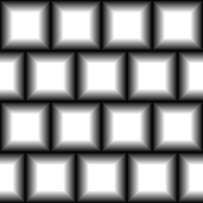

# 磚發電機

<table>
<tr style="border: 0;">
<td style="border: 0;" valign="top">

{width="128px"}

## 磚發電機

**收錄於：***貼圖產生器**/圖案*

**中級**

</td>
<td style="border: 0;" valign="top">

## 說明

進階磚塊圖案產生器。 有很多專門生成人造磚塊圖案的選項

更多選項請參見 [格子產生器](../../../../../../compositing-graphs/nodes-reference-for-com/node-library/texture-generators/patterns/tile-generator/tile-generator.md)。

## 參數

* **磚**&#x200B;塊： *1 - 64*&#x200B;設定 X 軸和 Y 軸的磚塊數量。
* **斜角**： *0.0 - 1.0*&#x200B;改變磚塊的斜面輪廓，允許雙向變換，並設定衰減輪廓與角角圓角。
* **保持比率**： *假/真*&#x200B;讓斜面輪廓是否與磚塊尺寸掛鉤。
* **間隙**： *0.0 - 1.0*&#x200B;磚塊間的空隙。 要記得斜角也會帶來縫隙，所以要加上斜角，也必須用這個參數來補償。
* **中等大小**： *0.0 - 1.0*&#x200B;磚塊模式偏移，每隔一欄或一列的大小改變。
* **高度**： *-1.0 - 1.0*&#x200B;修改高度輪廓。 允許引入亮度變化及各種隨機化。
* **斜率**： *-1.0 - 1.0*&#x200B;以每塊磚為基礎引入斜率，就像某些磚塊呈斜角排列。
* **偏移**&#x200B;量： *0.0 - 1.0*\
  以列為基礎偏移磚塊，會影響每列的間距。
* **非平方展開**： *假/真*\
  能以非平方比率補償擠壓與拉伸。

## 範例圖片

</td>
</tr>
</table>
