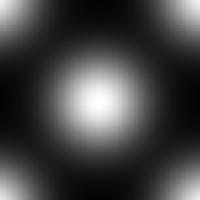

# 高斯1

<table>
<tr style="border: 0;">
<td width="33.33%" style="border: 0;" valign="top">

{width="128px"}

<b>收錄於：</b> 紋理產生器>圖案

</td>
<td width="100.00%" style="border: 0;" valign="top">

## 說明

簡單的高斯斑點圖案。

</td>
</tr>
</table>

## 參數

|  |  |
|:---|:---|
| <b>鋪磚</b> <i>1 - 16</i> | 設定結果應該鋪磚的次數。 |
| <b>非平方展開</b> <i>錯誤/真實</i> | 能以非平方比率補償擠壓與拉伸。 |

## 範例

<table style="margin-top: 32px; margin-bottom: 32px">
    <tr style="border: 0">
        <td style="border: 0; background: transparent">
            
        </td>
    </tr>
</table>
