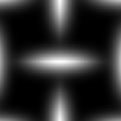

# 網格 1

<table>
<tr style="border: 0;">
<td style="border: 0;" valign="top">

{width="128px"}

## 網格 1

**收錄於：***貼圖產生器**/圖案*

**很簡單**

</td>
<td style="border: 0;" valign="top">

## 說明

簡單的網狀圖案，搭配薄方塊。 很適合製作高度和細節地圖。

## 參數

* **鋪磚**： *1 - 16*\
  設定結果應該鋪磚的次數。
* **旋轉45度**： *錯誤/真實*&#x200B;旋轉結果為45度。
* **非平方展開**： *假/真*\
  能以非平方比率補償擠壓與拉伸。

## 範例圖片

</td>
</tr>
</table>
