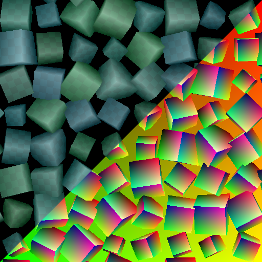
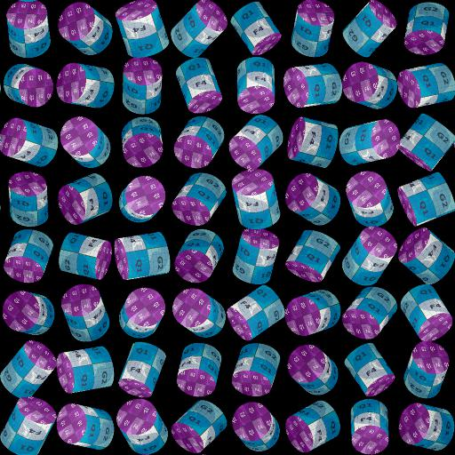
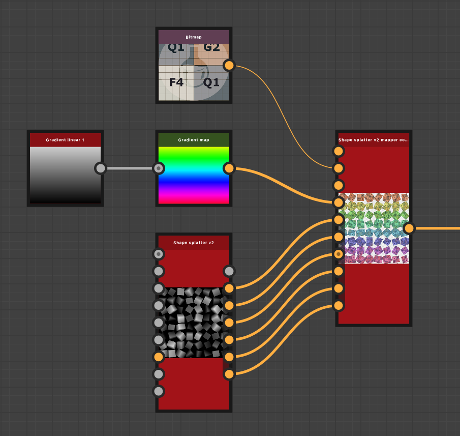

# Shape Splatter v2 映射器顏色

<table>
<tr style="border: 0;">
<td width="33.33%" style="border: 0;" valign="top">

<b>收錄於：</b> Generator > Pattern

</td>
<td width="100.00%" style="border: 0;" valign="top">

## 說明

利用 Shape splatter v2[&#128279;](../shape-splatter-v2/shape-splatter-v2.md) 節點生成並散布的形狀，利用該節點提供的額外資料，將彩色影像映射到形狀上。  影像可作為獨立的圖案輸入提供，或打包於格網圖集中，並可透過 UV 映射、三面投影或自訂映射套用到形狀上。  形狀可以均勻或隨機地調整顏色。

另 [見 Shape splatter v2 灰階](../shape-splatter-v2-mapper-grayscale/shape-splatter-v2-mapper-grayscale.md)映射器。

</td>
</tr>
</table>

>[!INFO]
>
> 此節點需要由 Shape splatter v2[&#128279;](../shape-splatter-v2/shape-splatter-v2.md) 節點產生的輸入資料。
> 
> Shape splatter v2 系列的其他節點：
> * [從 Shape Splatter v2 轉為遮罩](../shape-splatter-v2-to-mask/shape-splatter-v2-to-mask.md)
>
> [Grid 圖譜的色彩](../grid-atlas-color/grid-atlas-color.md)節點讓你能將圖片打包成自訂大小的圖集，最多可有 16 個圖案分布在 4*4 格子裡。

>[!TIP]
> 
> [**「Rusty bolts」**&#x200B;材質範例](../../../../../../function-graphs/nodes-reference-for-fun/function-node-library/function-nodes-sdf-functions/working-with-sdf-functions.md#material-sample)可供開始使用 Shape splatter v2 節點。
> 
> 欲了解更多涉及 SDF 函數的概念與工作流程，請前往專門頁面： [使用 SDF 函數](../../../../../../function-graphs/nodes-reference-for-fun/function-node-library/function-nodes-sdf-functions/working-with-sdf-functions.md)

## 輸入

|                                 |                                                                                                                                                                                                                                                                                                                                                                                                                                                                                                                                                                                                                                                                                                                                                                                                                                                                                        |
|:--------------------------------|:---------------------------------------------------------------------------------------------------------------------------------------------------------------------------------------------------------------------------------------------------------------------------------------------------------------------------------------------------------------------------------------------------------------------------------------------------------------------------------------------------------------------------------------------------------------------------------------------------------------------------------------------------------------------------------------------------------------------------------------------------------------------------------------------------------------------------------------------------------------------------------------|
| <b>網格圖集輸入</b> *顏色* | 一張彩色圖案圖像，排列成格子佈局。  格子大小應該與 Shape splatter v2[&#128279;](../shape-splatter-v2/shape-splatter-v2.md) 節點所用的大小相符。  使用 [Grid atlas 的顏色](../grid-atlas-color/grid-atlas-color.md)節點將不同的圖案打包到格子圖集中。 |
| <b>模式輸入 1</b> *顏色* | 這是映射到形狀的#1圖案的彩色圖片。  <i>提示：</i> 使用接近圖案在散佈時可能擁有的最大尺寸解析度。 |
| <b>模式輸入 2</b> *顏色* | #2圖案的彩色影像，映射到這些形狀。  <i>提示：</i> 使用接近圖案在散射時可能擁有的最大尺寸解析度。 |
| <b>模式輸入 3</b> *顏色* | #3圖案的彩色影像，映射到這些形狀。  <i>提示：</i> 使用接近圖案在散佈時可能擁有的最大大小的解析度。 |
| <b>模式輸入 4</b> *顏色* | 這是映射到這些形狀的 #4 圖案的彩色影像。  <i>提示：</i> 使用接近圖案在散射時可能擁有的最大尺寸解析度。 |
| <b>模式輸入 5</b> *顏色* | #5 圖案的彩色圖片，映射到這些形狀。  <i>提示：</i> 使用接近圖案在散射時可能擁有的最大尺寸解析度。 |
| <b>模式輸入 6</b> *顏色* | 這是映射到形狀的 #6 圖案的彩色影像。  <i>提示：</i> 使用接近圖案在散射時可能擁有的最大大小的解析度。 |
| <b>模式輸入 7</b> *顏色* | 映射到形狀的 #7 圖案的彩色圖片。  <i>提示：</i> 使用接近圖案在散佈時可能擁有的最大尺寸解析度。 |
| <b>模式輸入 8</b> *顏色* | 映射到形狀的 #8 圖案的彩色影像。  <i>提示：</i> 使用接近圖案在散射時可能擁有的最大尺寸的解析度。 |
| <b>背景輸入</b> *顏色* | 彩色影像作為映射形狀的背景。 |
| <b>色彩輸入</b> *顏色* | 彩色影像用來根據其樞軸位置對映射形狀進行著色。  使用 <b>色彩輸入不透明度</b> 參數來調整這些顏色對形狀顏色的強度貢獻。 |
| <b>正常</b> *顏色* | 這些法線是根據與背景高度  的混合來計算散布形狀的。 若形狀 <b>類型</b> 為「格網圖集」，則直接使用格 <b>網圖集法線</b> 輸入的法線。 |
| <b>濺射 UVW</b> *顏色* | <b>R</b> - 形狀 UV 的 U 分量。 <b>G</b> - 圖形 UV 的 V 分量。 <b>B</b> - 圖形的高度。 （W） <b>A</b> - 打包資料： - <i>整數部分：</i> 形狀的唯一識別碼。 （ID） - <i>分數部分：</i>依形狀類型</b>而定<b>：若為SDF/原始材料ID，若為模式輸入/網格圖集則為圖案ID*。  <b>*：</b>模式ID為列表/圖集中中形狀的索引。 |
| <b>濺血資料 1</b> *顏色* | <b>R</b> - 形狀表面上物件空間中位置的 X 分量。 <b>G</b> - 物件空間中形狀表面位置的 Y 分量。 <b>B</b> - 物件空間中形狀表面位置的 Z 分量。 <b>A</b> - 打包資料： - <i>整數部分：</i> 資料 2/3 輸出中形狀資料的 UV 座標 U 分量。 - <i>分數部分：</i> UV 座標的 V 分量，用於資料 2/3 輸出中形狀資料。 - <i>符號：</i> 用於將形狀與背景高度混合的二元遮罩。 |
| <b>濺血資料 2</b> *顏色* | <b>R</b> - 形狀三維旋轉的 X 分量。 <b>G</b> - 形狀三維旋轉的 Y 分量。 <b>B</b> - 形狀三維旋轉的 Z 分量。 <b>A</b> - 形狀繞法線旋轉的分量。  所有旋轉皆以轉數定義。 |
| <b>Splatter data 3</b> *顏色* | <b>R</b> - 形狀位置的 X 分量。 <b>G</b> - 形狀位置的 Y 分量。 <b>B</b> - 形狀沿法線的偏移量。 <b>A</b> - 打包資料： - <i>整數部分：</i> 形狀的 ID。 - <i>分數部分：</i>圖形在來源圖譜中圖案的索引。 （若使用格點圖集模式類型） |
| <b>濺血資料 4</b> *顏色* | <i>像素 1</i> <b>R</b> - 資料 2/3 輸出影像的 X 尺寸。 <b>G</b> - 資料 2/3 輸出影像的 Y 尺寸。 <b>B</b> - 資料 4 輸出影像的 X 尺寸。 <b>A</b> - 資料 4 輸出影像的 Y 尺寸。  <i>Pixel 2</i> <b>R</b> - 形狀類型。 (E.g. 立方體、圓柱體等） <b>G</b> - 打包資料： - <i>絕對值：</i> 模式輸入數。 - <i>符號：</i> 輸出法線貼圖的正規格式。 （正：DirectX / 負：OpenGL） <b>B</b> - X 個格子圖集大小。 （即欄位數量） <b>格子圖集的 A</b> - Y 大小。 （即行數） |

## 輸出

|               |                     |
|:--------------|:--------------------|
| <b>產出</b> | 那些彩色的形狀。 |

## 參數

|                                            |                                                                                                                                                                                                                                                                                                                                                                                                                                                                                                                                                                                                                                                                                                                                                                                                                                                                                                                                                                                                                                                                |
|:-------------------------------------------|:---------------------------------------------------------------------------------------------------------------------------------------------------------------------------------------------------------------------------------------------------------------------------------------------------------------------------------------------------------------------------------------------------------------------------------------------------------------------------------------------------------------------------------------------------------------------------------------------------------------------------------------------------------------------------------------------------------------------------------------------------------------------------------------------------------------------------------------------------------------------------------------------------------------------------------------------------------------------------------------------------------------------------------------------------------------|
| <b>投影模式</b> *整數* | 將輸入影像投影到形狀上的方法：  - <b>從 splatter UV 出發：</b> 使用 &#39;Shape splatter v2&#39; 節點提供的 UV。 - <b>Triplanar：</b> 使用三平面投影將影像映射到形狀的局部 XYZ 軸上。 - <b>自訂函式：</b> 撰寫功能圖以定義影像映射到形狀上的映射。 |
| <b>自訂功能</b> *Float4* | 以 Float4 形式指定形狀的每像素 RGBA 顏色。  可用變數如下： - <code>shape.position.os</code> （float3）形狀表面在物件空間中的位置。 - <code>shape.position.ws</code> （float3）形狀表面在世界空間中的位置*。 - <code>shape.normal.os</code> （Float3）物件空間中形狀表面的法線。  - <code>shape.normal.ws</code> （Float3）形狀表面在世界空間中的法線*。 - <code>shape.id</code> （漂浮）這個形狀唯一的識別碼。 - <code>material.id</code> （浮動）形狀表面的材質 ID，由「Shape splatter v2」節點定義。  *：形狀的世界空間以其樞軸為中心，未考慮形狀的高度。 這表示物件空間唯一的差別就是方向。  若需要取樣「Shape splatter v2 mapper color」節點的輸入，可以使用以下 <b>範例色彩</b> 節點輸入槽： - 0：格狀圖集  - 1-8：圖案輸入 1-8 |
| <b>是法線映射</b> *布林值* | 指定提供給<b>格網圖集輸入</b><b>或圖案輸入 #</b> 的影像是法線映射。  這是為了實現正確處理法向量並將其應用於形狀所需的處理。 |
| <b>輸入標準格式</b> *整數* | 提供給 <b>格網圖集輸入</b> 或 <b>圖案輸入 #</b> 的法線貼圖格式。  實際上是反轉綠色通道。  - <b>DirectX：</b> Y 軸指向上方。 - <b>OpenGL：</b> Y 軸指向下方。 |
| <b>融合對比</b> *浮標* | 平面投影間過渡的銳利度，其中 1 表示沒有淡出梯度。 |
| <b>影像投影</b> *整數* | 分布於平面投影的圖案輸入#</b>影像量<b>，對三平面映射有貢獻。  為了覆蓋形狀的所有邊，每個軸上會進行前（+）和後（-）平面投影，共6個投影。  - <b>1 張影像：</b> 所有平面投影使用圖案輸入 1。 - <b>3 張影像：</b> 每個軸的 +/- 投影分別使用一個圖案輸入。 - <b>6 張影像：</b> 每個投影使用獨立的圖案輸入。 - <b>每個材質 ID 1 張影像：</b> 每個材質 ID 使用獨立的圖案輸入，每個影像用於所有平面投影。 |
| <b>放映中心</b> *Float3* | 在物件空間中偏移每軸的三平面投影。  偏移是套用到 <i>整個投影空間</i>，因此一個軸上的偏移會影響投影在 <i>另外兩個</i> 軸上的貼圖位置。 |
| <b>投影尺度</b> *浮標* | 根據指定因子調整投影材質 <i>在所有軸</i>上的縮放比例。 |
| <b>輸入選擇模式</b> *整數* | 選擇哪些輸入影像要映射到形狀的方法。  <b>在來源「Shape splatter v2」節點中選擇的形狀類型</b>會改變將影像指派到形狀的方式：  - <b>格點圖集</b>表示透過匹配格網索引，在「格網圖集輸入」中取得影像（兩個圖集應使用相同的格子大小） - <b>圖案輸入</b>是指透過匹配索引，在「圖案輸入 #」輸入中擷取影像。 - <b>其他形狀類型：</b>透過將索引與形狀的材質 ID 匹配來指派影像。  可用的索引選擇方法如下： - <b>從濺射資料：</b>將「圖案輸入 #」或「格網圖集輸入」影像的索引與「形狀濺射 v2」節點所指派的形狀索引相匹配。 - <b>手動：</b>使用「影像索引」參數指定的索引。 - <b>隨機：</b>在「隨機範圍」參數範圍內使用隨機索引。 |
| <b>模式輸入號碼</b> *整數* | 圖案輸入的數量 <b>#</b> 輸入圖片應該映射到這些形狀上。 |
| <b>圖片索引</b> *整數* | 從 Pattern 輸入 #</b> 或<b>應映射到圖形的格點圖集輸入</b>的輸入圖案<b>索引。 |
| <b>隨機範圍</b> *整數2* | 該圖案應隨機選取 Pattern 輸入 #</b> 或 <b>Grid atlas 輸入</b>的索引<b>範圍，並將其映射到這些形狀上。 |
| <b>HSL 調整</b> *Float3* | 一個均勻地應用於所有形狀的色調、飽和度和亮度（HSL）的偏移量。 |
| <b>HSL 隨機</b> *Float3* | 隨機對形狀的色相、飽和度和亮度（HSL）施加正偏移或負偏移，直到指定值為止。 |
| <b>色彩輸入不透明度</b> *浮標* | 根據所選<b>的色彩輸入混合模式</b>，顏色<b>輸入</b>對形狀顏色的貢獻強度。 |
| <b>色彩輸入混合模式</b> *整數* | 用於將前景與背景影像結合的色彩混合操作。  這些操作與 Blend</b> 節點中的<b>對應操作相同。  可用模式：- 複製 - 加法（線性迴避）</b> - <b>減法</b>  - <b>乘法</b>  - <b>疊加 <b></b> <b> </b> |
| <b>法線角度隨機</b> *浮標* | 從法向量的原點生成一個方向向量，到錐體基底上繞著法向量的隨機點，然後將法向量與該隨機方向向量混合。  此參數調整 <i>錐</i>體角度，其中 1 為半球，0 表示方向向量等於法向量。 |
| <b>平鋪模式</b> *整數* | 貼圖應重複的軸線：   - <b>無平鋪</b>   - <b>水平平鋪</b>   - <b>垂直平鋪</b>   - <b>H 與 V 平鋪</b>：水平與垂直平鋪結合。 |
| <b>UV 平鋪</b> *浮標* | 調整映射到形狀上的影像的全域平鋪，  數值越高，重複次數越多。 |
| <b>紫外線尺度</b> *Float2* | 根據指定因子調整映射到形狀上的影像平鋪，並有獨立的 U 和 V 縮放控制。 數值越高，重複次數越多。 |
| <b>紫外線偏移量</b> *Float2* | 對影像在形狀上的映射施加偏移，從而能細緻調整影像在形狀上的位置。  這個偏移會加到 <b>隨機偏移</b>量（如果有的話）。 |
| <b>隨機偏移</b> *浮標* | 對每個形狀</i>的影像映射，對應形狀間的隨機正偏移或負偏移<i>量，直到指定值為止。  這個偏移量會加到 <b>紫外線偏移</b>量（如果有的話）。 |

## 範例

<table style="margin-top: 32px; margin-bottom: 32px; border: none">
    <tr style="border: 0; background: transparent">
        <td style="width: 33%; border: 0; background: transparent">
             <i>三平面映射</i>
        </td>
        <td style="width: 33%; border: 0; background: transparent">
             <i>法線映射</i>
        </td>
        <td style="width: 33%; border: 0; background: transparent">
             <i>從 SDF 形狀中依材質 ID 映射</i>
        </td>
    </tr>
    <tr style="border: 0; background: transparent">
        <td style="width: 33%; border: 0; background: transparent">
             <i>三平面映射的平鋪調整</i>
        </td>
        <td style="width: 33%; border: 0; background: transparent">
             <i>從圓柱形狀依材質 ID 映射</i>
        </td>
        <td style="width: 33%; border: 0; background: transparent">
             <i>節點在圖</i>的語境中」 /&gt;
        </td>
    </tr>
</table>

