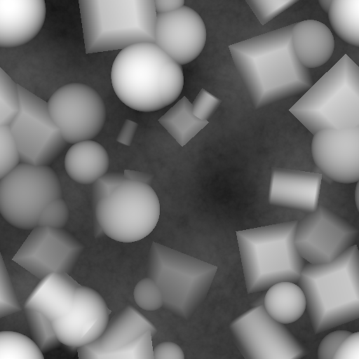

# 形狀濺射

<table>
<tr style="border: 0;">
<td style="border: 0;" valign="top">

{width="128px"}

## 形狀濺射

**收錄於：***貼圖產生器**/圖案*

**複合體**

</td>
<td style="border: 0;" valign="top">

## 說明

這是一個非常複雜的節點，設計用來搭配搭配的節點 [Shape Splatter Blend](../../../../../../compositing-graphs/nodes-reference-for-com/node-library/texture-generators/patterns/shape-splatter-blend/shape-splatter-blend.md)、 [Shape Splatter to Mask](../../../../../../compositing-graphs/nodes-reference-for-com/node-library/texture-generators/patterns/shape-splatter-to-mask/shape-splatter-to-mask.md) 以及 [Shape Splatter Data Extract](../../../../../../compositing-graphs/nodes-reference-for-com/node-library/texture-generators/patterns/shape-splatter-data-ext/shape-splatter-data-extract.md)。 用來以類似 Tile Sampler 或 Generator 的方式[潑灑形狀，但採用動態且非破壞性的過程，透過類似 [Flood Fill 的多層系統控制每一步。](../../../../../../compositing-graphs/nodes-reference-for-com/node-library/filters/effects/flood-fill/flood-fill.md)](../../../../../../compositing-graphs/nodes-reference-for-com/node-library/texture-generators/patterns/tile-generator/tile-generator.md) Flood Fill 是從外部來源取得基礎輸入地圖，而 Shape Splatter 則能在單一步驟內產生地圖及相關資料，作為 Flood Fill](../../../../../../compositing-graphs/nodes-reference-for-com/node-library/filters/effects/flood-fill/flood-fill.md) 的進階版本[。

它的主要目的是允許將形狀放置在高度圖上並由高度圖驅動，然後從 Splatter Data 生成各種地圖。 例如，在地形上放置石頭、樹枝和樹葉，並由各種地圖來定向和驅動。 不同貼圖可用於高度、法線、底色、粗糙度及其他任何通道，且皆基於相同的共用濺射資料。

## 參數

### 輸入

* **背景高度**： *灰階輸入*&#x200B;背景高度用於放置磁磚並驅動各種效果。
* **模式 1-8**： *灰階輸入**可選圖案*
* **模式分布**： *灰階輸入*&#x200B;灰階映射至
* **形狀縮放**： *灰階輸入*&#x200B;灰階貼圖以驅動圖塊縮放。
* **形狀旋轉**： *灰階輸入*&#x200B;灰階貼圖以驅動磁磚旋轉。
* **高度偏移**： *灰階輸入*&#x200B;灰階地圖，用作瓦片高度的偏移。
* **高度比例**： *灰階輸入*&#x200B;灰階地圖，作為磚塊高度的偏移量。
* **掩蓋隨機**： *灰階輸入*\
  遮罩槽用於遮蔽節點的效果。
* **向量貼圖**： *色彩輸入*&#x200B;色彩向量貼圖以驅動磁磚位置與旋轉。

### 參數

* **X 金額**： *1 - 64*\
  該模式重複次數為數。
* **Y金額**： *1 - 64*\
  該模式的Y字重複次數。
* **模式**
  * **圖案輸入編號**： *1 - 8*&#x200B;設定數量的各種圖案。 解鎖新的圖案輸入欄位。
  * **圖案分配模式**： *隨機、模式索引、線索引、欄位索引*&#x200B;設定如何決定使用哪種模式。 隨機或依模式、線條或欄目。
  * **圖案分布地圖乘數**： *0.0 - 1.0*&#x200B;設定可選分布地圖對圖案擺放的影響。
  * **模式旋轉**： *0、90、180、270*&#x200B;預設，模式旋轉90度。
  * **圖案旋轉**&#x200B;隨機： *0.0 - 1.0*&#x200B;設定圖案隨機90度階梯旋轉的數量。
* **規模**
  * **評分：***0.0 - 5.0*\
    為每塊磚設均勻比例。
  * **比例隨機**： *0.0 - 1.0*&#x200B;對每個格子進行均勻的隨機化。
  * **縮放無重疊**： *0.0 - 1.0*&#x200B;均勻隨機縮放，但僅限向下縮放，以避免重疊的格子。 不應與前兩個參數同時使用。
  * **比例尺地圖乘數**： *0.0 - 1.0*&#x200B;設定比例尺地圖的影響。
  * **尺寸**： *0.0 - 1.0*&#x200B;允許非均勻的方塊縮放。
  * **從 Bg 斜率**&#x200B;的尺寸比： *0.0 - 1.0*&#x200B;使用背景地圖斜率（計算法線）到非均勻縮放的圖塊。 模擬透視扭曲。
  * **X/Y量比**&#x200B;的尺寸： *0.0 - 1.0*&#x200B;非均勻縮放以補償X與Y量比例差異。
* **職位**
  * **位置隨機**： *0.0 - 2.0*&#x200B;隨機偏移操作，針對每個格子。
  * **隨機分布**： *用於前述參數的高斯分布、均勻*&#x200B;集計算。 差異不大，數值越高越明顯。 高斯分布通常會讓分布更均勻。
  * **向量映射乘法**： *0.0 - 1.0*&#x200B;向量輸入映射對偏移量的影響。
  * **水平**&#x200B;偏移： *-2.0 - 2.0*&#x200B;全局水平偏移。
  * **垂直偏移**： *-2.0 - 2.0*&#x200B;全域垂直偏移。
  * **界外選項**： *縮放形狀，限制位置*&#x200B;動作，讓方塊出現在界外時執行。
* **旋轉**
  * **旋轉**： *0.0 - 1.0*&#x200B;全域旋轉所有格子。
  * **旋轉隨機**： *0.0 - 1.0*&#x200B;每格隨機旋轉。
  * **從 BG 斜率**&#x200B;旋轉： *0.0 - 1.0*&#x200B;使用背景地圖斜率（計算法線）來旋轉圖塊。 可以用來讓形狀在斜坡上朝上或朝下。
  * **旋轉貼圖乘法**： *0.0 - 1.0*&#x200B;旋轉貼圖對每格旋轉的影響融合。
  * **向量地圖乘數**： *0.0 - 1.0*&#x200B;旋轉貼圖對每個圖塊旋轉的影響融合。
* **高度**
  * **高度比例自動調整**： *錯誤/真*&#x200B;自動調整相對於背景的高度範圍，而非定義絕對範圍。 可以讓控制權多或少。
  * **高度偏移**： *-1.0 - 1.0*&#x200B;修正器，讓所有地塊均勻偏移/移動高度範圍。
  * **高度偏移**&#x200B;隨機： *0.0 - 1.0*&#x200B;隨機改變每格的高度偏移。
  * **高度偏移貼圖多重調整器**： *0.0 - 1.0*&#x200B;修正值可設定偏移貼圖的影響。
  * **高度比例：*0.0 - 1.0*修改器，能均勻地將**&#x200B;所有地塊在高度範圍內縮放/擴展。相對於偏移，這會讓數值更遠，就像對比度一樣。
  * **高度比例**&#x200B;隨機： *0.0 - 1.0*&#x200B;高度比例會隨機以每格為基準調整。
  * **高度比例地圖乘數**： *0.0 - 1.0*&#x200B;修正器可設定比例尺地圖的影響。
  * **符合背景**： *0.0 - 1.0*&#x200B;影響磚塊與背景的混合。 不符合的意思是高度圖保持剛性，並且跟著背景形狀相符。 例如葉子和樹枝的對立。
  * **平滑順形背景**： *0.0 - 2.0*&#x200B;平滑值用於先前效果，以避免錯誤或極端變化。
  * **從 Bg 斜率***偏斜：0.0 - 1.0*&#x200B;調整/斜度磚高度由背景斜率（計算法線）驅動。
  * **背景斜率平滑度**： *0.0 - 2.0*&#x200B;平滑值用於先前效果，以避免錯誤或極端變化。
  * **切割黑像素**： *用假/真*&#x200B;切換來忽略圖塊底層形狀中完整的黑色（0）像素。
  * **平面化圖案基底**： *False/True（假/真*） 調整圖塊與背景的混合行為：圖塊會在較低位置時與背景相交（False）或覆蓋背景。
* **遮蔽**
  * **遮罩隨機：***0.0 - 1.0*&#x200B;隨機隱藏方塊。這個數值越高，消失的地塊就越多。
  * **遮罩隨機地圖乘數**： *0.0 - 1.0*&#x200B;遮罩地圖的 Treshold 何時開始隱藏地塊。
  * **從 Bg 斜率**&#x200B;的遮罩： *-1.0 - 1.0*&#x200B;利用背景地圖斜率（計算出的法線）來隱藏圖塊。

## 範例圖片

</td>
</tr>
</table>
