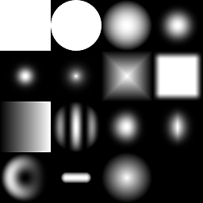

# 形狀

<table>
<tr style="border: 0;">
<td width="33.33%" style="border: 0;" valign="top">

{width="128px"}

<b>收錄於：</b> 紋理產生器>圖案

</td>
<td width="100.00%" style="border: 0;" valign="top">

## 說明

能產生多種程序化形狀，並可修改基礎形狀。 這些形狀總是完美插值且高精度。

儘管簡單，這是一個非常有用的節點：它是大多數程序式高度圖生成的基石！ 透過將基本形狀與變換節點結合，你可以創造出比任何位圖更精確的全程序式高度圖形狀。

</td>
</tr>
</table>

## 參數

|  |  |
|:---|:---|
| <b>鋪磚</b> <i>1 - 16</i> | 設定結果應該鋪磚的次數。 |
| <b>模式</b> <i>方形、圓盤、拋物面、鐘形、高斯分布、荊棘形、金字塔形、磚塊形、漸變形、波形、半鐘形、有脊形的鐘形、弧形、膠囊形、錐形、半球形</i> | 選擇要使用的圖案形狀。 |
| <b>圖案專屬</b> <i>0.0 - 1.0</i> | 讓你可以改變所選圖案的形狀。 效果取決於所選的模式。 |
| <b>規模</b> <i>0.0 - 1.0</i> | 整個形狀都能用來縮放。 |
| <b>規模</b> <i>0.0 - 1.0</i> | 允許在 X 軸或 Y 軸上進行非均勻縮放。 |
| <b>角度</b> <i>0.0 - 1.0</i> | 可以旋轉整個形狀。 |
| <b>旋轉45°</b> <i>錯誤/真實</i> | 旋轉角度設定為預設的45度。 |
| <b>非平方展開</b> <i>錯誤/真實</i> | 能以非平方比率補償擠壓與拉伸。 |
| <b>非方形鋪磚</b> <i>錯誤/真實</i> | 啟用非正方形擴展時，會將形狀平鋪而不會被壓扁。 |

## 範例

<table style="margin-top: 32px; margin-bottom: 32px">
    <tr style="border: 0">
        <td style="border: 0; background: transparent">
            
        </td>
    </tr>
</table>
