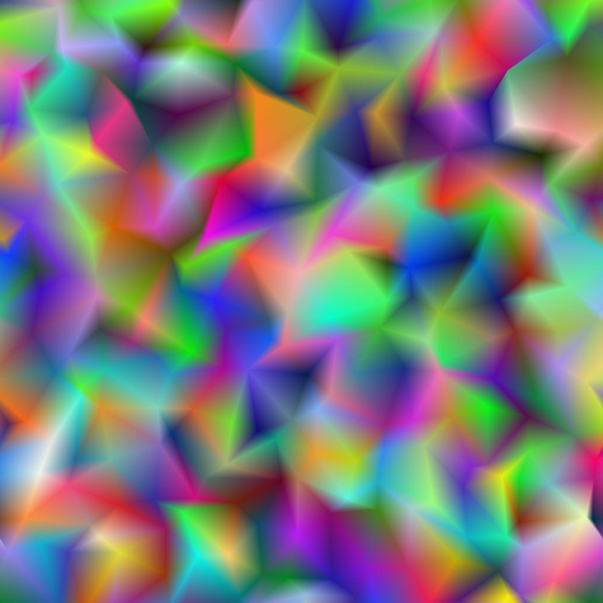

# 三角格網

<table>
<tr style="border: 0;">
<td width="41.60%" style="border: 0;" valign="top">

{width="200px"}

{width="200px"}

<b>收錄於：</b> 紋理產生器>圖案

</td>
<td width="58.30%" style="border: 0;" valign="top">

## 說明

**三角形網格**&#x200B;節點會用 Z 向下正交投影，從三維空間的頂點&#x200B;*生成灰階三角剖分曲面**的表示*。

**色彩輸出**&#x200B;參數讓你選擇用於表示的資料，產生各種視覺風格。\
*頂點的位置可以調整，這會影響產生的*&#x200B;網格。

</td>
</tr>
</table>

## 輸入

|  |  |
|:---|:---|
| <b>高度</b> <i>灰階</i> 初級 | 灰階影像輸入用於映射 *頂點的高度* ，即 Z 位置。    此輸入的影響由「高度輸入乘數」參數控制。 |
| <b>向量映射</b> <i>顏色</i> | 彩色影像輸入用於映射 *X 軸與 Y 軸頂點位移* 。    X/Y 偏移分別映射到影像的 R/G 通道。    此輸入的影響由「向量映射位移」參數控制。 |
| <b>色彩輸入</b> <i>顏色</i> | 彩色影像輸入用於映射 *頂點、線段或三角形的顏色* 。    當「色彩來源」參數設為「色彩輸入」時，會使用此輸入。 |

## 輸出

|  |  |
|:---|:---|
| <b>產出</b> <i>顏色</i> | 輸出影像。 |

## 參數

|  |  |
|:---|:---|
| <b>色彩輸出</b> *整數* | 表示三角剖分曲面的方法：<ul data-preserve-html="true"> <li data-preserve-html="true"><b>每個頂點：</b> 每個頂點分配一個顏色，並在三角形表面插值</li> <li data-preserve-html="true"><b>每個三角形：</b> 每個三角形會分配一個平面顏色</li> <li data-preserve-html="true"><b>細線</b><b>：</b> 在頂點間的線段上套用輪廓</li> <li data-preserve-html="true"><b>到邊</b><b>的距離：</b> 渲染每個三角形中距離最近的線段</li> <li data-preserve-html="true"><b>中心</b><b>：</b> 將標準化後的距離渲染到每個三角形的質心</li> </ul> |
| <b>三角測量</b> *整數* | 設定曲面的三角剖分方法，即 *四邊形中哪對頂點* 應該連接：<ul data-preserve-html="true"> <li data-preserve-html="true"><b>自動：</b> 自動選擇兩頂點，使三角形 <i>朝向</i> 相機最少  <b>45°：</b>連接對立頂點，使直線<i>相對於X軸旋轉45度</i></li> <li data-preserve-html="true"><b>-45°：</b>連接</i>相對頂點，使一條相對於右 X 軸旋轉 -45 度的直線<i></li> <li data-preserve-html="true"><b>Quincux 水平線：</b>每隔一排</i>頂點交替進行三角剖分方向<i></li> <li data-preserve-html="true"><b>Quincux 垂直方向：</b>每隔一列</i>頂點交替三角測量方向<i>  </li> </ul> |
| <b>X 金額</b> *整數* | X 軸上產生的頂點數量。 |
| <b>Y 金額</b> *整數* | 在 Y 軸上產生的頂點數量。 |
| <b>隨機位置乘法</b> *浮標* | 調整主要變形效應的強度。 |
| <b>隨機位置</b> *Float2* | 根據該頂點&#x200B;*在格點中格子的大小，調整施加在每個頂點* X 與 Y 位置的隨機偏移強度。此偏移 *會* 與 <b>Quincux 偏移</b> 和 <b>向量貼圖位移</b> 參數疊加。 |
| <b>向量地圖位移</b> *浮標* | 利用從向量映射</b>輸入取<b>*樣的值*&#x200B;調整&#x200B;*每個頂點所施加的全域*&#x200B;位移量。此偏移&#x200B;*量與<b>*&#x200B;隨機位置</b><b>和五分位偏移</b>參數疊加。 |
| <b>五度偏移 X</b> *浮標* | 對每隔一排&#x200B;*頂點，依其**格子大小，套用指定的偏移*&#x200B;量。這個偏移 *量會* 與 <b>隨機位置</b> 和 <b>向量貼圖位移</b> 參數疊加。 |
| <b>Quincux 偏移 Y</b> *浮標* | 將指定偏移量套用 *到每隔一列* 頂點，相對於 *其在網格中的格* 子大小。    這個偏移 *量會* 與 <b>隨機位置</b> 和 <b>向量貼圖位移</b> 參數疊加。 |
| <b>旋轉</b> *浮標* | 對每個頂點&#x200B;*在其基準位置*&#x200B;周圍施加&#x200B;*指定的*&#x200B;旋轉量——即在隨機偏移與位移施加&#x200B;*前的位置*。此旋轉&#x200B;*與*<b>旋轉無序</b>參數疊加。 |
| <b>旋轉失調</b> *浮標* | 對每個頂點&#x200B;*在其基底位置*&#x200B;周圍施加&#x200B;*隨機*&#x200B;旋轉——即在施加隨機偏移與位移前&#x200B;*的位置*。這個旋轉 *會* 與 <b>旋轉</b> 參數疊加。 |
| <b>高度輸入倍數</b> *浮標* | 利用從 Height</b> 輸入取樣的<b>*值*&#x200B;調整每個頂點的 Z 位置。這個偏移 *量會* 與 <b>高度隨機</b> 參數疊加。 |
| <b>高度隨機</b> *浮標* | 對每個頂點的 Z 位置施加隨機偏移。  此偏移&#x200B;*與<b>高度輸入乘</b>數參數疊*&#x200B;加。 |
| <b>混合模式</b> *整數* | 設定重疊三角形&#x200B;*值*&#x200B;的混合方法。這個模式讓你可以有效選擇&#x200B;**&#x200B;哪些三角形應該被看見：<ul data-preserve-html="true"> <li data-preserve-html="true"><b>Min：</b> 簡訊</li> <li data-preserve-html="true"><b>Max：</b> 簡訊</li> <li data-preserve-html="true"><b>深度測試</b>：文字</li> <li data-preserve-html="true"><b>Alpha 混合：</b> 文字</li> </ul>注意：可用的混合模式取決於色彩輸出</b>參數的<b>值。 |
| <b>色彩來源</b> *當「色彩輸出」參數設為「每個頂點」、「每個三角形」或「細線」時，整數*   *可用。* | 設定&#x200B;*應依選定<b>的色彩輸出</b>模式，將顏色*（即亮度）分配給頂點、三角形或線段：<ul data-preserve-html="true"> <li data-preserve-html="true"><b>高度</b><b>：</b> 以頂點高度作為亮度</li> <li data-preserve-html="true"><b>隨機</b><b>：</b> 使用隨機亮度值</li> <li data-preserve-html="true"><b>色彩輸入</b><b>：</b> 使用從 <b style="">色彩輸入</b> 取樣的值</li> </ul> |
| <b>色彩來源不透明度</b> *當「色彩輸出」參數設為「細線」時，浮點*   *可使用。* | 控制&#x200B;*線條色彩</b>值與所選<b>色彩來源</b>所產生的值的覆寫*<b>。注意：當此值設為 1 時， <b>線條顏色</b> 參數不會影響。 |
| <b>與刃口厚度的距離</b> *當「色彩輸出」參數設定為「到邊緣距離」時，浮點*   *可使用。* | 設定距離梯度的厚度。 值越低， *梯度越短* 。 |
| <b>線條顏色</b> *當「色彩輸出」參數設為「細線」時，Float/float4*   *可用。* | 分段的亮度值。   注意：當 <b>色彩來源不透明度</b> 值設為 1 時，此參數不會影響。 |
| <b>背景色</b> *當「色彩輸出」參數設為「細線」時，Float/float4*   *可用。* | 可見於各段之間的背景亮度值。   注意：當<b>混合模式</b>設為&#x200B;*最大*&#x200B;時，背景會覆蓋較亮&#x200B;*的*&#x200B;部分，這是預期的。 |
| <b>隨機色彩種子模式</b> *當「顏色輸出」參數設為「每個頂點」、「每個三角形」或「細線」，且「色彩來源」參數設為「隨機」時，整數*   *可使用。* | 偽隨機色彩分布中取得種子的方法：<ul data-preserve-html="true"> <li data-preserve-html="true"><b>全域隨機種子</b><b>：</b> 從節點的圖中繼承種子</li> <li data-preserve-html="true"><b>手動種子</b><b>：</b> 使用自訂的獨立種子</li> </ul> |
| <b>隨機色彩種子</b> *當「隨機色彩種子模式」參數設為「手動種子」且「色彩來源」參數設為「隨機」時，整數*   *可用。* | 偽隨機色彩分布中使用的離散種子值。 |
| <b>非平方展開</b> *布林值* | 能以非平方比率補償擠壓與拉伸。 |

## 範例

<table>
<tr style="border: 0;">
<td style="border: 0;" valign="top">

{zoomable="yes"}

</td>
<td style="border: 0;" valign="top">

{zoomable="yes"}

</td>
<td style="border: 0;" valign="top">

{zoomable="yes"}

</td>
</tr>
</table>

<table>
<tr style="border: 0;">
<td style="border: 0;" valign="top">

{zoomable="yes"}

</td>
<td style="border: 0;" valign="top">

{zoomable="yes"}

</td>
<td style="border: 0;" valign="top">

{zoomable="yes"}

</td>
</tr>
</table>

<table>
<tr style="border: 0;">
<td style="border: 0;" valign="top">

{zoomable="yes"}

</td>
<td style="border: 0;" valign="top">

{zoomable="yes"}

</td>
</tr>
</table>
