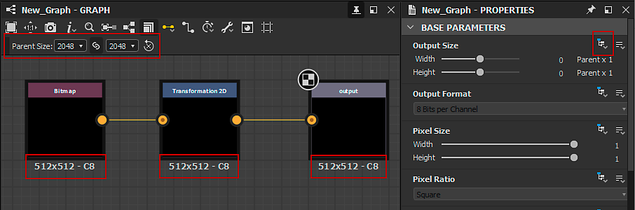
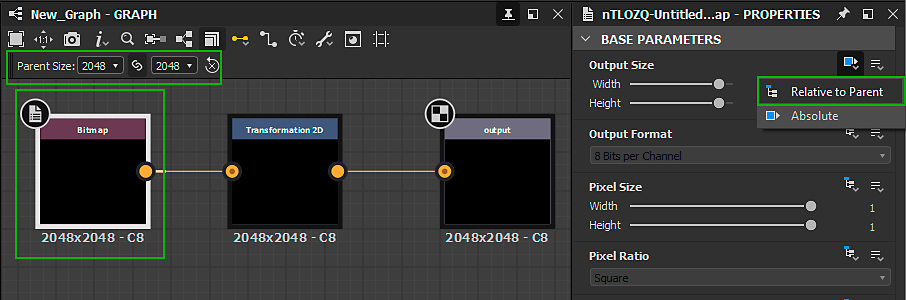

# 輸出大小

它是圖形<b>基本引數</b>中的第一個，與<b>輸出格式</b>（或位深）一起，對理解非常關鍵，因為它對圖形的輸出具有重大影響，無論是在Designer還是作為[發佈的Substance 3D資產(SBSAR)](../publishing-asset-files/publishing-substance-3d-asset-files-sbsar.md)檔案的其他應用程式中。

>[!TIP]
>
> 我們強烈建議您透過Substance圖形[&#128279;](../../compositing-graphs/inheritance-compositing/inheritance-in-substance-compositing-graphs.md)中的繼承取得良好的瞭解，以作為有效使用「輸出大小」屬性的基礎。

>[!NOTE]
>
> 使用鎖定按鈕，讓Height值&#x200B;*符合* Width值。

<table>
<tr style="border: 0;">
<td width="100.00%" style="border: 0;" valign="top">

## 2個值的功率

Output size引數決定圖形或節點所輸出的&#x200B;*紋理*&#x200B;的解析度。

一種紋理，是圖形計算中的物件，受限於圖形處理硬體執行計算的方式所施加的一些限制。 其中一個限制是，紋理應該代表X中畫素數的影像，而Y是2 *的*&#x200B;次方。

</td>
<td width="33.33%" style="border: 0;" valign="top">

| 2的功率 | 畫素 |
| --- | --- |
| 7 | 128 |
| 8 | 256 |
| 9 | 512 |
| 10 | 1024 |
| 11 | 2048 |
| 12 | 4096 |
| 13 | 8192 |

</td>
</tr>
</table>

Output size屬性使用&#x200B;*對數步長*&#x200B;來輕鬆對應兩個冪的遞增（例如256、512、1024、...） 至&#x200B;*線性比例*（例如8、9、10、...）。 這意味著以X或Y為單位增加或減少「輸出大小」值等於1將目前解析度乘以或除以2。

這同樣適用於「輸出大小」值由[函式](../../function-graphs/function-graphs.md)控制的情況，其中函式應輸出目標對數值（相對或絕對），而不是目標解析度。

>[!IMPORTANT]
>
> 在X和Y中增加或減少的解析度將畫素計數乘以&#x200B;*4*，這會對圖形的&#x200B;*效能*&#x200B;和&#x200B;*記憶體空間*&#x200B;產生重大影響。\
> 因此，我們強烈建議使用&#x200B;*最低解析度*&#x200B;來取得想要的結果。 控制解析度是我們許多[效能最佳化准則之一](../../best-practices/performance-optimization/performance-optimization-guidelines.md)。

>[!NOTE]
>
> 在[函式圖形](../../function-graphs/function-graphs.md)中，`$size`和`$sizelog2` [系統變數](../../function-graphs/variables/system-variables/system-variables.md)傳回符合節點或圖形目前解析度的Float2值，分別作為原始畫素計數或二的冪。\
> 例如，對於1024\*512影像，`$size`傳回`(1024,512)`，而`$sizelog2`傳回`(10,9)`。

## 相對大小

當Output Size屬性使用&#x200B;*相對時……* [繼承方法](../../compositing-graphs/inheritance-compositing/inheritance-in-substance-compositing-graphs.md)，其值表示為相對於繼承的對數值&#x200B;*的修飾詞*。

相對於繼承解析度的修飾詞範圍是從–12到+12（以對數刻度），預設值為0。 這意味著在上面或下面每一步將導致解析度加倍或減半。 右邊的表格舉例說明了繼承值9（即512 = 2^9）和11（即2048 = 2^11）的一維相對解析度的變化：

注意 8196 以上的大小是 *有*&#x200B;上限的。 這個上限是透過<b>偏好設定[&#128279;](../../interface/preferences-window/preferences-window.md)中「一般</b>」區塊的「烹飪大小限制</b>」設定<b>來控制的。請注意，使用非常高解析度的工作會帶來相應的效能成本與指數級的記憶體佔用。 此外，圖形處理的限制會嚴格限制貼圖的最大尺寸。

| -5 | -4 | -3 | -2 | -1 | 0 | +1 | +2 | +3 | +4 | +5 |
| --- | --- | --- | --- | --- | --- | --- | --- | --- | --- | --- |
| 16 | 32 | 64 | 128 | 256 | <b>512</b> | 1024 | 2048 | 4096 | 8196 | 8196 |
| 64 | 128 | 256 | 512 | 1024 | <b>2048</b> | 4096 | 8196 | 8196 | 8196 | 8196 |

>[!NOTE]
>
> 低於 16 **&#x200B; 解析度沒有上限，但不建議降低，因為低於這個門檻不會有效能提升。相反地，效能下降&#x200B;**&#x200B;是因為 Substance 引擎</b>的特定實作<b>。因此，在 Substance 圖中，請使用 16x16 作為一般的最低解析度。

## 變更繼承方法

在大多數情況下，輸出大小屬性的預設 [繼承方式](../../compositing-graphs/inheritance-compositing/inheritance-in-substance-compositing-graphs.md) 依項目而定：

* 圖： *相對於母圖*
* Node： *相對於輸入* ——此時使用節點 [主輸入](../../compositing-graphs/inheritance-compositing/inheritance-in-substance-compositing-graphs.md) 繼承的值
* [點陣](../../compositing-graphs/nodes-reference-for-com/atomic-nodes/bitmap/bitmap.md) 節點： *絕對* — 請參考 [點陣圖資源](../../resources/bitmap-resource/bitmap-resource.md) 頁面和 [效能優化指引](../../best-practices/performance-optimization/performance-optimization-guidelines.md) ，了解原因

點擊節點或圖形的屬性，然後在[屬性](../../interface/properties/properties.md)面板的基礎參數</b>區找到<b>輸出大小</b>屬性<b>。點擊繼承方法下拉選單，選擇所需的繼承方式。

{width="512px"}

## 範例問題

如果你是 Adobe Substance 3D Designer[&#128279;](https://www.adobe.com/tw/products/substance3d-designer.html) 的新手，可能會遇到一些常見問題。我們將在下面列出一些範例及解決方案。

+++問題一
** 問題**

**父大小**&#x200B;設定顯示&#x200B;*為灰色，*&#x200B;圖形解析度為不想要的 256\*256。

在圖的屬性中，輸出大小屬性的繼承方法被設定為 *絕對*，這會停止繼承，改用任意值。

** 解決方案**

將圖的輸出大小設定為 *相對於父*&#x200B;圖的繼承方法。

+++

+++問題二
** 問題**

上圖顯示，雖然圖設定為 *相對於母*&#x200B;圖，但解析度（512\*512）與父圖（1024\*1024）不同。

問題出在點陣[&#128279;](../../compositing-graphs/nodes-reference-for-com/atomic-nodes/bitmap/bitmap.md)節點。[它預設採用&#x200B;*絕對*&#x200B;繼承方法，並根據點陣圖資源](../../resources/bitmap-resource/bitmap-resource.md)選擇了 512\*512 作為解析。連接該節點的節點設定為 *相對於輸入*，因此其輸出大小會繼承自點陣節點。

** 解決方案**

將 Bitmap 節點的輸出大小繼承方法設為 *相對於父*&#x200B;節點，這樣就能解決後續鏈的問題。

+++

+++問題三
** 問題**

上面你可以看到一個問題，解析度在鏈條中途跳躍得更高，導致輸出解析度遠高於父系統定義的。

問題是因為轉換二維[&#128279;](../../compositing-graphs/nodes-reference-for-com/atomic-nodes/transformation-2d/transformation-2d.md)節點的相對修飾值為 3，使輸出變大了 8 倍。

** 解決方案**

將寬度和高度的相對修正值設為 0，這樣就不會有升階。

+++
