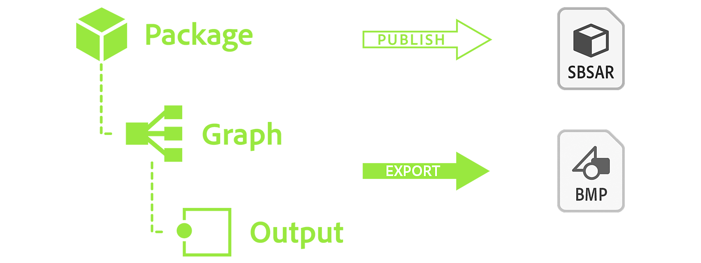
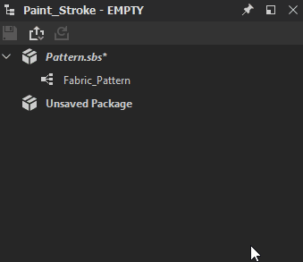

# 發布 Substance 3D 資產檔案（SBSAR）

本頁說明 Substance 3D Designer 如何將套件發佈為 <b>Substance 3D 資產</b> 檔案，這是一種帶有 <b>SBSAR</b> 副檔名的特殊檔案格式，用於 Substance 生態系統及其他支援它的應用程式中。

通常使用 Substance 的 3D 資產比點陣圖更好，因為它更靈活且輕量。 如果你是在 Substance 3D Painter、Sampler[&#128279;](https://experienceleague.adobe.com/en/docs/substance-3d-sampler/using/home) 或 [Player](https://helpx.adobe.com/substance-3d-player/home.html) 中使用它們，使用[「傳送到...」功能會更快。功能](../../interface/the-explorer-window/send-to-interoperability/send-to-interoperability.md)。 [&#128279;](https://experienceleague.adobe.com/en/docs/substance-3d-painter/using/home)

## 出版概念

發布物質圖時，請留意以下幾點：

* 你<b> 發佈的是包含所有內容的套件</b>，而不是單一 [的 Substance 圖表](../../compositing-graphs/substance-compositing-graphs.md)。 接著，Substance 3D 資產可以讓你從這個套件中所有 Substance 圖表生成內容。
* 已發佈的套件完全獨立 <b>：</b>所有所需資源都嵌入於檔案中。 這代表它們比 SBS 檔案更容易分享。
* Substance 3D 資產的輸出可以完全動態</b>呈現<b>。[解析度不設定;可調整外洩參數。](../../compositing-graphs/compositing-graph-key-con/substance-compositing-graph-key-concepts.md) 然而，現在已無法編輯圖譜。
* Substance 3D 資產可在 Designer 之外使用，適用於所有 Adobe Substance 3D 產品、Adobe Dimension 以及任何與 Substance 整合[&#128279;](https://experienceleague.adobe.com/en/docs/substance-3d/ecosystem/home)的應用程式。
* 出版和出口[&#128279;](../../compositing-graphs/exporting-bitmaps/exporting-bitmaps.md)是不同的，務必清楚兩者的差異。

## 準備出版

發佈比匯出點陣圖需要更多準備。 因為你發佈的 Substance 3D 資產是動態工具，而不只是目前材質狀態的靜態快照。 具體來說，你需要記住以下幾點：

* 確保圖的解析度（[輸出大小](../../compositing-graphs/output-size/output-size.md)）設定為&#x200B;*相對於父[*&#x200B;體繼承方法](../../compositing-graphs/inheritance-compositing/inheritance-in-substance-compositing-graphs.md)，表示解析度是動態的，可以即時更改。
* 確保 [圖的輸出](../../compositing-graphs/nodes-reference-for-com/atomic-nodes/output/output.md) 正確設定，包含名稱、標籤和使用標籤。
* 確保 [參數（如有需要）正確組織並命名](../../compositing-graphs/manage-parameters/exposing-a-parameter/exposing-a-parameter.md)。
* 如果一個圖描述了一種材料，請將其材料模型[&#128279;](../graph-parameters/graph-parameters.md)屬性設為該材料的模型。
* 確保所有位圖[&#128279;](../../compositing-graphs/nodes-reference-for-com/atomic-nodes/bitmap/bitmap.md)節點的輸出大小[&#128279;](../../compositing-graphs/output-size/output-size.md)屬性都設定為&#x200B;*絕對[*&#x200B;繼承方法](../../compositing-graphs/inheritance-compositing/inheritance-in-substance-compositing-graphs.md)。若非如此，其參考 [點陣圖資源](../../resources/bitmap-resource/bitmap-resource.md) 將以預設 <b>的 256\*256</b> 解析度儲存在已發佈的 Substance 3D 資產檔案中，這會影響*&#x200B;一個或多個輸出的品質* 。
* 如果套件中有不應該在 Designer 以外存在的圖形（例如僅在特定情境下運作的輔助或「工具」子圖），請將它們設為隱藏在屬性中。 詳情請見下文。

## 出版方法

一旦準備好發佈，有兩種方式可以進入發佈對話框，兩者皆透過 [檔案總管](../../interface/the-explorer-window/the-explorer-window.md)。

<table>
<tr style="border: 0;">
<td style="border: 0;" valign="top">

在檔案總管中，右鍵點選套件並選擇  **Publish .sbsar 檔案......**，然後用快捷鍵 Ctrl + P。

發佈一次對話框後，你也可以像之前&#x200B;**一樣使用 ** Publish .sbsar 檔案，重複發佈過程而不看到對話框，然後立即以相同設定發佈。

</td>
<td style="border: 0;" valign="top">

</td>
</tr>
</table>

<table>
<tr style="border: 0;">
<td style="border: 0;" valign="top">

在檔案總管中，點擊頂部工具列的發佈按鈕  。

發佈一次對話框後，你也可以使用「發佈如前一頁」按鈕  重複發佈過程，避免看到對話框，立即以相同設定發佈。

</td>
<td style="border: 0;" valign="top">

</td>
</tr>
</table>

<table>
<tr style="border: 0;">
<td style="border: 0;" valign="top">

## 資產發佈選項

在資產發佈選項出現之前，若未完成，系統會提示您儲存 Substance 3D 檔案（SBS），並會提示該在哪裡儲存 Substance 3D 資產。 為了避免看到檔案提示和對話並加快檔案輸出速度，請使用 <b>上述</b> 方法的發佈。

</td>
<td style="border: 0;" valign="top">

</td>
</tr>
</table>

以下選項可供選擇：

<b>檔案路徑</b> 會開啟一個檔案對話框，選擇要儲存 Substance 3D 資產檔案的位置。 預設路徑是系統的使用者文件。 如果包裹被保存，路徑就是包裹的位置。 如果套件在會話中發佈，路徑就是最後一次發佈位置。

<b>壓縮</b> 檔壓縮集的壓縮選項會影響檔案大小。

<b>產生缺失圖示</b> 使用[內建的 PBR 渲染](../../compositing-graphs/nodes-reference-for-com/node-library/material-filters/pbr-utilities/pbr-render/pbr-render.md) 技術，為每個圖屬性建立縮圖。

<b>Exposed Graphs </b>列出了本套件中所有將被曝光的圖表，以下說明排除的圖表。

>[!NOTE]
>
> **隨機種子暴露**
> 
> 「發佈」對話框中已不再有隨機種子曝光設定。 相反地，請將圖表的隨機種子屬性設 [為絕對（Absolute）而非相對（relor），以避免該屬性被使用。](../../compositing-graphs/graph-parameters/graph-parameters.md)

## 排除已發佈資產中的圖表

你的套件裡有些圖表可能不適合戶外使用。 這些子圖通常作為一個較大整體的一部分，即主材料的子程式。

<table>
<tr style="border: 0;">
<td style="border: 0;" valign="top">

要避免圖表在 Substance 3D 資產檔案中被顯示或使用，請進入該圖表的屬性（在圖表檢視中雙擊空白區域，或在檔案總管中單擊該圖表），然後開啟 <b>屬性</b> 展開。 在 SBSAR</b> 中將「暴露」設<b>為<b>「否</b>」，以便在發佈時隱藏它。

</td>
<td style="border: 0;" valign="top">

</td>
</tr>
</table>

### 發布對話警告

發佈對話框有時會以黃色顯示警告。 以下列出常見的錯誤，並附有說明與解決方案。

* 一個或多個圖沒有輸出\
  這個警告表示你正在嘗試發佈一個或多個沒有輸出節點的圖的套件。 解決方案是用黃色警告三角形在圖中加入 [輸出節點](../../compositing-graphs/nodes-reference-for-com/atomic-nodes/output/output.md)。
* 一個或多個圖具有非相對於父的輸出大小參數\
  此警告表示一個或多個圖表被設定為錯誤的輸出大小。 通常是圖本身的性質。 警告表示你在發布時無法動態控制此圖表。 解決方法是進入帶有黃色三角形的圖屬性，並將輸出大小的 [繼承方法](../../compositing-graphs/inheritance-compositing/inheritance-in-substance-compositing-graphs.md) 設為 *相對於父*&#x200B;體。

## Substance 3D 資產的限制

雖然 Substance 3D 資產是 Substance 生態系統中最強大且最具動態的格式，但仍有一些小的技術限制需要注意。

* 已發行的Substance 3D資產套件是單向檔案格式。 你無法將 Substance 3D 資產「反編譯」回 Substance 3D 檔案（SBS）。 唯一能「編輯」Substance 3D 資產的方法，就是編輯原始的 Substance 3D 檔案。 你仍然可以將 Substance 3D 資產包內容作為新 Substance 圖表中的節點（開啟和拖放），所以這並不是很大的限制。
* Substance 3D 資產檔案有版本可推斷相容性。 核心 Substance 引擎會不時更新新功能。 使用這些功能的套件需要由支援這些新功能的應用程式來讀取。 這並非所有 Substance 應用程式都會有問題，因為它們會同時更新，但插件和整合的相容性延遲可能會更長。\
  請使用專案偏好設定[&#128279;](../../interface/preferences-window/project-settings/project-settings.md)中的 Substance Engine 相容性顯示選項，追蹤任何潛在問題。
* 部分暴露的參數——例如 *靜態* 參數——一旦圖表作為 Substance 3D 資產的一部分發佈後會被 *隱藏* 。 請參閱[「暴露參數](../../compositing-graphs/manage-parameters/exposing-a-parameter/exposing-a-parameter.md)」頁面的[限制](../../compositing-graphs/manage-parameters/exposing-a-parameter/exposing-a-parameter.md)章節，了解這些參數的列表及一般靜態參數的相關知識。
