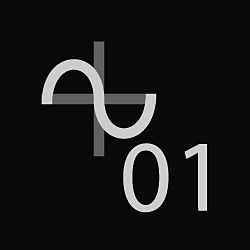

# 物質圖中的值

自從 2019.1.0 版本引入 [Substance 3D Designer](https://www.adobe.com/tw/products/substance3d-designer.html) Engine v7 後，現在可以處理 Substance 圖中的數值，而[不僅僅是函數](../../function-graphs/function-graphs.md)。 值資料是函數（如整數、浮點數和布林等）中使用的資料，因此與代表整張影像像素值的彩色或灰階影像資料有明顯區別。 具體來說，提到值資料時，指 *的是整數 1、整數 2、整數 3 和整數 4、浮點數 1、浮點數 2、浮點數 3、浮點數 4 以及布林值*。 每種顏色都有明顯的編碼，且大多不會互換。

這有幾個應用案例，例如：

* 回傳及處理非影像資料，例如單一值的材料屬性或額外的元資料。 例如，材料的 IOR 價值。
* 優化不需要逐像素計算的圖形計算（作為像素處理器[&#128279;](../../compositing-graphs/nodes-reference-for-com/atomic-nodes/pixel-processor/pixel-processor.md)的替代方案）。例如隨機的純色。
* 透過將影像資料轉換為數值，將一個節點的屬性連結到另一個節點。 例如，調整音量的影像最小值與最大值。

## 新值節點與輸入

兩個新的原子節點與以下值相符：

|  |  |
| --- | --- |
| 

  <b>[價值處理器](../../compositing-graphs/nodes-reference-for-com/atomic-nodes/value-processor/value-processor.md)</b> | [值處理器](../../compositing-graphs/nodes-reference-for-com/atomic-nodes/value-processor/value-processor.md)可以接收任意數量的灰階或色彩輸入，並允許你根據這些輸入從計算中回傳單一值。 |
| 

  **[價值輸入](../../compositing-graphs/nodes-reference-for-com/atomic-nodes/input/input.md)** | [Value Input](../../compositing-graphs/nodes-reference-for-com/atomic-nodes/input/input.md)允許你在子圖上建立一個明確定義為 Value 的輸入槽。 |

此外，其他節點也會以特定方式處理：

[如果你插入 Output 節點](../../compositing-graphs/nodes-reference-for-com/atomic-nodes/output/output.md)，它會自動調整成 Value Output，就像之前用 Grayscale 和 Color 一樣。

{width="512px"}

每個節點（[Atomic](../../compositing-graphs/nodes-reference-for-com/atomic-nodes/atomic-nodes.md)和 [Library](../../compositing-graphs/nodes-reference-for-com/node-library/node-library.md)/Instance）都有一個新分頁，可以定義 Value 輸入。

## 與價值觀共事

使用價值與一般實體圖工作略有不同：

值連接只能來自[值處理器](../../compositing-graphs/nodes-reference-for-com/atomic-nodes/value-processor/value-processor.md)、[值輸入或](../../compositing-graphs/nodes-reference-for-com/atomic-nodes/input/input.md) [子圖](../../compositing-graphs/creating-compositing-gra/graph-instances-sub-gra/graph-instances-sub-graphs.md)。這其實代表 Value 處理器是唯一能從零建立 Value 連線的方式，沒有「靜態值」節點或類似的東西。 相反地，建立一個值處理器，放置靜態值並將其設為輸出，以達成相同的結果。

值處理器只能回傳單一值，如果你想回傳多個值，或是值組或值群組，就必須建立 [子圖](../../compositing-graphs/creating-compositing-gra/graph-instances-sub-gra/graph-instances-sub-graphs.md)。

為了突出顯示 Value 的暴露或使用位置，任何有 Value Inputs 或 Value Outputs 的節點都會以粗黃色邊框標示：

