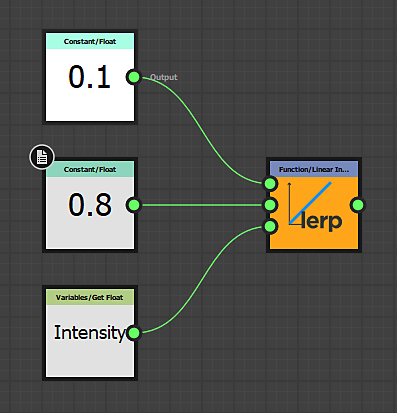

# 實體函數圖

<table>
<tr style="border: 0;">
<td style="border: 0;" valign="top">

[{width="120px"}](https://substance3d.adobe.com/)

</td>
<td style="border: 0;" valign="top">

[實質函數圖處理](https://substance3d.adobe.com/)<b>單一值</b>（整數、浮點數、向量），而非影像資料（整組像素）。函數也是帶有節點網路的圖，但 [所用](../function-graphs/nodes-reference-for-fun/function-nodes-overview/function-nodes-overview.md)節點與介面不同 [於一般的實體圖](../compositing-graphs/substance-compositing-graphs.md)。 工作流程完全基於 <b>數學運算</b> ，不會顯示任何圖片預覽縮圖，因此在使用 Substance 3D Designer 時，是 <b>更進階的方式</b> 。

函式可用於多種情境，主要包括修改暴露參數的行為[、撰寫像素處理器](../compositing-graphs/nodes-reference-for-com/atomic-nodes/pixel-processor/pixel-processor.md)或[FX-Map的](../compositing-graphs/nodes-reference-for-com/atomic-nodes/fx-map/fx-map.md)行為[，以及在Substance圖](../compositing-graphs/values-compositing-graphs/values-in-substance-compositing-graphs.md)中使用[數值。](../compositing-graphs/manage-parameters/exposing-a-parameter/exposing-a-parameter.md)

</td>
</tr>
</table>

## 範例

以下是一些函式常見使用案例的範例。

### 簡單函數

在暴露參數的情境下，這是一個簡單的函數。 它會得到一個名為「強度」的輸入浮點數值，該值從 0 到 1（一個容易理解的範圍），並重新映射到 0.1 到 0.8 的設定範圍。 這表示如果使用者將強度設為 0，內部會使用 0.1;如果 UI 設為 1，則會使用 0.8，中間的任何值則會線性插值。 這種函式在暴露參數](../compositing-graphs/manage-parameters/exposing-a-parameter/exposing-a-parameter.md)時很常見[，但會使用自訂函數。

此函式也可寫成 *lerp（0.1， 0.8， Intensity），* 以類似 HLSL 或 GLSL 的偽代碼形式。

### 進階功能

{width="545px"}

這個進階功能展示了像素處理器的 [內部運作，該處理器](../compositing-graphs/nodes-reference-for-com/atomic-nodes/pixel-processor/pixel-processor.md) 旨在根據第二個灰階遮罩輸入的強度調整色彩貼圖輸入的色調。

它會用系統的「$pos」變數取樣兩個輸入，然後剝離 Alpha，將色彩值轉換成 HSL，並透過與取樣的灰階值相乘來修改 Hue 成分。 接著重新組合向量，將 HSL 轉回 RGB，並加入 Alpha 作為最終輸出。

在偽程式碼中，這會是一個更複雜的函式，無法在單一行中呈現。
