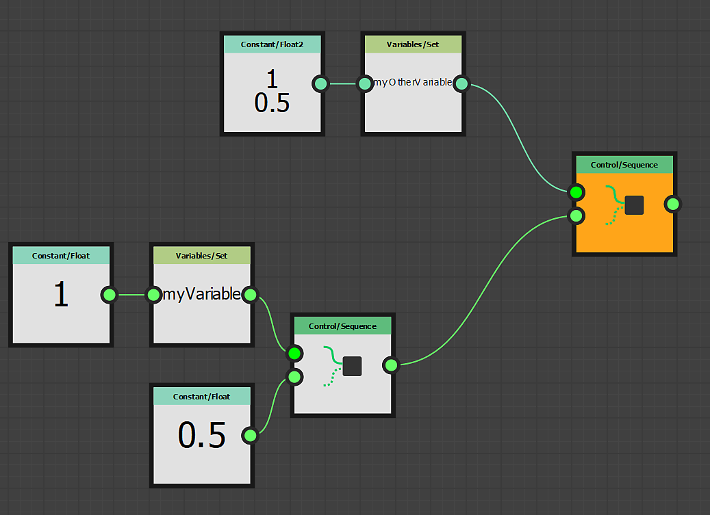
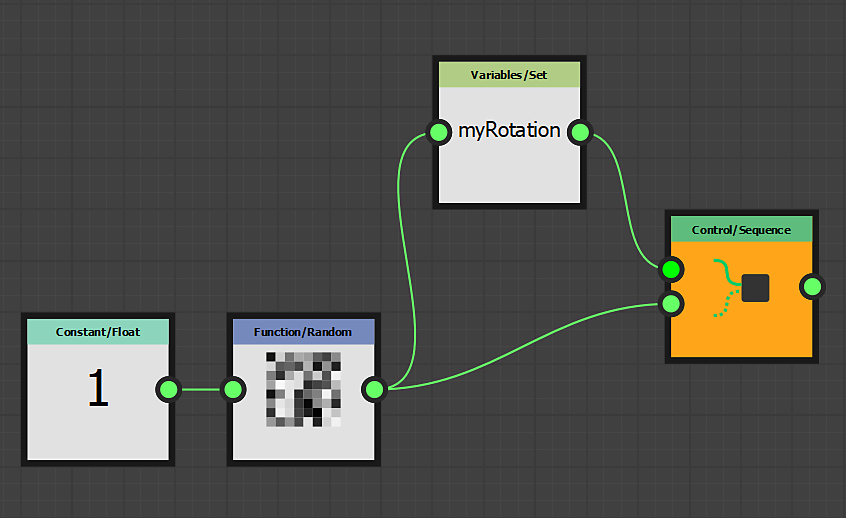

# 使用 Set/Sequence 節點

本頁描述 **Set** 與 **Sequence** 節點，並提供 FX-Maps **情境**&#x200B;下的範例使用案例。

<table>
<tr style="border: 0;">
<td style="border: 0;" valign="top">

## 概觀

在使用 FX-Maps</b> 函數<b>時，你偶爾會遇到想從參數的 *[Substance 函數圖](../../../../function-graphs/the-function-graph/the-function-graph.md)*&#x200B;輸出一個值，以便&#x200B;*用到另一個參數的情況。* 但預設情況下，Substance 函數圖只會輸出 *一個* 值：驅動相關參數的值。

</td>
<td style="border: 0;" valign="top">

</td>
</tr>
</table>

在這種情況下，你可以結合 <b>Set</b> 和 <b>Sequence</b> 節點，這樣可以控制單一或多個函式的變數。

此過程包含兩個步驟：

1. <b>Set</b> 節點會讓你建立一個新變數，這樣你就可以在別處呼叫它並指派值。
1. <b>序列</b>節點用於完整執行第 1 步的邏輯，*然後再執行圖的另一個分支*——例如實際輸出當前圖的期望值的邏輯

<table>
<tr style="border: 0;">
<td width="100.00%" style="border: 0;" valign="top">

## 集合節點

<b>Set</b> 節點讓你可以設定一個新變數，並指派它與該節點&#x200B;**&#x200B;輸入相關的型別和值。

*變數名稱*&#x200B;由使用者輸入到節點屬性中。

預設情況下，此節點&#x200B;*所設定的變數只能*&#x200B;在本實體函數圖的父&#x200B;*圖範圍內*&#x200B;存取，例如承載函式定義參數的節點。

</td>
<td width="25.00%" style="border: 0;" valign="top">

</td>
</tr>
</table>

<table>
<tr style="border: 0;">
<td style="border: 0;" valign="top">

在這個例子中，變數名稱被設定為 ， **`myVariable`** 其值為 **1**。

</td>
<td style="border: 0;" valign="top">

</td>
</tr>
</table>

<table>
<tr style="border: 0;">
<td width="100.00%" style="border: 0;" valign="top">

## 序列節點

<b>Sequence</b> 節點讓你能控制 *Substance 函數圖的執行流程*，確保&#x200B;*第一個分支在第二個分支*&#x200B;之前被完整執行。

第二個分支&#x200B;*的*&#x200B;輸出接著會傳遞到節點的輸出。

</td>
<td width="25.00%" style="border: 0;" valign="top">

</td>
</tr>
</table>

<table>
<tr style="border: 0;">
<td style="border: 0;" valign="top">

在此範例中， <b>序列</b> 節點被設定為圖的輸出。 因此<b>，函數的輸出即為浮點</b>節點的 <b>0.5</b> 值。

不過在此之前， `<b>myVariable</b>` 變數會設定浮點數值為 <b>1.0</b>。 此變數隨後可在節點的其他情境中使用&#x200B;**。

</td>
<td style="border: 0;" valign="top">

</td>
</tr>
</table>

**&#x200B;**&#x200B;序列節點可以串&#x200B;*接*&#x200B;以控制圖的執行流程。

例如，你可以&#x200B;*先設定*&#x200B;一個變數，之後&#x200B;*在某個點更新*&#x200B;其值，然後&#x200B;*讀取*&#x200B;最終值，同時確保這些動作以特定順序&#x200B;*發生*。

## 可變能見度

請注意，宣告的變數 *無法* 從任何地方存取！\
雖然在父層宣告的變數可以在子層級被存取，但相反的情況則 *不成立*。

因此，節點中設定 *的變數無法* 在圖層級存取，而設定在圖層級 *的變數則可在* 節點的參數函式中存取。

例如，這條規則是暴露參數&#x200B;*的核心*，因為揭露實際上包含以下步驟：

1. 建立圖輸入參數
1. 在參數的 Substance 函數圖中存取它
1. 將其值設為函式的輸出

讓我們舉個小例子：假設我們希望象<b>限</b>節點的<b>旋轉</b>值受到顏色/亮度</b>值的影響<b>：亮度越亮，旋轉越多。

<table>
<tr style="border: 0;">
<td style="border: 0;" valign="top">

我們將所有計算都放在 <b>色彩/亮度</b> 參數函數中。 這個參數會先&#x200B;*被計算*，因此其中的任何變數都會被其他節點使用。

</td>
<td style="border: 0;" valign="top">

</td>
</tr>
</table>

<table>
<tr style="border: 0;">
<td style="border: 0;" valign="top">

我們的函式很簡單：光度會是 0 到 1 **之間的**&#x200B;隨機值，這個值會儲存在變數中`myRotation`，然後我們將這個值設為函&#x200B;**數的輸出。**

這表示 **Color/Luminosity** 參數的值會是隨機 *的，並* 儲存在變數中 `myRotation` 。

請注意， **Position** 屬性已經由隨機值定義，且 **Iterate** 節點用於取得多個隨機放置的模式。

</td>
<td style="border: 0;" valign="top">

</td>
</tr>
</table>

<table>
<tr style="border: 0;">
<td style="border: 0;" valign="top">

現在變`myRotation`數存在且有值，讓我們進入 Pattern Rotation</b> 屬性的 <b>Substance 函數圖。

</td>
<td style="border: 0;" valign="top">

</td>
</tr>
</table>

<table>
<tr style="border: 0;">
<td width="100.00%" style="border: 0;" valign="top">

在函式中，我們用 **Get Float** 節點讀取`myRotation`參數值——我們知道變數包含浮點數值——並將其設為函式的輸出。

</td>
<td width="25.00%" style="border: 0;" valign="top">

</td>
</tr>
</table>

光度現在也控制旋轉。

