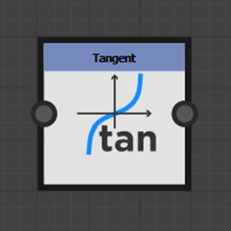

# 功能節點

函數節點會根據它們所代表的數學函數轉換輸入值。

雖然其輸入連接器通常不具型別，但並非支援所有值型別。

## 節點列表

+++砰

將第一個輸入的次方回傳為第二個輸入的冪次方： <b>X^Y</b>。

+++

+++2Pow

回傳 2 的輸入值的冪次方： <b>2^X</b>。

+++

+++平方根

回傳其輸入值的平方根： <b>√X</b>。

+++

+++指數

回傳其輸入值的指數值： <b>e^X</b>

<b>e</b> 大約等於 2.7182818。

+++

+++對數

回傳其輸入值的自然對數：<b>ln（X）。</b>

+++

+++對數底數為2

回傳輸入值的底數 2 對數：<b>log2（X）。</b>

+++

+++絕對

回傳其輸入的絕對值：<b>abs（X）。</b>

+++

+++凱爾

將輸入值向上取整。 它回傳最小的整數值，且不小於 X：<b>ceil（X）。</b>

+++

+++下限

將輸入值向下取整。 它回傳最大不大於 X：<b>floor（X）。</b>

+++

+++線性插值

回傳兩個值之間線性插值值，該值為浮動值： <b>（1 - X）\*A + X\*B</b>。

+++

+++最低限度

回傳兩個輸入值中最低的值：<b>min（A， B）。</b>

+++

+++極限

回傳兩個輸入值中最高的：<b>max（A， B）。</b>

+++

+++餘弦

回傳其輸入值的餘弦值（弧度<b>）：cos（X）。</b>

+++

+++正弦

回傳其輸入值的正弦值（弧度<b>）：sin（X）。</b>

+++

+++正切

回傳輸入值的切線（弧度<b>）：tan（X）。</b>

+++

+++弧切線2

回傳輸入二維向量與水平向量之間的角度。

它是笛卡兒</b>函數的<b>倒數。

不需像一般 <b>的 atan2</b> 函數那樣切換輸入向量的 X 和 Y 分量。

+++

+++笛卡兒

將極座標轉換為笛卡爾座標。

它是弧切</b>2函數的倒數<b>：<b>長度 \* Float2（cos（Angle）， sin（Angle）。</b>

極座標是距離原點的距離以及與水平線的弧度角。

+++

+++隨機

回傳一個介於 0 與輸入值 <b>X</b> 之間的隨機值。

+++
