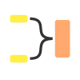

# 向量與旋轉節點

向量節點和旋轉節點分別允許你從和拆解向量節點組成和拆解。它們類似 [於 RGBA 合併](../../../../compositing-graphs/nodes-reference-for-com/node-library/filters/channels/rgba-merge/rgba-merge.md) 和 [RGBA 分割](../../../../compositing-graphs/nodes-reference-for-com/node-library/filters/channels/rgba-split/rgba-split.md)，但分別是針對函數圖。 它們也是向量資料類型轉換的主要方法，因為 [在很多情況下無法選擇鑄造](../../../../function-graphs/nodes-reference-for-fun/atomic-function-nodes/cast-nodes/cast-nodes.md)。

## 向量節點

<table>
<tr style="border: 0;">
<td style="border: 0;" valign="top">

向量節點允許你將向量或元件數量較少的元素，合併成包含更多元件的向量。 向量節點有幾項特定規則或限制：

* 向量節點 **只有兩個輸入**，即使產生的向量有超過兩個分量。
* 向量輸入 **不限於一種類型**：它們可以接受任何較小的分量作為輸入。
* 結果輸出的順序由 **輸入**&#x200B;的順序決定。

這表示以下方法是最佳的使用：

* 構造向量4有兩種方式：要麼連接兩個二成分向量，要麼連接一個一成分與一個三成分向量。
* 如果你想從單一整數或浮點數構造出一個三或四分量的向量，你必須先至少做一個向量 2 的組合，才能將它們組合成三分量向量。

仔細思考連結的順序。 輸入的連接順序如下所示。

{width="200px"}

左邊的例子先連接一個整數（1），接著連接整數3。 結果如下

| 輸出 | X | Y | Z | W |
| --- | --- | --- | --- | --- |
| 輸入 1 | 0 |  |  |  |
| 輸入 2 |  | 1 | 2 | 4 |

{width="200px"}

左邊的範例會將輸入從第一個例子交換，先是整數 3，接著是整數（1）。

| 輸出 | X | Y | Z | W |
| --- | --- | --- | --- | --- |
| 輸入 1 | 1 | 2 | 4 |  |
| 輸入 2 |  |  |  | 0 |

</td>
<td style="border: 0;" valign="top">

| 

 | 

 | 

 |
| --- | --- | --- |
| **向量整數2** | **向量整數3** | **向量整數4** |
| 

 | 

 | 

 |
| **向量 Float2** | **向量 Float3** | **向量浮4** |

</td>
</tr>
</table>

## 旋轉節點

<table>
<tr style="border: 0;">
<td style="border: 0;" valign="top">

Swizzle 節點能拆解或分離多組件向量的組件，讓你能分別使用 X、Y、Z 和 W 組件，並互相交換。 適用以下規則與限制：

* Swizzle 節點 **只有一個輸出**。
* Swizzle 節點 **會接收任何正確類型的輸入** （Int 或 Float）。

### 分體組件

Swizzle 最常見的使用場景是用來拆分元件，例如將一個整數四分解成四個獨立的整數。 限制確實意味著你需要四個獨立的 Swizzle 整數節點來實現這個功能。

對於 Integer4 也可以進行其他形式的分割，例如兩個 Integer2，或一個 Integer 加一個 Integer3，同樣要記得每個結果都需要自己的節點。

### 更換/更換元件

顧名思義，Swizzle 可以用來改變數值的順序，甚至覆蓋數值。 你可以把順序從 X、Y、Z、W 改成 W、Y、X、Z，也可以把數值從 X、Y、Z、W 改成 X、X、X、W。

</td>
<td style="border: 0;" valign="top">

| 

 | 

 | 

 | 

 |
| --- | --- | --- | --- |
| **旋轉整數** | **Swizzle** **整數2** | **Swizzle** **整數3** | **旋轉**&#x200B;**整數4** |
| 

 | 

 | 

 | 

 |
| **Swizzle** **花車** | **Swizzle** **Float2** | **Swizzle** **Float3** | **旋轉**&#x200B;**漂浮4** |

</td>
</tr>
</table>
